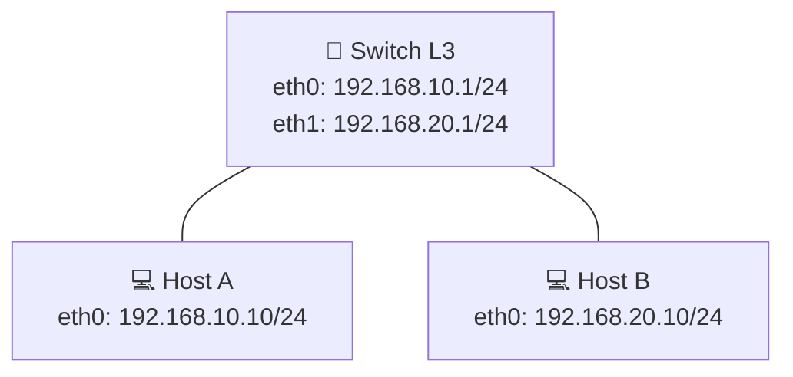

# Laboratório 01 - Configuração inicial no PNetLab

**Disciplina:** ENE0025 - Protocolos de Transporte e Roteamento  
**Professor responsável:** Prof. Dr. Laerte Peotta de Melo  

---

## Objetivos do laboratório

- Compreender que redes distintas **não se comunicam automaticamente**
    
- Identificar o **papel do roteador** como elemento lógico de interconexão
    
- Diferenciar falha de comunicação por ausência de roteamento de falha física
    
- Relacionar teoria de roteamento com comportamento real da rede
    
>DICA: Execute o comando `setxkbmap -model pc105 -layout br -variant abnt2` tente colar com Ctrl+Shift+V
---

## Cenário do Laboratório

### Topologia lógica




 ---

## Recursos no PNetLab

- Escolha usar um router ou SW L3

- 1 roteador (FRRouting ou Cisco IOU ou  VyOS)
  
- 2 hosts Linux
    
- 2 segmentos Ethernet
    

---

## Parte 1 – Montagem da topologia

### Passo 1 – Criar o laboratório

1. Acessar o PNetLab
    
2. Criar novo laboratório:  **Nome:** `Aula1_Conceitos_Roteamento`
    
3. Inserir os nós:
    
    - `Linux-PC-1` (Host A)
        
    - `Linux-PC-2` (Host B)
        
    - `Router-1`
        

---

### Passo 2 – Conectar os dispositivos

- Host A → Interface 1 do Router
    
- Host B → Interface 2 do Router
    

---

## Parte 2 – Configuração de endereçamento IP

### Endereçamento proposto

|Dispositivo|Interface|IP|Máscara|
|---|---|---|---|
|Host A|eth0|192.168.10.10|/24|
|Router|eth0|192.168.10.1|/24|
|Router|eth1|192.168.20.1|/24|
|Host B|eth0|192.168.20.10|/24|

---

### Passo 3 – Configurar os hosts

**Host A**

```bash
ip addr add 192.168.10.10/24 dev eth0
ip link set eth0 up
```

**Host B**

```bash
ip addr add 192.168.20.10/24 dev eth0
ip link set eth0 up
```

---

### Passo 4 – Configurar o roteador

```bash
ip addr add 192.168.10.1/24 dev eth0
ip addr add 192.168.20.1/24 dev eth1
ip link set eth0 up
ip link set eth1 up
```

---

## Parte 3 – Testes de conectividade sem roteamento

### Passo 5 – Testes iniciais

1. Do Host A:
    

`ping 192.168.20.10`

 **Resultado esperado:** falha

2. Do Host A para o roteador:
    

`ping 192.168.10.1`

 **Resultado esperado:** sucesso

---

### Discussão orientada

- O enlace físico funciona?
    
- O IP está configurado corretamente?
    
- Por que o pacote não chega ao Host B?
    

**Conclusão:**  Sem uma decisão de encaminhamento, o pacote não sabe para onde ir.

---

## Parte 4 – Introdução da decisão de roteamento

### Passo 6 – Configurar gateway padrão nos hosts

**Host A**

`ip route add default via 192.168.10.1`

**Host B**

`ip route add default via 192.168.20.1`

---

### Passo 7 – Novo teste de conectividade

`ping 192.168.20.10`

**Resultado esperado:** sucesso

---

## Parte 5 – Observação da tabela de rotas

### Passo 8 – Examinar tabelas

**Host A**

`ip route`

**Roteador**

`ip route`

Pontos a observar:

- Rotas diretamente conectadas
    
- Rota default nos hosts
    
- Decisão local em cada salto
    

---

## Parte 6 – Amarração com a teoria

### Discussão final orientada

- O roteador conhece o caminho completo?
    
- Onde ocorreu a “inteligência” da rede?
    
- O que aconteceria com mais roteadores?
    

Relacionar explicitamente com:

- Encaminhamento × roteamento
    
- Plano de dados × plano de controle

---

## Questões para análise

1. No teste inicial, por que o Host A conseguiu alcançar a interface local do roteador (`192.168.10.1`), mas não conseguiu se comunicar com o Host B (`192.168.20.10`)?
2. Qual a função exata do comando de gateway padrão (`ip route add default via ...`) configurado nos hosts e o que ocorre na ausência dele?
3. O roteador intermediário precisa conhecer o caminho completo de ponta a ponta até a aplicação final para encaminhar os pacotes? Justifique com base no conceito de decisão salto a salto (*hop-by-hop*).
4. Explique a diferença prática observada neste laboratório entre **Encaminhamento (*Forwarding* - Plano de Dados)** e **Roteamento (*Routing* - Plano de Controle)**.

---

## Critérios de avaliação

| Critério | Pontos |
|---|---:|
| Montagem correta da topologia e endereçamento IP das interfaces | 2,0 |
| Configuração de rotas estáticas / gateway padrão nos hosts | 2,5 |
| Execução e validação dos testes de conectividade (`ping`) | 2,0 |
| Inspeção e interpretação das tabelas de rotas (`ip route`) | 1,5 |
| Respostas técnicas fundamentadas às questões de análise | 2,0 |

**Total: 10,0**

---

## Entregáveis

O aluno deverá enviar relatório técnico contendo:
- captura de tela da topologia montada e ativa no PNetLab;
- evidência da configuração IP e tabela de rotas (`ip route`) em Host A, Host B e Roteador;
- evidência dos testes de ping (falha inicial antes do gateway e sucesso após a configuração);
- respostas completas e fundamentadas às **Questões para análise**;
- breve relatório síntese com objetivo, comandos utilizados e conclusão.

---

[Índice Geral (README)](../README.md) | [Próximo: Laboratório 02 →](lab02.md)

