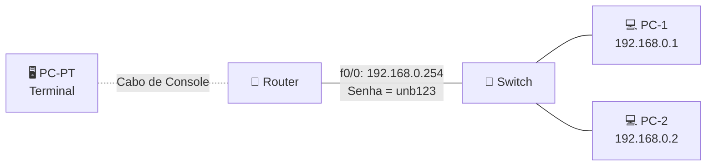

# Laboratório 02 - Configuração básica de roteadores no PNetLab

**Disciplina:** ENE0025 - Protocolos de Transporte e Roteamento  
**Professor responsável:** **Prof. Dr. Laerte Peotta de Melo**  

**Monitores:** Victor Lima dos Santos / Beatriz Silva Nascimento

---

## 1. Visão geral

Este laboratório tem como objetivo introduzir o aluno à configuração inicial de roteadores Cisco em ambiente emulado no **PNetLab**. A prática cobre acesso à CLI, definição de parâmetros básicos de administração, configuração de interface IP, habilitação de acesso remoto seguro e testes de conectividade.

Este é o primeiro cenário prático da disciplina e serve como base para os laboratórios posteriores de roteamento estático e dinâmico.

---

## 2. Objetivos

Ao final deste laboratório, o aluno deverá ser capaz de:

- montar uma topologia básica no PNetLab com terminal, roteador, switch e hosts;
- realizar o acesso inicial ao roteador por meio da porta de console;
- compreender a função de cada elemento da topologia em uma rede local;
- configurar parâmetros básicos de administração no roteador;
- atribuir endereço IP à interface Fa0/0 do roteador;
- configurar o endereçamento IP dos hosts da LAN;
- identificar o papel do gateway padrão na comunicação da rede;
- testar a conectividade entre roteador e estações com comandos de verificação;
- salvar a configuração realizada no equipamento;
- preparar o ambiente para os próximos laboratórios de roteamento.

---

## 3. Topologia

A topologia do laboratório é composta por:

- **1 roteador**
- **1 switch Ethernet**
- **1 Terminal**
- **2 PCS** 
- enlaces Ethernet entre os dispositivos

### Diagrama lógico



---

## 4. Endereçamento IP

| Dispositivo | Interface        | Endereço IP   | Máscara           | Gateway Padrão | Observação                    |
|-------------|------------------|:---------------:|-------------------|:----------------:|-------------------------------|
| Router      | Fa0/0            | 192.168.0.254 | 255.255.255.0     | —              | Interface LAN do roteador     |
| PC 1        | eth0             | 192.168.0.1   | 255.255.255.0     | 192.168.0.254  | Host conectado ao switch      |
| PC 2        | eth0             | 192.168.0.2   | 255.255.255.0     | 192.168.0.254  | Host conectado ao switch      |
| Terminal    | Console          | —             | —                 | —              | Acesso local via cabo console |

---

## 5. Requisitos

- Ambiente **PNetLab** operacional
- Imagem de **roteador Cisco** compatível: **IOL L3-ADVENTERPRISEK9-M-15.4-2T.bin**
- 1 nó **Ethernet Switch** compatível: **L2-ADVENTERPRISEK9-M-15.2-IRON-20151103.bin**
- 2 nó **VPCS**
- Acesso ao console do roteador pelo navegador

---

## 6. Montagem do cenário no PNetLab

Nesta atividade, o cenário deve reproduzir uma topologia simples de rede local com acesso inicial ao roteador por **console** e comunicação dos hosts por meio de uma **LAN Ethernet**.

### 6.1 Dispositivos necessários

Adicionar ao laboratório os seguintes nós no PNetLab conforme o item 5 Requisitos:

- **1 roteador**
- **1 switch**
- **2 PCs** para a rede local
- **1 terminal** para acesso via console ao roteador

> Caso a imagem exata dos equipamentos não esteja disponível no PNetLab, podem ser utilizados dispositivos equivalentes, mantendo a mesma função lógica no cenário.

### 6.2 Conexões da topologia

Realizar as conexões conforme abaixo:

- conectar o **Terminal** à porta **Console** do **Router**
- conectar a interface **Fa0/0** do **Router** ao **Switch**
- conectar o **PC 1** ao switch
- conectar o **PC 2** ao switch

### 6.3 Organização lógica do cenário

A topologia final deverá representar:

- **acesso local ao roteador** por meio de cabo de console;
- **rede LAN 192.168.0.0/24** interligando roteador, switch e hosts;
- **roteador como gateway padrão** da rede local.

### 6.4 Passos de montagem

1. Criar um novo laboratório no PNetLab.
2. Inserir os dispositivos listados na topologia.
3. Renomear os nós para facilitar a identificação:
   - `Terminal`
   - `R1`
   - `SW1`
   - `PC1`
   - `PC2`
4. Conectar os equipamentos conforme o diagrama da atividade.
5. Inicializar todos os nós.
6. Acessar o roteador inicialmente pelo **terminal de console**.
7. Após a configuração da interface `Fa0/0`, validar a conectividade entre os hosts e o roteador.
   
---

## 7. Configuração do roteador

Acessar o console do roteador e executar os comandos abaixo.

### 7.1 Configuração inicial

```bash
enable
configure terminal
hostname R1
no ip domain-lookup
banner motd #
Acesso restrito. Somente usuarios autorizados.
#
enable secret unb123
service password-encryption
```

### 7.2 Configuração da linha de console

```bash
line console 0
password cisco
login
logging synchronous
exec-timeout 10 0
exit
```

### 7.3 Criação de usuário local e habilitação de SSH

```bash
username admin privilege 15 secret Admin@123
ip domain-name unb.lab
crypto key generate rsa
1024
ip ssh version 2
line vty 0 4
login local
transport input ssh
exec-timeout 10 0
logging synchronous
exit
```

### 7.4 Configuração da interface LAN

> Caso a interface disponível no seu roteador tenha outro nome, como `f0/0`, adapte os comandos.

```bash
interface g0/0
description LAN-PNETLAB
no switchport
ip address 192.168.0.254 255.255.255.0
no shutdown
exit
end
copy running-config startup-config
```

---

## 8. Configuração do host VPCS

No terminal do **PC1**, executar:

```bash
ip 192.168.0.1/24 192.168.0.254
save
```
No terminal do **PC2**, executar:

```bash
ip 192.168.0.2/24 192.168.0.254
save
```

---

## 9. Comandos de verificação

### 9.1 No roteador

```bash
show ip interface brief
show running-config
show users
show ssh
```

### 9.2 No PC1

```bash
ping 192.168.0.254
ping 192.168.0.2
```

### 9.2 No PC2

```bash
ping 192.168.0.254
ping 192.168.0.1
```


---

## 10. Resultados esperados

Ao final da montagem, o laboratório deverá permitir:

- Acesso ao roteador via console pelo terminal;
- Comunicação entre o roteador e os dois PCs da LAN;
- Testes de conectividade com `ping` entre hosts e gateway;
- Continuidade das configurações básicas de administração do roteador.

---

## 11. Questões para reflexão

1. Qual a diferença entre acesso **via console** e acesso **remoto pela rede**?
2. Qual a função do comando `no ip domain-lookup` em laboratório?
3. Por que o comando `enable secret` é preferível ao `enable password`?
4. Por que o protocolo SSH é mais seguro que o Telnet?
5. O que ocorre se a interface não receber o comando `no shutdown`?

---

## 13. Entrega

O aluno deverá entregar:

- captura de tela da topologia no PNetLab;
- saída do comando `show ip interface brief`;
- saída do comando `show running-config`;
- evidência do teste de `ping`;
- evidência do acesso remoto via SSH, quando aplicável.

> O aluno deve seguir rigorosamente os **roteiros** utilizando o modelo de [**relatório**](https://github.com/ProfessorLaerte/labredes/blob/main/labs/relatorio.md) e registrar os resultados conforme solicitado.

---

## 15. Conclusão

Este laboratório introduz a configuração básica de roteadores no PNetLab e estabelece as competências mínimas necessárias para os próximos cenários da disciplina. Dominar CLI, interface IP, acesso remoto e testes de conectividade é essencial antes da evolução para protocolos de roteamento e atividades de diagnóstico mais avançadas.
