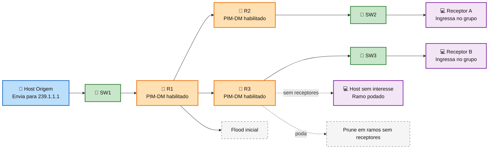
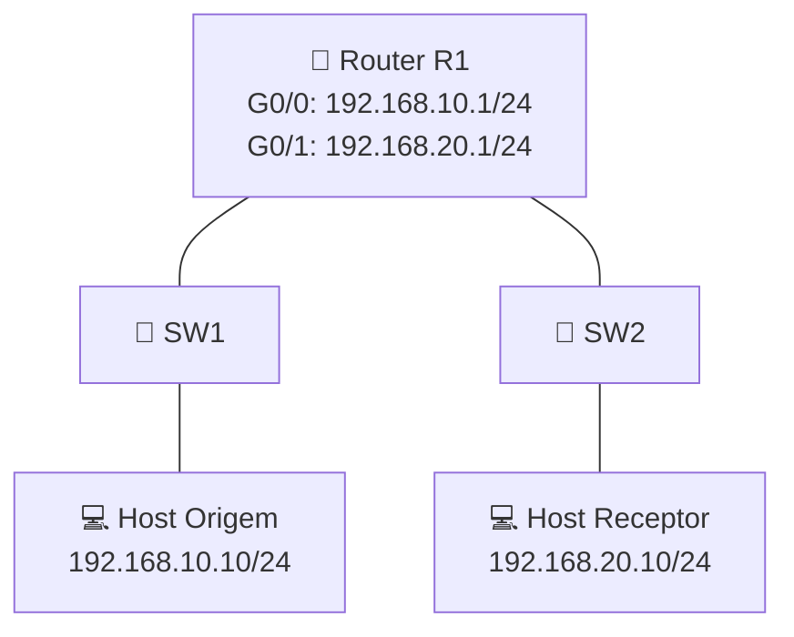

# Laboratório 03 - PIM-DM em topologia controlada

**Disciplina:** ENE0025 - Protocolos de Transporte e Roteamento  
**Professor responsável:** Prof. Dr. Laerte Peotta de Melo  

---

<h2>Podcast desta Aula</h2>

<table>
  <tr>
    <td width="320" align="center">
      <a href="https://open.spotify.com/show/59S06LhFsKlyvfLFQCJ8fK">
        
      </a>
    </td>
    <td valign="top">
      <p>
        O podcast <strong>Latência Zero</strong> apresenta discussões relacionadas a temas
        abordados em aula, com ênfase em <strong>redes de computadores</strong>,
        <strong>latência</strong>, <strong>infraestrutura de comunicação</strong> e
        aspectos práticos da engenharia de redes.
      </p>
      <p>
        <a href="https://open.spotify.com/episode/4DYXfykVe2M5XiUSHmoW7H?si=577680b5f45749a3">Episódio 1: Engenharia do Roteamento Multicast PIM-DM</a>
      </p>
    </td>
  </tr>
</table>


## 1. Tema 

Implementação inicial de **multicast IP com PIM-DM** em uma topologia pequena e controlada no **PNetLab**, validando a formação básica do encaminhamento multicast entre uma origem e um receptor em duas LANs distintas.

---

## 2. Justificativa 

Esta prática introduz o aluno ao roteamento multicast em ambiente controlado. Após a configuração básica de interfaces e conectividade IP em laboratório anterior, o estudante passa a observar:

- tráfego **unicast** como base para o funcionamento do multicast;
- habilitação de **multicast routing** no roteador;
- ativação do **PIM Dense Mode (PIM-DM)**;
- formação da tabela de rotas multicast;
- encaminhamento de tráfego multicast entre redes diferentes.

A atividade foi estruturada para simplificar o primeiro contato com multicast roteado.

---

## Fundamentação teórica

Protocolos de roteamento tradicionais foram concebidos para comunicação **unicast**, em que um emissor envia pacotes para um único destino. Em aplicações como transmissão de vídeo, distribuição de conteúdo em tempo real, aulas ao vivo, monitoramento e replicação simultânea de dados, esse modelo pode ser ineficiente, pois obriga a origem a enviar múltiplas cópias do mesmo fluxo para diferentes receptores. Nesse contexto surge o **multicast IP**, cujo objetivo é permitir que um mesmo fluxo seja entregue a vários receptores interessados, reduzindo consumo de banda e processamento na origem.

### Diagrama explicativo do conceito de multicast com PIM-DM



No modelo multicast, os receptores passam a fazer parte de um **grupo multicast**, identificado por um endereço de classe D no IPv4, normalmente no intervalo de `224.0.0.0` a `239.255.255.255`. Um host emissor envia pacotes para o endereço do grupo, e a rede se encarrega de replicar esse tráfego apenas nos pontos necessários. Isso torna o encaminhamento mais eficiente do que no broadcast, que alcança todos os dispositivos do domínio, e mais escalável do que múltiplas transmissões unicast paralelas. Para que o roteamento multicast funcione, não basta apenas que a rede tenha conectividade IP entre as sub-redes. É necessário que os roteadores saibam **como encaminhar o tráfego multicast** e, principalmente, **por quais interfaces esse tráfego deve ser recebido e reenviado**. É nesse ponto que entra o **PIM - Protocol Independent Multicast**. O termo *independent* indica que o PIM não depende de um protocolo unicast específico, como RIP, OSPF ou EIGRP. Em vez disso, ele utiliza a tabela de roteamento unicast já existente para tomar decisões sobre o melhor caminho reverso até a origem do tráfego.

Entre os modos de operação do PIM, o **PIM Dense Mode (PIM-DM)** foi projetado para ambientes em que os receptores estão distribuídos de forma relativamente densa na rede, isto é, quando se supõe que muitos segmentos da topologia desejam receber o tráfego multicast. Seu funcionamento baseia-se na lógica de **flood and prune** (Inundar e Podar). Inicialmente, quando surge um fluxo multicast, o roteador propaga o tráfego para todas as interfaces habilitadas para PIM-DM, exceto aquela pela qual o pacote foi recebido. Em seguida, os roteadores que não possuem receptores interessados enviam mensagens de **prune**, interrompendo a distribuição naquele ramo da árvore multicast. Esse comportamento torna o PIM-DM adequado para laboratórios introdutórios, pois dispensa, em um primeiro momento, elementos adicionais como **Rendezvous Point (RP)**, exigidos em cenários com **PIM Sparse Mode (PIM-SM)**. Em compensação, o PIM-DM pode gerar envio desnecessário de tráfego em redes grandes, já que o fluxo é inicialmente inundado antes do processo de poda. Por isso, ele é mais apropriado em cenários controlados, pequenos e com elevada probabilidade de interesse pelo fluxo multicast. Outro conceito central para compreender o PIM-DM é o **RPF - Reverse Path Forwarding**. Esse mecanismo verifica se um pacote multicast chegou pela interface que corresponde ao melhor caminho de volta até a origem, segundo a tabela unicast. Se o pacote chega por essa interface esperada, ele pode ser encaminhado; caso contrário, é descartado. Essa regra ajuda a evitar loops e garante consistência na árvore de distribuição multicast. Assim, mesmo sendo um protocolo multicast, o PIM depende diretamente da qualidade da base unicast configurada na rede.


>Na prática, o funcionamento multicast também envolve o comportamento dos hosts. Os receptores precisam manifestar interesse em participar de um grupo, normalmente por meio do **IGMP (Internet Group Management Protocol)** em redes IPv4. Em um laboratório simplificado, muitas vezes o foco recai sobre a ativação do multicast no roteador e a geração de tráfego para um endereço de grupo, mas é importante compreender que, em cenários reais, a adesão dos hosts ao grupo é fundamental para que a rede saiba onde o tráfego deve ser mantido ou podado.

---

## 3. Objetivos

Ao final desta atividade, o aluno deverá ser capaz de:

- montar uma topologia controlada de multicast no **PNetLab**;
- configurar interfaces IP em roteador e hosts;
- habilitar o roteamento multicast com `ip multicast-routing`;
- ativar o **PIM-DM** nas interfaces do roteador;
- gerar tráfego multicast de teste;
- verificar a operação básica do encaminhamento multicast;
- analisar a relação entre a tabela unicast e a tabela multicast;
- validar o funcionamento do grupo multicast configurado.

---


## 4. Topologia proposta



---

## 5. Endereçamento IP

| Dispositivo   | Interface | Endereço IP   | Máscara           |Gateway          |
|---------------|-----------|---------------|-------------------|:-----------------:|
| R1            | G0/0      | 192.168.10.1  | 255.255.255.0     | -               |
| R1            | G0/1      | 192.168.20.1  | 255.255.255.0     | -               |
| Host Origem   | eth0      | 192.168.10.10 | 255.255.255.0     | 192.168.10.1    |
| Host Receptor | eth0      | 192.168.20.10 | 255.255.255.0     | 192.168.20.1    |

**Grupo multicast sugerido:** `239.1.1.1`  
**Porta UDP de teste:** `5000`

---

## 6. Montagem do cenário no PNetLab

### 6.1 Dispositivos necessários

Adicionar ao laboratório os seguintes nós:

- Imagem de **roteador Cisco** compatível: **IOL L3-ADVENTERPRISEK9-M-15.4-2T.bin**
- 2 nó **Ethernet Switch** compatível: **L2-ADVENTERPRISEK9-M-15.2-IRON-20151103.bin**
- **2 hosts**,  Linux leves.

### 6.2 Conexões da topologia

Realizar as conexões conforme abaixo:

- conectar o **Host Origem** ao **SW1**;
- conectar o **SW1** à interface **G0/0** do **R1**;
- conectar o **Host Receptor** ao **SW2**;
- conectar o **SW2** à interface **G0/1** do **R1**.

### 6.3 Resultado esperado da montagem

Ao final da montagem, o cenário deverá permitir:

- comunicação unicast entre cada host e sua interface de gateway;
- ativação do multicast no roteador;
- encaminhamento multicast entre as duas redes;
- visualização da tabela multicast no roteador.

---

## 7. Configuração do roteador

### 7.1 Configuração básica das interfaces

```bash
enable
configure terminal
hostname R1
no ip domain-lookup

interface g0/0
 description LAN-ORIGEM
 ip address 192.168.10.1 255.255.255.0
 no shutdown
 exit

interface g0/1
 description LAN-RECEPTOR
 ip address 192.168.20.1 255.255.255.0
 no shutdown
 exit
```

### 7.2 Habilitação do multicast e do PIM-DM

```bash
ip multicast-routing

interface g0/0
 ip pim dense-mode
 exit

interface g0/1
 ip pim dense-mode
 exit

end
copy running-config startup-config
```

---

## 8. Configuração dos hosts

### 8.1 Host Origem

No **Host Origem (Linux simples)**:

```bash
ip addr add 192.168.10.10/24 dev eth0
ip link set eth0 up
ip route add default via 192.168.10.1
```

### 8.2 Host Receptor

No **Host Origem (Linux simples)**:

```bash
ip addr add 192.168.20.10/24 dev eth0
ip link set eth0 up
ip route add default via 192.168.20.1
```

---

## 9. Geração de tráfego multicast

Para testes de multicast, recomenda-se utilizar **hosts Linux leves** no PNetLab com suporte a ferramentas como `iperf`.

### 9.1 No Host Receptor

```bash
iperf -s -u -B 239.1.1.1 -i 1
```

### 9.2 No Host Origem

```bash
iperf -c 239.1.1.1 -u -T 32 -t 30 -i 1
```

> Caso a imagem utilizada não possua `iperf`, podem ser usados `iperf2`, `socat` ou outra ferramenta compatível com envio e recepção multicast.

---

## 10. Comandos de verificação no roteador

```bash
show ip interface brief
show ip pim interface
show ip mroute
show ip route
```

### 10.1 O que observar

- interfaces `G0/0` e `G0/1` em estado `up/up`;
- PIM habilitado nas interfaces;
- existência de entradas multicast em `show ip mroute`;
- coerência entre interface de entrada, interface de saída e origem do tráfego.

---

## 11. Resultados esperados

Ao concluir a atividade, o aluno deve verificar que:

- o tráfego multicast sai da rede de origem e alcança a rede do receptor;
- o roteador mantém informações multicast específicas para o grupo configurado;
- o funcionamento do PIM depende da base de encaminhamento unicast já estabelecida;
- a topologia controlada permite visualizar o comportamento inicial do PIM-DM com baixa complexidade.

---

## 12. Checklist de validação

- [ ] Topologia criada corretamente no PNetLab  
- [ ] Interfaces do roteador configuradas com os IPs corretos  
- [ ] Hosts configurados com IP e gateway corretos  
- [ ] Comando `ip multicast-routing` habilitado  
- [ ] PIM-DM configurado nas interfaces do roteador  
- [ ] Tráfego multicast gerado no host de origem  
- [ ] Recepção do fluxo multicast no host receptor  
- [ ] Saída de `show ip pim interface` validada  
- [ ] Saída de `show ip mroute` validada  
- [ ] Configuração salva com sucesso  

---

## 13. Questões para análise

1. Por que o PIM é considerado independente do protocolo de roteamento unicast?
2. Qual a diferença entre tráfego unicast e multicast neste cenário?
3. Qual a função do comando `ip multicast-routing`?
4. Por que o PIM-DM é uma boa escolha para uma primeira atividade prática?
5. O que a tabela `show ip mroute` revela sobre o encaminhamento multicast?

---

## 14. Entrega

O aluno deverá entregar:

- captura de tela da topologia montada no PNetLab;
- configuração aplicada no roteador;
- saída dos comandos `show ip pim interface` e `show ip mroute`;
- evidência do envio do tráfego multicast;
- evidência da recepção do tráfego multicast.

---

## 15. Observação técnica

Nem toda imagem de roteador Cisco disponível no PNetLab suporta multicast/PIM integralmente. Para esta atividade, recomenda-se utilizar imagens como:

- **IOSv**
- **CSR1000v**
- outra imagem com suporte explícito a:
  - `ip multicast-routing`
  - `ip pim dense-mode`

---

## 16. Conclusão

Esta atividade apresenta o primeiro cenário prático de multicast IP com PIM-DM em ambiente controlado no PNetLab. O laboratório permite que o aluno compreenda como o roteador passa a tratar tráfego multicast, formando a base conceitual e operacional necessária para topologias mais complexas nas próximas práticas.

---

[← Anterior: Laboratório 02](lab02.md) | [Índice Geral (README)](../README.md) | [Próximo: Laboratório 04 →](lab04.md)

