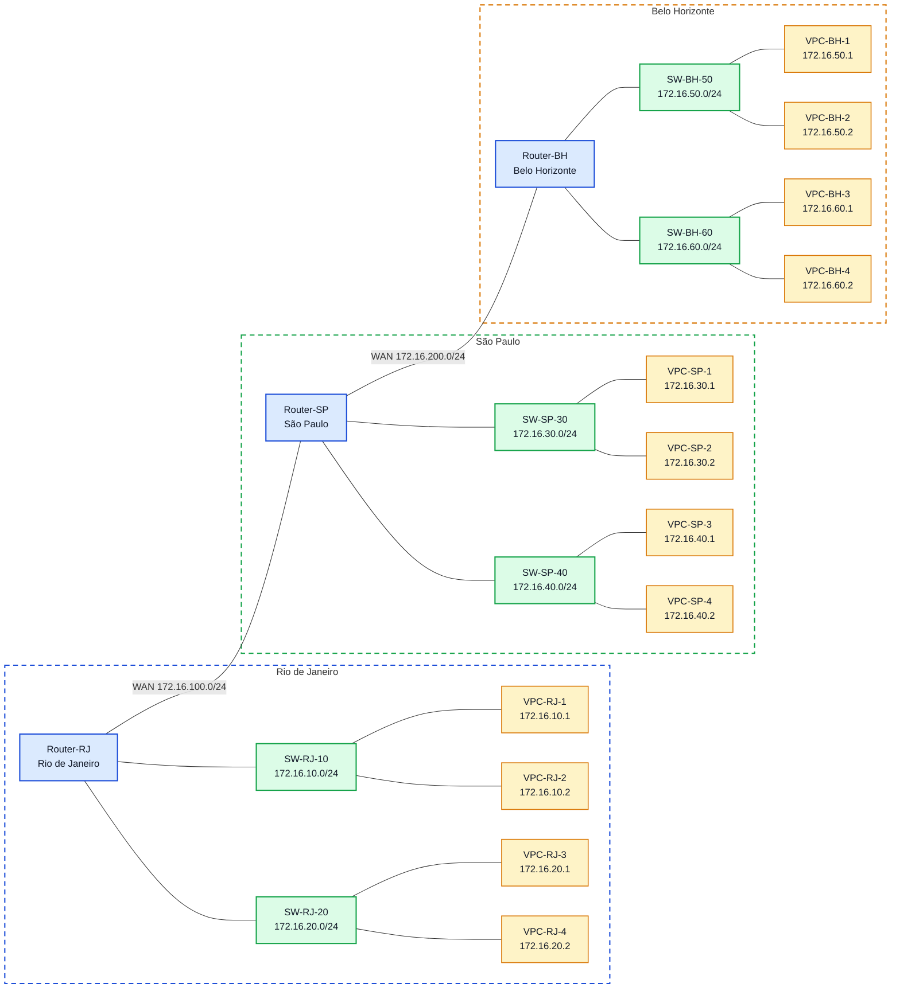

# Laboratório 05 - Roteamento Dinâmico com OSPF

**Disciplina:** ENE0025 - Protocolos de Transporte e Roteamento  
**Professor responsável:** Prof. Dr. Laerte Peotta de Melo  
**Monitores:** 

---
<h2>Podcast desta Aula</h2>

<table>
  <tr>
    <td width="320" align="center">
      <a href="https://open.spotify.com/show/59S06LhFsKlyvfLFQCJ8fK">
        
      </a>
    </td>
    <td valign="top">
      <p>
        O podcast <strong>Latência Zero</strong> apresenta discussões relacionadas a temas
        abordados em aula, com ênfase em <strong>redes de computadores</strong>,
        <strong>latência</strong>, <strong>infraestrutura de comunicação</strong> e
        aspectos práticos da engenharia de redes.
      </p>
      <p>
        <a href="https://open.spotify.com/episode/6ha3fZPjrfBp8ZQNyIfTps?si=754a105ed6474063">Episódio 4: RIP versus OSPF na prática</a>
      </p>
    </td>
  </tr>
</table>

## 1. Objetivo

Configurar e validar o roteamento dinâmico com **OSPF** em uma topologia com três roteadores, compreendendo seu funcionamento como protocolo do tipo link-state e comparando-o conceitualmente com o RIP.

---

## 2. Objetivos específicos

Ao final deste laboratório, o estudante deverá ser capaz de:

- configurar interfaces IP em roteadores Cisco;
- ativar roteamento dinâmico com OSPF em área única (área 0);
- verificar a formação de adjacências OSPF;
- verificar tabelas de roteamento e custos de rota;
- validar conectividade entre redes remotas;
- capturar e analisar pacotes OSPF com o Wireshark, identificando os tipos de mensagem do protocolo (Hello, DBD, LSR, LSU, LSAck);
- explicar, por comparação, por que o OSPF é mais indicado que o RIP em redes maiores e mais complexas.

---

## 3. Fundamentação teórica

O roteador precisa saber por onde encaminhar os pacotes para que eles cheguem ao destino correto. Para isso, ele mantém uma tabela de rotas, que funciona como um mapa interno da rede. Essas informações podem ser inseridas de duas formas: manualmente pelo administrador, no caso do roteamento estático, ou aprendidas automaticamente, por meio dos protocolos de roteamento dinâmico. No roteamento dinâmico, os roteadores trocam informações entre si para descobrir quais redes existem e qual é o melhor caminho até elas. Isso torna a rede mais flexível, porque as rotas podem ser atualizadas automaticamente quando ocorre alguma mudança, como a queda de um enlace ou a entrada de uma nova rede.

Os protocolos de roteamento dinâmico podem ser divididos em dois grandes grupos. O primeiro é o dos protocolos internos, chamados de IGP (Interior Gateway Protocol), usados dentro de uma mesma organização, como uma empresa, universidade ou órgão público. O segundo é o dos protocolos externos, chamados de EGP (Exterior Gateway Protocol), usados na comunicação entre redes diferentes na Internet. O OSPF é um IGP, e é o protocolo em foco neste laboratório.

### 3.1 Por que OSPF?

O OSPF (Open Shortest Path First) é um protocolo do tipo **link-state**. Cada roteador constrói uma visão lógica completa da topologia da rede (o *link-state database*) e calcula o melhor caminho até cada destino usando o algoritmo **SPF/Dijkstra**. Com isso, o OSPF oferece maior escalabilidade, convergência mais rápida diante de falhas e uma organização lógica da rede em áreas, sendo o protocolo mais adequado para ambientes corporativos maiores e mais exigentes — como o cenário multi-unidades deste laboratório.

O OSPF se parece com o uso de um aplicativo de navegação, um GPS mais inteligente: ele não olha apenas quantos roteadores existem no caminho, mas monta um mapa completo da rede e escolhe a rota de menor custo cumulativo (baseado na largura de banda dos enlaces), antes de decidir o trajeto. Por isso, toma decisões melhores em cenários maiores e mais complexos que os de uma rede pequena.

### 3.2 Nota comparativa: OSPF x RIP

Para contextualizar as vantagens do OSPF, vale registrar como o RIP resolveria o mesmo problema. O RIP é um protocolo **distance-vector**, baseado no algoritmo Bellman-Ford, que escolhe rotas apenas pela contagem de saltos (quantos roteadores o pacote atravessa), sem considerar a qualidade ou capacidade dos enlaces. Como aceita no máximo 15 saltos e converge mais lentamente, o RIP é adequado apenas para redes pequenas e simples. É como pedir uma direção e receber a resposta "vá pelo caminho com menos cruzamentos", sem levar em conta se há trânsito ou se a via é melhor.

Essa comparação será retomada na Seção 12, mas a partir daqui todo o laboratório é conduzido apenas com **OSPF**.


---

## 4. Topologia do laboratório

A topologia possui três roteadores interligando três unidades:

- **Router-RJ** - Rio de Janeiro
- **Router-SP** - São Paulo
- **Router-BH** - Belo Horizonte

Cada unidade possui duas LANs locais, e os roteadores são interligados por duas redes WAN.



---

## 5. Plano de endereçamento

## Tipos de interfaces

- **`f` = FastEthernet**  
  Interface Ethernet de menor velocidade, muito comum em laboratórios e em equipamentos mais antigos.  
  **Exemplo de uso:** conexão do roteador a uma rede local ou a um switch.  
  **Exemplo de interface:** `f0/0`, `f0/1`

- **`g` = GigabitEthernet**  
  Interface Ethernet de maior velocidade, bastante usada em redes atuais.  
  **Exemplo de uso:** uplink entre switches, conexão do roteador com a LAN principal ou com outro equipamento de maior capacidade.  
  **Exemplo de interface:** `g0/0`, `g0/1`

- **`s` = Serial**  
  Interface serial, muito utilizada em cenários WAN e em laboratórios de roteamento entre roteadores.  
  **Exemplo de uso:** enlace entre duas filiais ou conexão ponto a ponto entre roteadores.  
  **Exemplo de interface:** `s0/0`, `s0/1`

- **`lo` = Loopback**  
  Interface lógica, não física, criada por software.  
  **Exemplo de uso:** testes de conectividade, identificação estável do roteador e uso em protocolos de roteamento (por exemplo, para definir o Router ID do OSPF).  
  **Exemplo de interface:** `lo0`

- **`vlan` = interface lógica de VLAN**  
  Interface virtual associada a uma VLAN, muito comum em switches camada 3.  
  **Exemplo de uso:** gerenciamento do switch ou roteamento entre VLANs.  
  **Exemplo de interface:** `interface vlan 10`

- **`tunnel` = interface virtual de túnel**  
  Interface lógica usada para encapsular tráfego e criar comunicação virtual entre dois pontos.  
  **Exemplo de uso:** VPN, GRE ou transporte de IPv6 sobre IPv4.  
  **Exemplo de interface:** `tunnel0`

O cenário segue uma lógica simples com redes da faixa `172.16.0.0/16`, organizadas em sub-redes `/24`.

### 5.1 Redes utilizadas

| Segmento | Rede | Máscara |
|---|---|---|
| LAN RJ-10 | 172.16.10.0 | 255.255.255.0 |
| LAN RJ-20 | 172.16.20.0 | 255.255.255.0 |
| WAN RJ-SP | 172.16.100.0 | 255.255.255.0 |
| LAN SP-30 | 172.16.30.0 | 255.255.255.0 |
| LAN SP-40 | 172.16.40.0 | 255.255.255.0 |
| WAN SP-BH | 172.16.200.0 | 255.255.255.0 |
| LAN BH-50 | 172.16.50.0 | 255.255.255.0 |
| LAN BH-60 | 172.16.60.0 | 255.255.255.0 |

### 5.2 Endereçamento das interfaces dos roteadores

#### Router-RJ

| Interface | Endereço IP | Máscara | Função |
|---|---|---|---|
| `g0/0` | 172.16.100.1 | 255.255.255.0 | WAN para São Paulo |
| `f0/0` | 172.16.10.254 | 255.255.255.0 | LAN RJ-10 |
| `f0/1` | 172.16.20.254 | 255.255.255.0 | LAN RJ-20 |

#### Router-SP

| Interface | Endereço IP | Máscara | Função |
|---|---|---|---|
| `g0/0` | 172.16.100.2 | 255.255.255.0 | WAN para Rio de Janeiro |
| `f0/0` | 172.16.30.254 | 255.255.255.0 | LAN SP-30 |
| `f0/1` | 172.16.40.254 | 255.255.255.0 | LAN SP-40 |
| `g0/1` | 172.16.200.1 | 255.255.255.0 | WAN para Belo Horizonte |

#### Router-BH

| Interface | Endereço IP | Máscara | Função |
|---|---|---|---|
| `g0/0` | 172.16.200.2 | 255.255.255.0 | WAN para São Paulo |
| `f0/0` | 172.16.50.254 | 255.255.255.0 | LAN BH-50 |
| `f0/1` | 172.16.60.254 | 255.255.255.0 | LAN BH-60 |

### 5.3 Endereçamento dos hosts

| Host | Endereço IP | Máscara | Gateway |
|---|---|---|---|
| VPC-RJ-10-1 | 172.16.10.1 | 255.255.255.0 | 172.16.10.254 |
| VPC-RJ-10-2 | 172.16.10.2 | 255.255.255.0 | 172.16.10.254 |
| VPC-RJ-20-1 | 172.16.20.1 | 255.255.255.0 | 172.16.20.254 |
| VPC-RJ-20-2 | 172.16.20.2 | 255.255.255.0 | 172.16.20.254 |
| VPC-SP-30-1 | 172.16.30.1 | 255.255.255.0 | 172.16.30.254 |
| VPC-SP-30-2 | 172.16.30.2 | 255.255.255.0 | 172.16.30.254 |
| VPC-SP-40-1 | 172.16.40.1 | 255.255.255.0 | 172.16.40.254 |
| VPC-SP-40-2 | 172.16.40.2 | 255.255.255.0 | 172.16.40.254 |
| VPC-BH-50-1 | 172.16.50.1 | 255.255.255.0 | 172.16.50.254 |
| VPC-BH-50-2 | 172.16.50.2 | 255.255.255.0 | 172.16.50.254 |
| VPC-BH-60-1 | 172.16.60.1 | 255.255.255.0 | 172.16.60.254 |
| VPC-BH-60-2 | 172.16.60.2 | 255.255.255.0 | 172.16.60.254 |

---

## 6. Montagem no PNetLab

Montar a topologia com:

- 3 roteadores Cisco;
- 6 switches;
- 12 PCs;
- 2 enlaces WAN entre os roteadores;
- enlaces Ethernet entre roteadores, switches e hosts.

---

## 7. Configuração básica das interfaces

> Obs.: antes de configurar as interfaces dos roteadores, é interessante configurar os endereços das máquinas que representam as sub-redes, com seus respectivos gateways. É importante lembrar que o gateway de cada sub-rede será a interface do roteador que foi configurada como membro dessa mesma sub-rede.

### Configuração para PC-BH-60-2 (Exemplo)

```bash
O formato básico é ip <ip_address> <subnet_mask> <gateway>

ip 172.16.60.2 255.255.255.0 172.16.60.254
show ip
save
```

Repita o mesmo comando para todos os outros VPCs considerando a seção **5.3 Endereçamento dos hosts**.

### 7.1 Router-RJ

```bash
Router> enable
Router# configure terminal
Router(config)# hostname Router-RJ
Router-RJ(config)# interface g0/0
Router-RJ(config-if)# ip address 172.16.100.1 255.255.255.0
Router-RJ(config-if)# no shut
Router-RJ(config-if)# interface f0/0
Router-RJ(config-if)# ip address 172.16.10.254 255.255.255.0
Router-RJ(config-if)# no shut
Router-RJ(config-if)# interface f0/1
Router-RJ(config-if)# ip address 172.16.20.254 255.255.255.0
Router-RJ(config-if)# no shut
Router-RJ(config-if)# end
```

### 7.2 Router-SP

```bash
Router> enable
Router# configure terminal
Router(config)# hostname Router-SP
Router-SP(config)# interface g0/0
Router-SP(config-if)# ip address 172.16.100.2 255.255.255.0
Router-SP(config-if)# no shut
Router-SP(config-if)# interface g0/1
Router-SP(config-if)# ip address 172.16.200.1 255.255.255.0
Router-SP(config-if)# no shut
Router-SP(config-if)# interface f0/0
Router-SP(config-if)# ip address 172.16.30.254 255.255.255.0
Router-SP(config-if)# no shut
Router-SP(config-if)# interface f0/1
Router-SP(config-if)# ip address 172.16.40.254 255.255.255.0
Router-SP(config-if)# no shut
Router-SP(config-if)# end
```

### 7.3 Router-BH

```bash
Router> enable
Router# configure terminal
Router(config)# hostname Router-BH
Router-BH(config)# interface g0/0
Router-BH(config-if)# ip address 172.16.200.2 255.255.255.0
Router-BH(config-if)# no shut
Router-BH(config-if)# interface f0/0
Router-BH(config-if)# ip address 172.16.50.254 255.255.255.0
Router-BH(config-if)# no shut
Router-BH(config-if)# interface f0/1
Router-BH(config-if)# ip address 172.16.60.254 255.255.255.0
Router-BH(config-if)# no shut
Router-BH(config-if)# end
```

---

## 8. Verificação inicial sem roteamento dinâmico

Antes de configurar o OSPF, verificar:

- conectividade apenas entre redes diretamente conectadas;
- ausência de rotas remotas;
- tabela de rotas contendo apenas rotas conectadas.

### Comando de verificação

```bash
show ip route
```

### Resultado esperado

- presença de rotas `C` e `L`;
- ausência de rotas aprendidas dinamicamente;
- pings bem-sucedidos apenas para redes diretamente conectadas.

---

## 9. Configuração do OSPF

Neste laboratório será utilizada apenas a **área 0** (backbone), com objetivo introdutório. Cada roteador anuncia diretamente as sub-redes `/24` às quais está conectado — diferente do RIP, que neste mesmo cenário poderia anunciar de forma simplificada a rede sumarizada `172.16.0.0`. No OSPF, essa granularidade por sub-rede é o que permite ao protocolo montar um mapa preciso da topologia.

### 9.1 Router-RJ

```bash
Router-RJ> enable
Router-RJ# configure terminal
Router-RJ(config)# router ospf 64
Router-RJ(config-router)# network 172.16.10.0 0.0.0.255 area 0
Router-RJ(config-router)# network 172.16.20.0 0.0.0.255 area 0
Router-RJ(config-router)# network 172.16.100.0 0.0.0.255 area 0
Router-RJ(config-router)# end
```

### 9.2 Router-SP

```bash
Router-SP> enable
Router-SP# configure terminal
Router-SP(config)# router ospf 65
Router-SP(config-router)# network 172.16.30.0 0.0.0.255 area 0
Router-SP(config-router)# network 172.16.40.0 0.0.0.255 area 0
Router-SP(config-router)# network 172.16.100.0 0.0.0.255 area 0
Router-SP(config-router)# network 172.16.200.0 0.0.0.255 area 0
Router-SP(config-router)# end
```

### 9.3 Router-BH

```bash
Router-BH> enable
Router-BH# configure terminal
Router-BH(config)# router ospf 66
Router-BH(config-router)# network 172.16.50.0 0.0.0.255 area 0
Router-BH(config-router)# network 172.16.60.0 0.0.0.255 area 0
Router-BH(config-router)# network 172.16.200.0 0.0.0.255 area 0
Router-BH(config-router)# end
```

> **Nota:** os números de processo OSPF (64, 65, 66) são identificadores **locais**, válidos apenas dentro de cada roteador — não precisam ser iguais entre roteadores para que a adjacência se forme, ao contrário do que ocorre, por exemplo, com o *Autonomous System* no EIGRP.

---

## 10. Verificação do OSPF

### Comandos em todos os roteadores

```bash
show ip ospf neighbor
show ip route
show ip protocols
ping 172.16.30.1
ping 172.16.40.1
ping 172.16.50.1
ping 172.16.60.1
```

### Resultado esperado

- adjacência OSPF (estado `FULL`) formada entre RJ-SP e SP-BH;
- rotas aprendidas na tabela de roteamento com marcação `O`;
- conectividade total entre todas as LANs;
- custo de rota (`cost`) visível em `show ip route`, calculado a partir da largura de banda dos enlaces — diferente do RIP, que exibiria apenas a contagem de saltos.

---

## 11. Captura e análise de pacotes OSPF com Wireshark

Com a adjacência OSPF já formada (Seção 10), o objetivo desta etapa é observar o protocolo "por dentro", capturando o tráfego trocado entre os roteadores e identificando cada tipo de mensagem OSPF na prática.

### 11.1 Posicionamento da captura

No PNetLab, habilitar a captura (ícone de *Wireshark*/*capture*) diretamente sobre um dos enlaces WAN, por exemplo o enlace entre **Router-RJ** e **Router-SP** (rede `172.16.100.0/24`). Capturar nesse ponto permite observar a troca de mensagens entre dois vizinhos OSPF sem o ruído de tráfego das LANs.

### 11.2 Gerando tráfego OSPF para captura

Para capturar o processo completo de formação de adjacência (e não apenas os Hellos de manutenção), reiniciar o processo OSPF em um dos roteadores enquanto a captura estiver ativa:

```bash
Router-SP# clear ip ospf process
```

> O comando `clear ip ospf process` força o roteador a derrubar e reformar a adjacência, reiniciando toda a sequência de estados (`Down → Init → 2-Way → ExStart → Exchange → Loading → Full`) — o que garante que a captura registre todos os tipos de pacote OSPF, não apenas os Hellos periódicos.

### 11.3 Filtro no Wireshark

Aplicar o filtro de exibição para isolar apenas o tráfego OSPF (protocolo IP 89):

```text
ospf
```

Filtros complementares úteis:

```text
ospf.msg == 1   # Hello
ospf.msg == 2   # Database Description (DBD)
ospf.msg == 3   # Link State Request (LSR)
ospf.msg == 4   # Link State Update (LSU)
ospf.msg == 5   # Link State Acknowledgment (LSAck)
```

### 11.4 O que identificar em cada tipo de pacote

| Tipo (msg) | Nome | O que observar na captura |
|---|---|---|
| 1 | Hello | Endereço de origem/destino multicast (`224.0.0.5`); campos *Router ID*, *Area ID*, *Hello Interval* e *Dead Interval*; lista de vizinhos já conhecidos |
| 2 | Database Description (DBD) | Troca do resumo do *link-state database*; bits `I/M/MS` indicando início, continuação e quem é mestre da troca |
| 3 | Link State Request (LSR) | Solicitação dos LSAs completos que o roteador ainda não possui |
| 4 | Link State Update (LSU) | Envio dos LSAs completos (ex.: *Router LSA*, *Network LSA*); é aqui que aparece o custo de cada enlace anunciado |
| 5 | Link State Acknowledgment (LSAck) | Confirmação de recebimento dos LSAs, garantindo a entrega confiável do protocolo |

### 11.5 Roteiro de análise sugerido

1. Localizar o primeiro pacote **Hello** após o `clear ip ospf process` e identificar o *Router ID* de origem.
2. Acompanhar a sequência **Hello → DBD → LSR → LSU → LSAck** e relacioná-la com a saída de `show ip ospf neighbor` (estado `FULL`) obtida na Seção 10.
3. Abrir um pacote **LSU** e localizar o custo (*metric*) anunciado para uma das LANs (por exemplo, `172.16.30.0/24`), comparando com o valor visto em `show ip ospf interface`.
4. Verificar o endereço de destino multicast `224.0.0.5` (All OSPF Routers) usado nos Hellos, e `224.0.0.6` (All DR Routers), caso apareça em algum pacote.
5. Salvar a captura (`.pcapng`) e destacar, com anotações, ao menos um pacote de cada tipo (Hello, DBD, LSR, LSU, LSAck).

---

## 12. Aprofundando o OSPF

### 11.1 Router ID

Verificar o Router ID escolhido automaticamente por cada roteador:

```bash
show ip ospf
show ip protocols
```

O Router ID é escolhido, por padrão, a partir do maior endereço IP entre as interfaces de loopback ativas ou, na ausência delas, entre as interfaces físicas ativas. Em ambientes de produção, é comum fixá-lo manualmente com uma interface de loopback dedicada, para evitar que ele mude após uma reinicialização de interface.

### 11.2 Custo (cost) da rota OSPF

O custo de cada interface é calculado por padrão como `100.000.000 / largura de banda (bps)`. Verificar o custo configurado em cada interface:

```bash
show ip ospf interface g0/0
show ip ospf interface f0/0
```

### 11.3 Tipos de vizinhança e estados

Observar a progressão dos estados de vizinhança OSPF durante a formação da adjacência (`Down → Init → 2-Way → ExStart → Exchange → Loading → Full`):

```bash
show ip ospf neighbor
debug ip ospf adj
```

> Lembrar de desativar o `debug` ao final com `undebug all` ou `no debug ip ospf adj`.

---

## 13. Comparação orientada entre OSPF e RIP

Este laboratório foi conduzido inteiramente em OSPF. Ainda assim, é importante que o estudante compreenda, ao menos conceitualmente, por que essa escolha foi feita. Responder, com base na fundamentação teórica (Seção 3) e na experiência prática deste laboratório:

1. Por que o OSPF é mais adequado do que o RIP para um cenário com três unidades distintas como este?
2. Qual algoritmo é usado pelo OSPF, e em que ele difere do algoritmo Bellman-Ford usado pelo RIP?
3. O que significa o OSPF ser um protocolo *link-state*, em oposição a um *distance-vector* como o RIP?
4. Como o custo (cost) do OSPF, baseado em largura de banda, produz decisões de roteamento diferentes da contagem de saltos do RIP?
5. Em que cenário (rede pequena, plana e estável) o RIP ainda seria uma escolha aceitável apesar de suas limitações?
6. Qual dos dois protocolos converge mais rapidamente após a queda de um enlace, e por quê?

---

## 14. Troubleshooting proposto

### Situação 1 – Remover uma rede do anúncio OSPF em São Paulo

```bash
configure terminal
router ospf 65
 no network 172.16.40.0 0.0.0.255 area 0
end
```

Verificar:

- perda de rota para a rede `172.16.40.0/24`;
- impacto na conectividade;
- necessidade de restaurar a configuração.

### Situação 2 – Interromper o enlace SP-BH

```bash
configure terminal
interface g0/1
 shutdown
end
```

Verificar:

- perda da adjacência com BH;
- remoção de rotas remotas;
- impacto nos testes de ping;
- tempo de convergência do OSPF até a atualização da tabela de rotas.

Restaurar:

```bash
configure terminal
interface g0/1
 no shutdown
end
```

### Situação 3 – Alterar a área de uma rede (erro de configuração comum)

```bash
configure terminal
router ospf 66
 no network 172.16.60.0 0.0.0.255 area 0
 network 172.16.60.0 0.0.0.255 area 1
end
```

Verificar:

- por que essa alteração quebra a adjacência (área 1 sem conexão à área 0/backbone, em uma topologia de área única);
- restaurar para `area 0`.

---

## 15. Testes sugeridos

### 14.1 Teste de alcance entre unidades

A partir de um host do Rio de Janeiro, testar conectividade com São Paulo e Belo Horizonte.

Exemplo a partir do PC-RJ-10-1:

```bash
ping 172.16.30.1
ping 172.16.40.1
ping 172.16.50.1
ping 172.16.60.1
```

### 14.2 Teste de tabela de rotas

```bash
show ip route
```

### 14.3 Teste de vizinhança OSPF

```bash
show ip ospf neighbor
```

---

## 16. Critérios de avaliação

| Critério | Pontos |
|---|---:|
| Configuração correta das interfaces | 1,5 |
| Funcionamento do OSPF (adjacências e rotas) | 2,5 |
| Testes de conectividade | 1,5 |
| Captura e análise de pacotes OSPF no Wireshark | 2,0 |
| Troubleshooting proposto | 1,0 |
| Análise comparativa OSPF x RIP | 1,5 |

**Total: 10,0**

---

## 17. Entregáveis

- print da topologia no PNetLab;
- print do `show ip ospf neighbor`;
- print do `show ip route` com OSPF;
- print do `show ip ospf interface` de pelo menos uma interface;
- print de todas as saídas dos itens 10 e 11;
- arquivo de captura do Wireshark (`.pcapng`) com o tráfego OSPF, incluindo ao menos um pacote de cada tipo (Hello, DBD, LSR, LSU, LSAck);
- breve relatório contendo:
  - objetivo;
  - topologia;
  - comandos aplicados;
  - testes realizados;
  - análise dos pacotes OSPF capturados;
  - comparação conceitual entre OSPF e RIP.

---

## 18. Referências

- BRITO, Samuel Henrique Bucke. *Laboratórios de Tecnologias Cisco em Infraestrutura de Redes*. 2. ed. São Paulo: Novatec, 2014.
- LOBATO, Luiz Carlos. *Protocolos de Roteamento IP*. Rio de Janeiro: RNP/ESR, 2013.
- KUROSE, James F.; ROSS, Keith W. *Redes de Computadores e a Internet: uma abordagem top-down*. 8. ed. Porto Alegre: Pearson/Bookman, 2021.
- MORAES, Alexandre Fernandes de. *Wireshark: Guia Prático de Análise de Tráfego de Rede*. São Paulo: Novatec, 2015.
