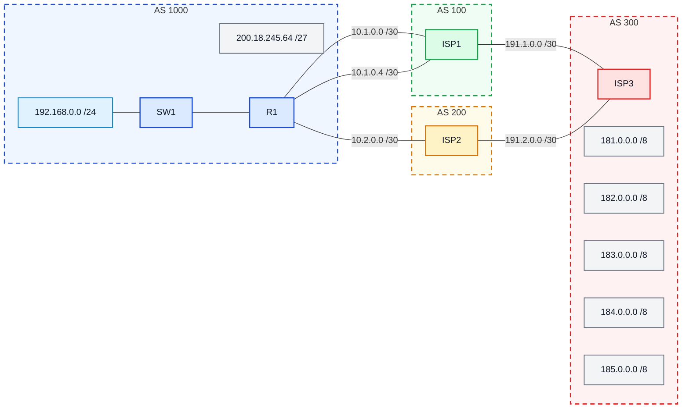

# Laboratório 06 - Roteamento Externo via BGP

**Disciplina:** ENE0025 - Protocolos de Transporte e Roteamento  
**Professor responsável:** Prof. Dr. Laerte Peotta de Melo  

---

<h2>Podcast desta Aula</h2>

<table>
  <tr>
    <td width="320" align="center">
      <a href="https://open.spotify.com/show/59S06LhFsKlyvfLFQCJ8fK">
        
      </a>
    </td>
    <td valign="top">
      <p>
        O podcast <strong>Latência Zero</strong> apresenta discussões relacionadas a temas
        abordados em aula, com ênfase em <strong>redes de computadores</strong>,
        <strong>latência</strong>, <strong>infraestrutura de comunicação</strong> e
        aspectos práticos da engenharia de redes.
      </p>
      <p>
        <a href="https://open.spotify.com/episode/5h5COkh8c51req9tUxZhzs?si=20722c87de1b41aa">Episódio 5: Como o protocolo BGP sustenta a internet</a>
      </p>
    </td>
  </tr>
</table>


## 1. Objetivo

Configurar o protocolo **BGP** no roteador da empresa para que ela possa **anunciar seu prefixo público à Internet** por meio de seus provedores.

---

## 2. Objetivos específicos

Ao final deste laboratório, o estudante deverá ser capaz de:

- compreender o papel do **BGP** no roteamento entre sistemas autônomos;
- identificar vizinhanças **eBGP**;
- configurar o BGP em um roteador de borda corporativo;
- anunciar um prefixo público usando o comando `network`;
- entender o uso de **loopback**, `update-source` e `ebgp-multihop`;
- verificar a tabela de rotas e a tabela BGP;
- capturar e dissecar mensagens do protocolo BGP (OPEN, KEEPALIVE e UPDATE) com o Wireshark;
- verificar o funcionamento prático da opção TCP MD5 Signature e do parâmetro TTL no eBGP multihop.

---

## 3. Fundamentação teórica BGP 

O **BGP (Border Gateway Protocol)** é o protocolo usado para trocar rotas entre **redes grandes diferentes**, chamadas de **Sistemas Autônomos (AS)**.  Na prática, ele ajuda um roteador a decidir **por qual provedor ou caminho externo** um pacote deve seguir para chegar a outra rede.

> Pense assim: enquanto protocolos como **RIP** e **OSPF** costumam organizar rotas **dentro de uma empresa ou organização**, o **BGP** é usado para trocar rotas **entre empresas, provedores e a Internet**.

O BGP(v4) está oficialmente definido na RFC 1771 (1995) e utiliza um algoritmo de roteamento dinâmico do tipo vetor-caminho, similar ao vetor-distância. A diferença principal é que cada “hop” do BGP representa o salto entre um AS inteiro para evitar a ocorrência de loop e não apenas entre roteadores distintos.

De forma mais simples, o BGP funciona como uma **conversa entre grandes redes** para decidir por onde os dados devem passar. É como se cada rede dissesse:

- “essas redes eu conheço”
- “esse caminho passa por mim”
- “para chegar lá, você pode usar esta rota”

Ou seja, o BGP ajuda a escolher **qual caminho seguir para sair de uma rede e chegar em outra**.

## eBGP

O **eBGP** significa **External BGP**.

Ele é usado quando a troca de rotas acontece entre roteadores que pertencem a **AS diferentes**, ou seja, entre **redes diferentes**.

### Exemplo

- uma empresa no **AS 1000**
- conectada a um provedor no **AS 100**

Nesse caso, a sessão entre eles é **eBGP**, porque estão em sistemas autônomos diferentes.

De forma bem simples: o **eBGP conecta uma rede ao mundo externo**.

## iBGP

O **iBGP** significa **Internal BGP**.

Ele é usado quando a troca de rotas acontece entre roteadores do **mesmo AS**, ou seja, **dentro da mesma rede grande**.

### Exemplo

- dois roteadores dentro do **AS 1000**
- compartilhando entre si as rotas aprendidas externamente

Nesse caso, a sessão entre eles é **iBGP**, porque os dois pertencem ao mesmo sistema autônomo.

De forma simples: o **iBGP espalha essa informação dentro da própria rede**.

## Analogia simples

Imagine que cada **AS** é como um **país**.

- **eBGP** é como a comunicação entre **países diferentes**
- **iBGP** é como a comunicação entre **cidades do mesmo país**, repassando decisões que vieram do exterior

Outra forma de imaginar é pensar em viagens:

- **eBGP** é como conversar com pessoas de **outras cidades ou outros países** para saber como chegar até lá
- **iBGP** é como avisar as pessoas da **sua própria cidade** qual estrada usar para sair dela


## Resumindo

- **BGP**: protocolo de roteamento entre sistemas autônomos
- **eBGP**: troca de rotas entre **AS diferentes**
- **iBGP**: troca de rotas **dentro do mesmo AS**

O BGP não escolhe apenas o caminho mais curto.  

Ele permite:

- decidir por qual provedor sair;
- controlar quais rotas serão anunciadas;
- organizar o tráfego de forma mais estratégica;
- aplicar regras e preferências de roteamento.

Por isso, o BGP é o protocolo mais importante quando falamos de **Internet, provedores e roteamento entre organizações**.


---

## 4. Topologia do laboratório

O cenário representa um pequeno trecho do núcleo operacional da Internet, com **três provedores** e **uma empresa** que precisa anunciar o bloco público **`200.18.245.64/27`**.  **BGP** é um protocolo de roteamento **interdomínios**, usado entre **sistemas autônomos (AS)**.

O material informa ainda que:

- a empresa pertence ao **AS 1000**;
- o **ISP1** pertence ao **AS 100**;
- o **ISP2** pertence ao **AS 200**;
- a senha das vizinhanças é **`SENHA`**.

### Descrição do cenário

A **empresa** pertence ao **AS 1000** e possui o bloco público **200.18.245.64/27**, que será anunciado para a Internet usando o protocolo **BGP**. Internamente, a empresa também possui a rede local **192.168.0.0/24**, conectada ao roteador **R1** por meio do **SW1**. No roteador da empresa, também é criada a interface de loopback **11.11.11.11/32**, que será usada como origem da sessão BGP com o **ISP1**.

O roteador **R1** conecta-se ao **ISP1**, pertencente ao **AS 100**, por dois enlaces físicos, usando as redes **10.1.0.0/30** e **10.1.0.4/30**. Entretanto, a vizinhança BGP com o ISP1 não é feita pelos endereços físicos desses enlaces. Ela é estabelecida com o endereço **10.10.10.10/32**, que corresponde à **interface de loopback do ISP1**. Por isso, no roteador da empresa é necessário usar os comandos `update-source Loopback1` e `ebgp-multihop 2`, além de criar rotas estáticas para alcançar esse endereço pelos enlaces disponíveis.

A empresa também se conecta ao **ISP2**, pertencente ao **AS 200**, por meio da rede **10.2.0.0/30**. Nesse caso, a vizinhança BGP é feita diretamente com o endereço real da interface do provedor, **10.2.0.2**, sem necessidade de loopback remota.

O **ISP1** conecta-se ao **ISP3**, pertencente ao **AS 300**, pela rede **191.1.0.0/30**. O **ISP2** também se conecta ao **ISP3**, usando a rede **191.2.0.0/30**. No **AS 300**, o roteador **ISP3** concentra vários prefixos externos já existentes no cenário, entre eles **181.0.0.0/8**, **182.0.0.0/8**, **183.0.0.0/8**, **184.0.0.0/8** e **185.0.0.0/8**.

Dessa forma, o laboratório representa uma empresa anunciando seu prefixo público para dois provedores distintos, sendo um deles configurado com vizinhança via loopback e outro com vizinhança direta pela interface física. Esse arranjo permite estudar, de forma prática, o funcionamento do **BGP externo**, o anúncio de prefixos, o uso de `network`, o papel das interfaces de loopback e a formação de sessões entre diferentes sistemas autônomos.

### Diagrama lógico 



---

## 5. Informações fornecidas pelo cenário

- a empresa anuncia o bloco **`200.18.245.64/27`**;
- o vizinho do **ISP1** deve ser estabelecido com a loopback **`10.10.10.10/32`**;
- a empresa deve usar a loopback **`11.11.11.11/32`** como origem da sessão com o ISP1;
- a vizinhança com o **ISP2** será feita pelos endereços reais das interfaces diretamente conectadas.

---

## 6. Configuração básica das interfaces em R1


```bash
R1> enable

R1# configure terminal

R1(config)# no ip domain lookup

R1(config)# interface loopback 1

R1(config-if)# ip address 11.11.11.11 255.255.255.255

R1(config-if)# no shut

R1(config-if)# interface f0/0

R1(config-if)# ip address 192.168.0.1 255.255.255.0

R1(config-if)# no shut

R1(config-if)# interface g0/1

R1(config-if)# ip address 10.1.0.1 255.255.255.252

R1(config-if)# no shut

R1(config-if)# interface g0/2

R1(config-if)# ip address 10.1.0.5 255.255.255.252

R1(config-if)# no shut

R1(config-if)# interface g0/3

R1(config-if)# ip address 10.2.0.1 255.255.255.252

R1(config-if)# no shut

R1(config-if)# end
```

---

## 7. Configuração do BGP em R1


```bash
R1> enable

R1# configure terminal

R1(config)# router bgp 1000

R1(config-router)# neighbor 10.10.10.10 remote-as 100

R1(config-router)# neighbor 10.10.10.10 password SENHA

R1(config-router)# neighbor 10.10.10.10 ebgp-multihop 2

R1(config-router)# neighbor 10.10.10.10 update-source Loopback1

R1(config-router)# neighbor 10.2.0.2 remote-as 200

R1(config-router)# neighbor 10.2.0.2 password SENHA

R1(config-router)# network 200.18.245.64 mask 255.255.255.224

R1(config-router)# exit

R1(config)# ip route 10.10.10.10 255.255.255.255 GigabitEthernet0/1

R1(config)# ip route 10.10.10.10 255.255.255.255 GigabitEthernet0/2

R1(config)# ip route 200.18.245.64 255.255.255.224 Null0
```

---

## 8. Explicação da configuração


- primeiro o BGP foi inicializado no **AS 1000**;
- depois foi configurada a vizinhança com o **ISP1** usando **endereços de loopback**;
- por isso foi necessário usar:
  - `update-source Loopback1`
  - `ebgp-multihop 2`
  - duas rotas estáticas para alcançar `10.10.10.10/32`;
- em seguida foi configurada a vizinhança com o **ISP2**, desta vez usando o endereço real da interface;
- por fim, foi anunciado o prefixo público da empresa com:
  - `network 200.18.245.64 mask 255.255.255.224`

---

## 9. Verificação

Verificar os seguintes comandos em todos os roteadores dos ASs.

```bash
Router# show ip route

Router# show ip bgp

Router# show ip bgp summary

Router# show run
```

---

## 10. Captura e Análise de Tráfego com Wireshark

O BGP opera sobre uma conexão **TCP confiável na porta 179**. Nesta etapa, o aluno deverá capturar a troca de mensagens entre o roteador corporativo (**R1**) e os provedores para analisar o estabelecimento da sessão e a propagação de rotas.

### 10.1 Procedimento de Captura no PNetLab

1. No ambiente do **PNetLab**, clique com o botão direito sobre o enlace entre **R1** e **ISP1** (interface `g0/1`) ou entre **R1** e **ISP2** (interface `g0/3`).
2. Selecione **Capture** $\rightarrow$ selecione a interface correspondente para iniciar o Wireshark.
3. No campo de filtro de exibição (*display filter*) do Wireshark, utilize:
   ```text
   bgp || tcp.port == 179
   ```
4. Para forçar a renegociação da sessão e a reemissão dos anúncios sem alterar as configurações, execute em **R1**:
   ```bash
   R1# clear ip bgp *
   ```
   > **Nota:** Para forçar apenas o reenvio das mensagens de anúncio (UPDATE) sem derrubar a conexão TCP subjacente, utilize o comando de *soft reset*: `clear ip bgp * soft`.

---

### 10.2 Mensagens BGP a Identificar e Analisar

O aluno deverá localizar no Wireshark os seguintes tipos de pacotes definidos na RFC 4271:

#### 1. Handshake TCP de Transporte (Porta 179)
- Identificar os pacotes `SYN`, `SYN-ACK` e `ACK` que inicializam o canal confiável.
- Observar a presença da opção **TCP Option (19) - TCP MD5 Signature** no cabeçalho TCP, resultante da configuração do comando `neighbor ... password SENHA`.

#### 2. Mensagem BGP OPEN
- Inspecionada imediatamente após a conclusão do *handshake* TCP.
- **Campos a analisar:**
  - `Version`: versão do BGP (deve ser 4);
  - `My Autonomous System`: número do AS local (AS 1000 para R1; AS 100 para ISP1; AS 200 para ISP2);
  - `Hold Time`: tempo de retenção proposto (padrão de 180 segundos);
  - `BGP Identifier`: endereço IP do Router-ID do emissor;
  - `Optional Parameters`: capacidades negociadas (e.g., suporte a MP-BGP e AS de 4 bytes).

#### 3. Mensagem BGP KEEPALIVE
- Pacote periódico simples (composto apenas pelo cabeçalho padrão de 19 bytes do BGP).
- Observar que ele é trocado a cada $\frac{1}{3}$ do *Hold Time* (tipicamente a cada 60 segundos) para manter o estado da adjacência como `Established`.

#### 4. Mensagem BGP UPDATE
- Mensagem responsável por divulgar ou retirar rotas.
- **Campos a analisar:**
  - `Network Layer Reachability Information (NLRI)`: verificar o prefixo público anunciado pela empresa (**`200.18.245.64/27`**);
  - `Path Attributes`:
    - **ORIGIN:** deve indicar `IGP` (código 0), gerado pelo comando `network`;
    - **AS_PATH:** deve conter a sequência de ASs percorridos;
    - **NEXT_HOP:** endereço do próximo salto para o prefixo anunciado.

#### 5. Inspeção do TTL no Cabeçalho IP (eBGP Multihop)
- Comparar o campo **Time to Live (TTL)** nos pacotes IP entre os dois enlaces:
  - Na sessão com o **ISP2** (enlace direto): o TTL é enviado com valor **1** (padrão de sessões eBGP);
  - Na sessão com o **ISP1** (via Loopback com `ebgp-multihop 2`): o TTL é enviado com valor **2**, permitindo que o pacote atravesse o roteador intermediário até atingir a interface de loopback `10.10.10.10/32`.

---

## 11. O que o aluno deve observar

Durante a verificação e a análise de pacotes, o aluno deve observar:

- se as vizinhanças BGP foram estabelecidas (estado `Established`);
- se o prefixo **`200.18.245.64/27`** aparece sendo anunciado na tabela BGP e nos pacotes UPDATE capturados;
- se a tabela BGP mostra rotas aprendidas dos provedores;
- se a tabela de rotas contém a rota estática para `10.10.10.10/32`;
- se a rota para `200.18.245.64/27` foi criada com `Null0` para permitir o anúncio do prefixo sumarizado;
- a sequência temporal da captura: Handshake TCP $\rightarrow$ Mensagens OPEN $\rightarrow$ KEEPALIVE $\rightarrow$ UPDATE.

---

## 12. Questões para análise

1. Qual é a função do BGP nesse cenário?
2. Por que a sessão com o ISP1 usa endereço de loopback?
3. Por que foi necessário configurar `ebgp-multihop 2`?
4. Qual a função do `update-source Loopback1`?
5. Por que foi criada a rota `ip route 200.18.245.64 255.255.255.224 Null0`?
6. Qual a diferença entre o pareamento com o ISP1 e com o ISP2?
7. Com base na captura do Wireshark, qual o papel da mensagem OPEN e quais parâmetros principais são negociados nela antes do envio de rotas?
8. Explique por que os pacotes BGP destinados ao ISP1 apresentam TTL igual a 2, enquanto os pacotes destinados ao ISP2 utilizam TTL igual a 1.

---

## 13. Critérios de avaliação

| Critério | Pontos |
|---|---:|
| Configuração correta das interfaces e rotas | 2,0 |
| Configuração correta do BGP e vizinhanças | 2,5 |
| Entendimento da vizinhança por loopback e multihop | 1,5 |
| Captura e análise dos pacotes BGP no Wireshark | 2,0 |
| Verificação com comandos CLI e respostas técnicas | 2,0 |

**Total: 10,0**

---

## 14. Entregáveis

- print da topologia no emulador;
- print do `show ip bgp summary`;
- print do `show ip bgp`;
- print do `show ip route`;
- arquivo de captura do Wireshark (`.pcapng`) contendo o estabelecimento da sessão BGP;
- print do pacote BGP OPEN destacando os campos `My AS` e `BGP Identifier`;
- print do pacote BGP UPDATE destacando o prefixo anunciado no campo NLRI e seus atributos;
- relatório curto com:
  - objetivo;
  - comandos executados;
  - explicação da sessão com loopback e análise de TTL;
  - conclusão;
- respostas completas às questões para análise.

---

[← Anterior: Laboratório 05](lab05.md) | [Índice Geral (README)](../README.md) | [Próximo: Laboratório 07 →](lab07.md)


