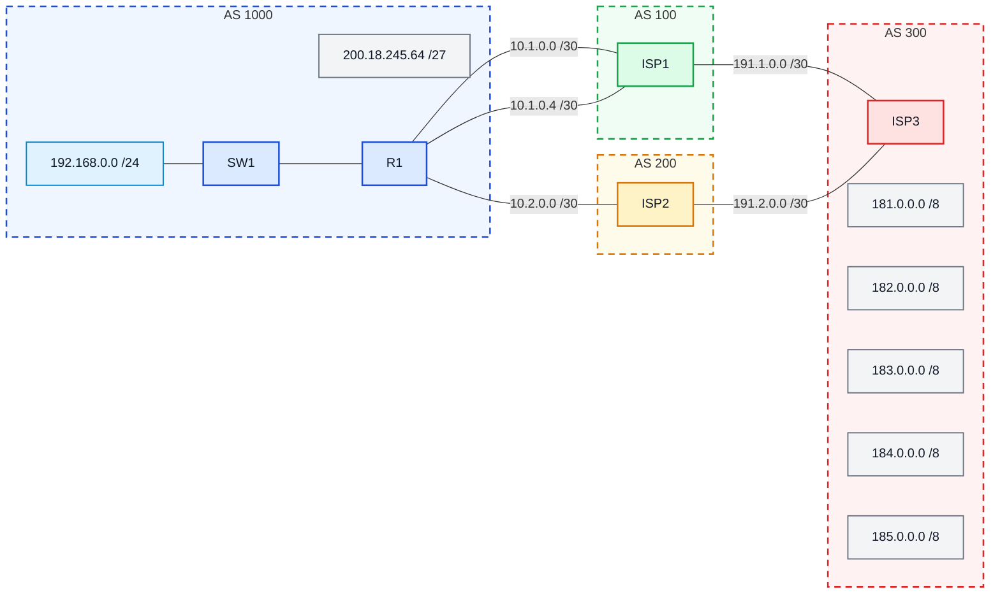

# Laboratório 07 - Configuração dos Provedores (BGP Externo)

**Disciplina:** ENE0025 - Protocolos de Transporte e Roteamento  
**Professor responsável:** Prof. Dr. Laerte Peotta de Melo  

**Observação:** Este laboratório é continuação do **Laboratório 06**

---

## 1. Objetivo

Configurar os roteadores **ISP1**, **ISP2** e **ISP3** para permitir o funcionamento completo do cenário de **BGP externo**.

---

## 2. Premissas do cenário

### Diagrama lógico 




Considerando a topologia do laboratório 06:

- **R1** pertence ao **AS 1000**
- **ISP1** pertence ao **AS 100**
- **ISP2** pertence ao **AS 200**
- **ISP3** pertence ao **AS 300**

Os enlaces considerados são:

- **R1 ↔ ISP1**
  - rede **10.1.0.0/30**
  - rede **10.1.0.4/30**

- **R1 ↔ ISP2**
  - rede **10.2.0.0/30**

- **ISP1 ↔ ISP3**
  - rede **191.1.0.0/30**

- **ISP2 ↔ ISP3**
  - rede **191.2.0.0/30**

Também será utilizada a loopback:

- **ISP1:** `10.10.10.10/32`

E os prefixos externos anunciados por **ISP3**:

- `181.0.0.0/8`
- `182.0.0.0/8`
- `183.0.0.0/8`
- `184.0.0.0/8`
- `185.0.0.0/8`

---

## 3. Configuração do ISP3

Configure primeiro o **ISP3**, pois ele representa a rede externa com os prefixos de teste.

```bash
ISP3> enable
ISP3# configure terminal
ISP3(config)# no ip domain lookup
ISP3(config)# interface g0/0
ISP3(config-if)# ip address 191.1.0.2 255.255.255.252
ISP3(config-if)# no shut
ISP3(config-if)# interface g0/1
ISP3(config-if)# ip address 191.2.0.2 255.255.255.252
ISP3(config-if)# no shut
ISP3(config-if)# interface loopback 1
ISP3(config-if)# ip address 181.0.0.1 255.0.0.0
ISP3(config-if)# interface loopback 2
ISP3(config-if)# ip address 182.0.0.1 255.0.0.0
ISP3(config-if)# interface loopback 3
ISP3(config-if)# ip address 183.0.0.1 255.0.0.0
ISP3(config-if)# interface loopback 4
ISP3(config-if)# ip address 184.0.0.1 255.0.0.0
ISP3(config-if)# interface loopback 5
ISP3(config-if)# ip address 185.0.0.1 255.0.0.0
ISP3(config-if)# end
```

### BGP no ISP3

```bash
ISP3> enable

ISP3# configure terminal

ISP3(config)# router bgp 300

ISP3(config-router)# neighbor 191.1.0.1 remote-as 100

ISP3(config-router)# neighbor 191.1.0.1 password SENHA

ISP3(config-router)# neighbor 191.2.0.1 remote-as 200

ISP3(config-router)# neighbor 191.2.0.1 password SENHA

ISP3(config-router)# network 181.0.0.0 mask 255.0.0.0

ISP3(config-router)# network 182.0.0.0 mask 255.0.0.0

ISP3(config-router)# network 183.0.0.0 mask 255.0.0.0

ISP3(config-router)# network 184.0.0.0 mask 255.0.0.0

ISP3(config-router)# network 185.0.0.0 mask 255.0.0.0

ISP3(config-router)# end
```

---

## 4. Configuração do ISP1

O **ISP1** possui dois enlaces físicos com o **R1**, além de uma loopback usada como vizinho BGP.

### Interfaces do ISP1

```bash
ISP1> enable
ISP1# configure terminal
ISP1(config)# no ip domain lookup
ISP1(config)# interface loopback 0
ISP1(config-if)# ip address 10.10.10.10 255.255.255.255
ISP1(config-if)# no shut
ISP1(config-if)# interface g0/0
ISP1(config-if)# ip address 10.1.0.2 255.255.255.252
ISP1(config-if)# no shut
ISP1(config-if)# interface g0/1
ISP1(config-if)# ip address 10.1.0.6 255.255.255.252
ISP1(config-if)# no shut
ISP1(config-if)# interface g0/2
ISP1(config-if)# ip address 191.1.0.1 255.255.255.252
ISP1(config-if)# no shut
ISP1(config-if)# end
```

### BGP no ISP1

```bash
ISP1> enable
ISP1# configure terminal
ISP1(config)# router bgp 100
ISP1(config-router)# neighbor 11.11.11.11 remote-as 1000
ISP1(config-router)# neighbor 11.11.11.11 password SENHA
ISP1(config-router)# neighbor 11.11.11.11 ebgp-multihop 2
ISP1(config-router)# neighbor 11.11.11.11 update-source Loopback0
ISP1(config-router)# neighbor 191.1.0.2 remote-as 300
ISP1(config-router)# neighbor 191.1.0.2 password SENHA
ISP1(config-router)# network 10.10.10.10 mask 255.255.255.255
ISP1(config-router)# exit
ISP1(config)# ip route 11.11.11.11 255.255.255.255 GigabitEthernet0/0
ISP1(config)# ip route 11.11.11.11 255.255.255.255 GigabitEthernet0/1
ISP1(config)# end
```

---

## 5. Configuração do ISP2

O **ISP2** possui um enlace direto com o **R1** e um enlace com o **ISP3**.

### Interfaces do ISP2

```bash
ISP2> enable
ISP2# configure terminal
ISP2(config)# no ip domain lookup
ISP2(config)# interface g0/0
ISP2(config-if)# ip address 10.2.0.2 255.255.255.252
ISP2(config-if)# no shut
ISP2(config-if)# interface g0/1
ISP2(config-if)# ip address 191.2.0.1 255.255.255.252
ISP2(config-if)# no shut
ISP2(config-if)# end
```

### BGP no ISP2

```bash
ISP2> enable

ISP2# configure terminal

ISP2(config)# router bgp 200

ISP2(config-router)# neighbor 10.2.0.1 remote-as 1000

ISP2(config-router)# neighbor 10.2.0.1 password SENHA

ISP2(config-router)# neighbor 191.2.0.2 remote-as 300

ISP2(config-router)# neighbor 191.2.0.2 password SENHA

ISP2(config-router)# end
```

---

## 6. Ordem recomendada de configuração

Para evitar dúvidas, use esta sequência:

1. Configurar **ISP3**
2. Configurar **ISP1**
3. Configurar **ISP2**
4. Manter o **R1** com a configuração já aplicada
5. Fazer a verificação final em todos os roteadores

---

## 7. Verificação final

Após concluir as configurações, execute os comandos abaixo em todos os roteadores:

```bash
Router# show ip bgp summary

Router# show ip bgp

Router# show ip route

Router# show run
```

---

## 8. O que deve funcionar

Ao final, o cenário deve apresentar:

- sessão BGP entre **R1 e ISP1** em estado **Established**
- sessão BGP entre **R1 e ISP2** em estado **Established**
- sessão BGP entre **ISP1 e ISP3** em estado **Established**
- sessão BGP entre **ISP2 e ISP3** em estado **Established**

No **R1**, devem aparecer as rotas para:

- `181.0.0.0/8`
- `182.0.0.0/8`
- `183.0.0.0/8`
- `184.0.0.0/8`
- `185.0.0.0/8`

Nos provedores, deve aparecer o prefixo da empresa:

- `200.18.245.64/27`

---

## 9. Questões para análise

1. Por que os provedores ISP1, ISP2 e ISP3 não anunciam suas redes internas de enlace e gerência diretamente para os clientes ou para a Internet pública?
2. Qual a importância técnica e econômica do estabelecimento de sessões de *Peering* direto entre provedores (ISP1-ISP3 e ISP2-ISP3) para a latência e o tráfego global?
3. Qual a diferença operacional observada entre a sessão eBGP com o ISP1 (via interface Loopback com múltiplos enlaces) e a sessão com o ISP2 (enlace físico único direto)?
4. Ao inspecionar a tabela BGP no ISP3 (`show ip bgp`), como ele aprendeu a rota para o prefixo da empresa (`200.18.245.64/27`)? Qual o *AS-Path* e o próximo salto (*Next Hop*) exibidos?
5. O que aconteceria com o fluxo de tráfego da empresa caso o enlace primário entre R1 e ISP1 sofresse uma interrupção física? Como o BGP reage diante desse evento?

---

## 10. Critérios de avaliação

| Critério | Pontos |
|---|---:|
| Configuração e ativação das interfaces dos provedores | 2,0 |
| Estabelecimento das sessões eBGP (adjacências *Established*) | 3,0 |
| Propagação e validação correta dos prefixos (181-185/8 e 200.18.245.64/27) | 2,0 |
| Testes de conectividade e análise de rotas (`show ip bgp` / `show ip route`) | 1,5 |
| Respostas técnicas às questões de análise | 1,5 |

**Total: 10,0**

---

## 11. Entregáveis

- print da topologia montada no emulador com indicação dos estados BGP;
- print da saída de `show ip bgp summary` em **ISP1**, **ISP2** e **ISP3**;
- print da tabela BGP (`show ip bgp`) no **ISP3**, comprovando o aprendizado do bloco `200.18.245.64/27`;
- evidência de testes de `ping` a partir de R1 para os prefixos de destino na Internet (`181.0.0.1`, etc.);
- respostas técnicas fundamentadas às questões de análise;
- relatório síntese contendo: objetivo, configuração aplicada nos provedores, análise do fluxo de anúncios e conclusão.

---

[← Anterior: Laboratório 06](lab06.md) | [Índice Geral (README)](../README.md) | [Próximo: Laboratório 08 →](lab08.md)


