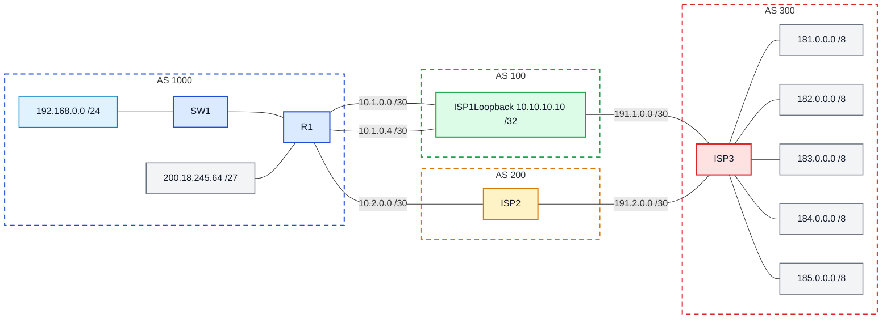

# Laboratório 08 - Políticas BGP e integração com OSPF

**Disciplina:** ENE0025 - Protocolos de Transporte e Roteamento  
**Professor responsável:** Prof. Dr. Laerte Peotta de Melo  

**Observação:** Este laboratório é continuação do **Laboratório 07**

---

## 1. Objetivo

Aplicar políticas de roteamento **BGP** e integrar o **BGP** ao **OSPF** em um cenário já previamente configurado, realizando apenas os ajustes específicos deste laboratório para anúncio de prefixos, escolha de caminho preferencial de saída, propagação controlada de rota default e análise de redundância entre provedores.

---

## 2. **Importante:** Este laboratório é uma continuação das atividades anteriores. 

> Considere que as configurações básicas de interfaces, endereçamento IP, conectividade inicial e topologia já foram realizadas anteriormente.  Portanto, **não devem ser refeitas** as configurações iniciais da infraestrutura.  Neste laboratório, o foco será apenas nas configurações **necessárias para continuidade das atividades**, especificamente:
> 
> - OSPF interno no roteador da empresa.
> - sessões eBGP com os provedores.
> - política de preferência de saída.
> - propagação controlada de rota default.
> - análise de redundância e failover.

---

## 3. Situação-problema

Uma empresa do **AS 1000** possui o bloco público **200.18.245.64/27** e já está conectada a dois provedores:

- **ISP1**, no **AS 100**, por dois enlaces físicos
- **ISP2**, no **AS 200**, por um enlace físico

Os provedores alcançam o **AS 300**, onde existem diversos prefixos externos.  
Com a infraestrutura básica já pronta, a empresa agora precisa:

1. anunciar seu prefixo público para a Internet
2. preferir o **ISP1** como caminho principal de saída
3. manter o **ISP2** como contingência
4. usar **OSPF** para representar o domínio interno da empresa
5. propagar apenas a **rota default** no OSPF, evitando inserir prefixos externos desnecessários no domínio interno

---

## 4. Fundamentação

Neste laboratório, o **OSPF** será usado para representar o domínio interno da empresa, enquanto o **BGP** será usado na borda para:

- anunciar o bloco público da empresa
- receber rotas externas
- aplicar política de preferência de saída

A integração entre **OSPF** e **BGP** será feita de forma controlada.  
Em vez de redistribuir várias rotas externas para o OSPF, será propagada apenas a **rota default**, mantendo o domínio interno mais limpo e mais simples de administrar.

---

## 5. Topologia lógica



---

## 6. Premissas adotadas

Considere que os seguintes elementos **já estão configurados**:

- interfaces físicas dos roteadores
- endereçamento IP básico
- conectividade entre os enlaces
- loopback do **R1**
- loopback do **ISP1**
- topologia montada no emulador

Neste laboratório, serão realizadas apenas as configurações referentes a:

- **OSPF** no roteador da empresa
- **BGP** no roteador da empresa
- política BGP para preferência de saída
- propagação da rota default no OSPF
- testes de falha e verificação

---

## 7. Dados relevantes do cenário

### Empresa – AS 1000

- Prefixo público: `200.18.245.64/27`
- LAN interna: `192.168.0.0/24`
- Loopback do R1: `11.11.11.11/32`

### ISP1 – AS 100

- Loopback do ISP1: `10.10.10.10/32`

### ISP2 – AS 200

- Vizinho direto com R1 pela rede `10.2.0.0/30`

### Prefixos externos no ISP3 – AS 300

- `181.0.0.0/8`
- `182.0.0.0/8`
- `183.0.0.0/8`
- `184.0.0.0/8`
- `185.0.0.0/8`

---

## 8. Etapa 1 – Configuração do OSPF interno no R1

Neste laboratório, o OSPF representa o domínio interno da empresa.

```bash
R1> enable
R1# configure terminal
R1(config)# router ospf 10
R1(config-router)# network 192.168.0.0 0.0.0.255 area 0
R1(config-router)# network 11.11.11.11 0.0.0.0 area 0
R1(config-router)# end
```

---

## 9. Etapa 2 – Configuração do BGP no R1

Nesta etapa, será configurado o **BGP** apenas no roteador da empresa, considerando que a infraestrutura do cenário já está pronta.

```bash
R1> enable
R1# configure terminal
R1(config)# router bgp 1000
R1(config-router)# neighbor 10.10.10.10 remote-as 100
R1(config-router)# neighbor 10.10.10.10 password SENHA
R1(config-router)# neighbor 10.10.10.10 ebgp-multihop 2
R1(config-router)# neighbor 10.10.10.10 update-source Loopback1
R1(config-router)# neighbor 10.2.0.2 remote-as 200
R1(config-router)# neighbor 10.2.0.2 password SENHA
R1(config-router)# network 200.18.245.64 mask 255.255.255.224
R1(config-router)# exit
R1(config)# ip route 10.10.10.10 255.255.255.255 Serial2/0
R1(config)# ip route 10.10.10.10 255.255.255.255 Serial2/1
R1(config)# ip route 200.18.245.64 255.255.255.224 Null0
R1(config)# end
```

---

## 10. Etapa 3 – Política BGP: ISP1 como principal, ISP2 como backup

A política abaixo define o **ISP1** como caminho preferencial de saída e o **ISP2** como contingência.

```bash
R1> enable

R1# configure terminal

R1(config)# router bgp 1000

R1(config-router)# neighbor 10.10.10.10 weight 200

R1(config-router)# neighbor 10.2.0.2 weight 100

R1(config-router)# end
```

### Observação

- O atributo **weight** é local ao roteador Cisco
- Neste caso, ele está sendo usado para demonstrar de forma simples a escolha de caminho preferencial
- Enquanto os dois caminhos estiverem disponíveis, o tráfego deve preferir o **ISP1**
- Em caso de falha do ISP1, a saída deve migrar para o **ISP2**

---

## 11. Etapa 4 – Integração entre BGP e OSPF

A integração proposta neste laboratório não redistribui todos os prefixos externos no OSPF. Será propagada apenas a **rota default**, o que representa uma prática mais limpa para o domínio interno.

### 11.1 Criar rota default no R1

```bash
R1> enable

R1# configure terminal

R1(config)# ip route 0.0.0.0 0.0.0.0 10.10.10.10

R1(config)# end
```

### 11.2 Propagar a default route no OSPF

```bash
R1> enable

R1# configure terminal

R1(config)# router ospf 10

R1(config-router)# default-information originate

R1(config-router)# end
```

---

## 12. Etapa 5 – Verificação da conectividade e da política

Depois de aplicar as configurações, verifique:

- se as sessões BGP foram estabelecidas
- se o prefixo da empresa está sendo anunciado
- se o melhor caminho é o ISP1
- se a rota default está presente no domínio OSPF

### Comandos sugeridos no R1

```bash
show ip interface brief
show ip route
show ip bgp
show ip bgp summary
show ip ospf
show ip ospf database
show ip protocols
show running-config
```

### Comandos sugeridos nos provedores

```bash
show ip interface brief
show ip route
show ip bgp
show ip bgp summary
show running-config
```

---

## 13. Etapa 6 – Teste de falha

### Procedimento

1. Verifique o melhor caminho com todos os enlaces ativos
2. Desative um dos enlaces físicos com o **ISP1**
3. Observe se a sessão BGP com o ISP1 continua ativa por causa da loopback
4. Em seguida, desative a conectividade total com o **ISP1**
5. Verifique se a saída migra para o **ISP2**

### O que observar

- o **ISP1** deve ser o caminho principal
- o **ISP2** deve assumir em caso de falha
- a rota default continua representando a saída do domínio interno

---

## 14. Questões para análise

1. Qual é o papel do **OSPF** neste laboratório?
2. Qual é o papel do **BGP** neste laboratório?
3. Por que o bloco **200.18.245.64/27** é anunciado externamente, mas a rede **192.168.0.0/24** não?
4. Qual a vantagem de formar a sessão BGP com o ISP1 por **loopback**?
5. Qual é a função do comando `update-source Loopback1`?
6. Qual é a função do comando `ebgp-multihop 2`?
7. Como verificar, no `show ip bgp`, qual ISP está sendo preferido?
8. Por que é mais adequado propagar apenas a **default route** no OSPF?
9. O que acontece quando o enlace principal com o ISP1 falha?
10. Qual a diferença entre usar **OSPF** para a rede interna e **BGP** para a borda?

---

## 15. Critérios de avaliação

| Critério | Pontos |
| --- | --- |
| Configuração correta do OSPF | 2,0 |
| Configuração correta do BGP | 3,0 |
| Aplicação da política de preferência | 2,0 |
| Integração controlada BGP–OSPF | 1,5 |
| Verificação e análise técnica | 1,5 |

**Total: 10,0**

---

## 16. Entregáveis

Cada aluno deve entregar relatório contendo:

- print da topologia no pnetlab
- print do `show ip bgp summary` no R1
- print do `show ip bgp` no R1
- print do `show ip route` no R1
- print do `show ip ospf` ou `show ip protocols`
- relatório curto contendo:
  - objetivo do laboratório.
  - descrição da política aplicada.
  - explicação da integração OSPF/BGP.
  - análise do comportamento em caso de falha.

---

## 17. Conclusão esperada

Ao concluir este laboratório, o estudante deve perceber que:

- **OSPF** e **BGP** têm papéis diferentes e complementares
- **BGP** é usado para troca de rotas e políticas entre sistemas autônomos
- **OSPF** é mais adequado para o domínio interno
- A integração entre ambos deve ser seletiva
- Políticas BGP permitem controlar a saída da rede
- Redundância com múltiplos provedores aumenta a resiliência do ambiente

---

[← Anterior: Laboratório 07](lab07.md) | [Índice Geral (README)](../README.md) | [Próximo: Laboratório 09 →](lab09.md)

