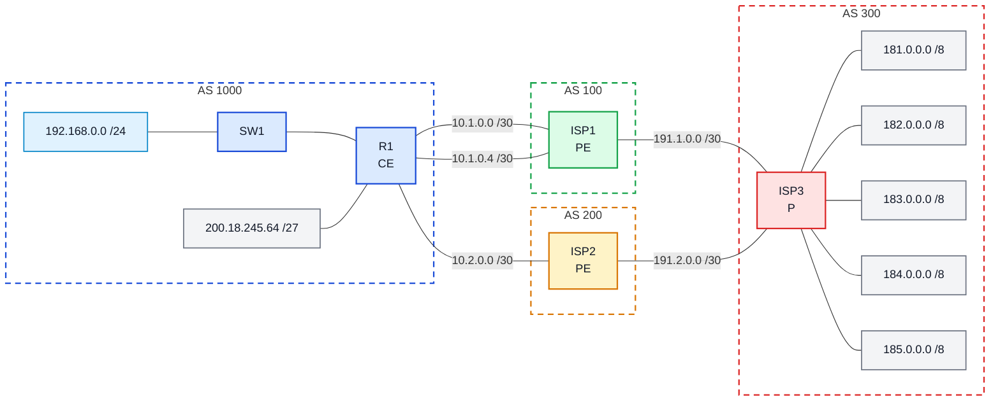

# Laboratório 09 - Implementação de MPLS no Backbone

**Disciplina:** ENE0025 - Protocolos de Transporte e Roteamento  
**Professor responsável:** Prof. Dr. Laerte Peotta de Melo  

**Observação:** Este laboratório é continuação do **Laboratório 08**


---

<h2>Podcast desta Aula</h2>

<table>
  <tr>
    <td width="320" align="center">
      <a href="https://open.spotify.com/show/59S06LhFsKlyvfLFQCJ8fK">
        
      </a>
    </td>
    <td valign="top">
      <p>
        O podcast <strong>Latência Zero</strong> apresenta discussões relacionadas a temas
        abordados em aula, com ênfase em <strong>redes de computadores</strong>,
        <strong>latência</strong>, <strong>infraestrutura de comunicação</strong> e
        aspectos práticos da engenharia de redes.
      </p>
      <p>
        <a href="https://open.spotify.com/episode/5RXovxuVQ6eLXa5pt2dUeR?si=dZE1TCGAQwyFAuxqumNnyQ">Episódio 6: A Engenharia de Rótulos do Protocolo MPLS</a>
      </p>
    </td>
  </tr>
</table>


## 1. Objetivo

Implementar um backbone **MPLS** simplificado na rede do provedor, dando continuidade ao **Lab 08**, de modo a compreender o papel dos roteadores **CE**, **PE** e **P**, habilitar o transporte por rótulos no núcleo da operadora e verificar o funcionamento do backbone MPLS sobre uma infraestrutura previamente estabelecida com **OSPF** e **BGP**.

---

## 2. Observação inicial

> **Importante:** este laboratório é uma continuação do **Lab 08**.  Considere que a topologia, o endereçamento IP básico, a conectividade entre enlaces e as sessões BGP já foram previamente configuradas.  Portanto, neste laboratório **não devem ser refeitas** as configurações básicas já concluídas.  O foco agora será apenas nas configurações necessárias para:
>
> - identificar os papéis **CE**, **PE** e **P**;
> - ativar o **OSPF** no backbone do provedor, se ainda não estiver operacional;
> - habilitar o **MPLS** nos enlaces do núcleo;
> - verificar a distribuição de rótulos e o encaminhamento no backbone.


---

## 3. Situação-problema

No laboratório 08, a empresa do **AS 1000** estabeleceu conectividade com dois provedores e aplicou políticas BGP para definir caminho preferencial de saída. Agora, a operadora deseja evoluir sua infraestrutura e implantar um **backbone MPLS** entre seus roteadores, de modo que o transporte no núcleo passe a utilizar **comutação por rótulos**, preparando a rede para maior escalabilidade e para futuras ofertas de serviços avançados.

---

## 4. Fundamentação teórica 


O **MPLS (Multiprotocol Label Switching)** é uma tecnologia que adiciona rótulos aos pacotes, permitindo que o encaminhamento no backbone ocorra com base nesses rótulos, e não apenas pela análise completa do cabeçalho IP a cada salto.

Em um cenário simplificado de operadora, os papéis dos roteadores podem ser entendidos assim:

- **CE (Customer Edge)** é o roteador do cliente.
Ele fica na empresa e recebe a conectividade oferecida pela operadora. Em geral, o CE não precisa conhecer MPLS; para ele, a comunicação com o provedor costuma parecer apenas um enlace IP normal.

- **PE (Provider Edge)** é o roteador de borda da operadora, diretamente conectado ao CE.
Ele faz a interface entre a rede do cliente e a nuvem do provedor. É no PE que a operadora trata as rotas do cliente, associa serviços e, em cenários mais avançados, trabalha com elementos como VRF e redistribuição das rotas do CE para processos internos da operadora.

- **P (Provider)** é o roteador do núcleo da operadora.
Ele fica dentro da nuvem MPLS e participa do transporte do tráfego no backbone. Diferentemente do PE, o roteador P não se conecta ao cliente; sua função principal é encaminhar pacotes com base em rótulos MPLS dentro da infraestrutura da operadora.
- **LDP significa Label Distribution Protocol:** Protocolo usado em redes MPLS para que os roteadores troquem entre si os rótulos (labels) que serão usados no encaminhamento dos pacotes.
> **OBSERVAÇÃO:** 
> Se o roteador ISP1 sabe, pelo OSPF, que para chegar à loopback do ISP3 deve passar por determinado enlace, o LDP vai permitir que os roteadores troquem informações como:
> - “para esse destino, use o label X”
> - “quando receber esse label, troque por Y”
> - “ou retire o label antes de entregar no destino”
> A principal função do LDP é: distribuir rótulos MPLS entre roteadores vizinhos para viabilizar o encaminhamento dos pacotes no backbone MPLS.

Neste laboratório:

- **R1** será tratado como **CE**;
- **ISP1** e **ISP2** serão tratados como **PEs**;
- **ISP3** será tratado como elemento central do backbone, assumindo o papel de **P**.
- **OSPF → descobre o caminho**
- **LDP → distribui os rótulos**
- **MPLS → encaminha com base nesses rótulos**  

O **OSPF** será usado como protocolo interno do backbone da operadora, enquanto o **MPLS** será habilitado nos enlaces da rede do provedor. 

---

## 5. Topologia lógica



---

## 6. Premissas adotadas

Considere que os seguintes elementos **já estão configurados**:

- interfaces físicas e endereçamento IP;
- sessões BGP previamente estabelecidas;
- anúncio do prefixo da empresa;
- política de saída preferencial no R1;
- conectividade entre todos os enlaces.

Neste laboratório, serão realizadas apenas as configurações referentes a:

- backbone OSPF do provedor;
- habilitação do MPLS no núcleo;
- verificação de labels e encaminhamento.

---

## 7. Papéis dos roteadores no cenário

| Roteador | Papel no Lab 09 | Descrição |
|---|---|---|
| R1 | CE | Roteador do cliente |
| ISP1 | PE | Borda da operadora conectada ao cliente |
| ISP2 | PE | Borda da operadora conectada ao cliente |
| ISP3 | P | Núcleo do backbone da operadora |

---

## 8. Dados relevantes do backbone

### Enlaces do backbone do provedor
- ISP1 ↔ ISP3: `191.1.0.0/30`
- ISP2 ↔ ISP3: `191.2.0.0/30`

### Mapeamento de interfaces FastEthernet sugerido

| Dispositivo | Interface | Uso |
|---|---|---|
| ISP1 | FastEthernet0/0 | enlace com ISP3 |
| ISP2 | FastEthernet0/0 | enlace com ISP3 |
| ISP3 | FastEthernet0/0 | enlace com ISP1 |
| ISP3 | FastEthernet0/1 | enlace com ISP2 |

### Loopbacks sugeridas para identificação interna
Caso ainda não existam loopbacks para o backbone, utilize:

- ISP1: `1.1.1.1/32`
- ISP2: `2.2.2.2/32`
- ISP3: `3.3.3.3/32`

Essas loopbacks serão úteis para o OSPF e para a identificação lógica dos LSRs no backbone.

---

## 9. Configuração das loopbacks do backbone

Configure apenas se ainda não tiver criado essas interfaces em atividades anteriores.

### ISP1

```bash
ISP1> enable

ISP1# configure terminal

ISP1(config)# interface loopback 1

ISP1(config-if)# ip address 1.1.1.1 255.255.255.255

ISP1(config-if)# end
```

### ISP2

```bash
ISP2> enable

ISP2# configure terminal

ISP2(config)# interface loopback 1

ISP2(config-if)# ip address 2.2.2.2 255.255.255.255

ISP2(config-if)# end
```

### ISP3

```bash
ISP3> enable

ISP3# configure terminal

ISP3(config)# interface loopback 10

ISP3(config-if)# ip address 3.3.3.3 255.255.255.255

ISP3(config-if)# end
```

---

## 10. OSPF no backbone do provedor

O OSPF será usado como protocolo interno da operadora.  
Nesta etapa, configure ou ajuste o OSPF apenas nos roteadores do backbone.

### ISP1

```bash
ISP1> enable

ISP1# configure terminal

ISP1(config)# router ospf 100

ISP1(config-router)# router-id 1.1.1.1

ISP1(config-router)# network 191.1.0.0 0.0.0.3 area 0

ISP1(config-router)# network 1.1.1.1 0.0.0.0 area 0

ISP1(config-router)# end
```

### ISP2

```bash
ISP2> enable

ISP2# configure terminal

ISP2(config)# router ospf 100

ISP2(config-router)# router-id 2.2.2.2

ISP2(config-router)# network 191.2.0.0 0.0.0.3 area 0

ISP2(config-router)# network 2.2.2.2 0.0.0.0 area 0

ISP2(config-router)# end
```

### ISP3

```bash
ISP3> enable

ISP3# configure terminal

ISP3(config)# router ospf 100

ISP3(config-router)# router-id 3.3.3.3

ISP3(config-router)# network 191.1.0.0 0.0.0.3 area 0

ISP3(config-router)# network 191.2.0.0 0.0.0.3 area 0

ISP3(config-router)# network 3.3.3.3 0.0.0.0 area 0

ISP3(config-router)# end
```

---

## 11. Habilitação do MPLS no backbone

Depois que o OSPF estiver funcional no backbone, habilite o MPLS apenas nos enlaces internos da operadora.

### ISP1

```bash
ISP1> enable

ISP1# configure terminal

ISP1(config)# interface fastethernet 0/0

ISP1(config-if)# mpls ip

ISP1(config-if)# end
```

### ISP2

```bash
ISP2> enable

ISP2# configure terminal

ISP2(config)# interface fastethernet 0/0

ISP2(config-if)# mpls ip

ISP2(config-if)# end
```

### ISP3

```bash
ISP3> enable

ISP3# configure terminal

ISP3(config)# interface fastethernet 0/0

ISP3(config-if)# mpls ip

ISP3(config-if)# interface fastethernet 0/1

ISP3(config-if)# mpls ip

ISP3(config-if)# end
```

---

## 12. Verificação do backbone OSPF

Antes de validar o MPLS, verifique se o backbone OSPF da operadora está funcionando corretamente.

### Comandos sugeridos

```bash
show ip ospf neighbor
show ip route
show ip protocols
show ip interface brief
```

### O que observar

- vizinhança OSPF entre **ISP1** e **ISP3**;
- vizinhança OSPF entre **ISP2** e **ISP3**;
- presença das loopbacks na tabela de rotas;
- alcançabilidade do backbone por roteamento interno.

---

## 13. Verificação do MPLS

Depois de habilitar o MPLS nos enlaces do backbone, verifique a distribuição de labels.

### Comandos sugeridos

```bash
show mpls interfaces
show mpls ldp neighbor
show mpls forwarding-table
show ip route
```

### O que observar

- interfaces com MPLS habilitado;
- vizinhos LDP estabelecidos;
- presença de labels na forwarding table;
- associação entre prefixos e rótulos.

---

## 14. Teste de observação

Peça aos alunos que identifiquem:

1. onde termina o papel do cliente;
2. onde começa a nuvem do provedor;
3. quais roteadores são CE, PE e P;
4. em quais enlaces o MPLS foi ativado;
5. quais prefixos do backbone receberam rótulos.

---

## 15. Questões para análise

1. Qual é a principal diferença entre **roteamento IP tradicional** e **encaminhamento com MPLS**?
2. Qual é a função do **OSPF** dentro do backbone do provedor?
3. Qual é o papel dos roteadores **PE**?
4. Qual é o papel do roteador **P**?
5. Por que o cliente normalmente não precisa configurar MPLS no seu roteador?
6. Como o **Lab 09** complementa o **Lab 08**?
7. O que significa dizer que o MPLS atua como tecnologia de “camada 2,5”?
8. Por que o backbone precisa de um IGP estável antes da ativação do MPLS?

---

## 16. Critérios de avaliação

| Critério | Pontos |
|---|---:|
| Identificação correta dos papéis CE, PE e P | 1,5 |
| Configuração correta do OSPF no backbone | 3,0 |
| Habilitação correta do MPLS nos enlaces internos | 2,5 |
| Verificação técnica do backbone MPLS | 2,0 |
| Análise conceitual e comparação com o Lab 08 | 1,0 |

**Total: 10,0**

---

## 17. Entregáveis

Cada aluno deve entregar:

- print da topologia no Pnetlab;
- print do `show ip ospf neighbor` em pelo menos um roteador do backbone;
- print do `show mpls interfaces`;
- print do `show mpls ldp neighbor`;
- print do `show mpls forwarding-table`;
- relatório curto contendo:
  - objetivo do laboratório;
  - papéis CE, PE e P no cenário;
  - conclusão sobre o uso de MPLS no backbone.

---

## 18. Conclusão esperada

Ao final deste laboratório, o estudante deve perceber que:

- o **BGP** continua importante na borda da rede;
- o **OSPF** organiza a alcançabilidade interna do backbone;
- o **MPLS** permite transportar o tráfego por meio de rótulos;
- a nuvem da operadora possui lógica própria, diferente da rede do cliente;

---

[← Anterior: Laboratório 08](lab08.md) | [Índice Geral (README)](../README.md) | [Próximo: Laboratório 10 →](lab10.md)

