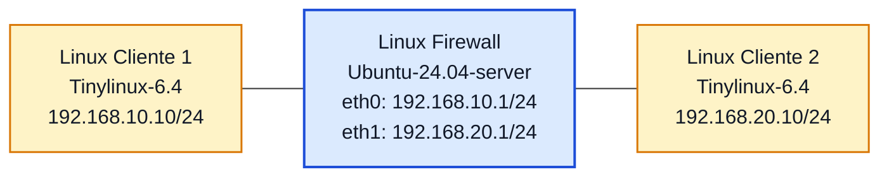

# Laboratório 10 - Firewall de Pacotes com `iptables`

**Disciplina:** ENE0025 - Protocolos de Transporte e Roteamento  
**Professor responsável:** Prof. Dr. Laerte Peotta de Melo  

---

<h2>Podcast desta Aula</h2>

<table>
  <tr>
    <td width="320" align="center">
      <a href="https://open.spotify.com/show/59S06LhFsKlyvfLFQCJ8fK">
        
      </a>
    </td>
    <td valign="top">
      <p>
        O podcast <strong>Latência Zero</strong> apresenta discussões relacionadas a temas
        abordados em aula, com ênfase em <strong>redes de computadores</strong>,
        <strong>latência</strong>, <strong>infraestrutura de comunicação</strong> e
        aspectos práticos da engenharia de redes.
      </p>
      <p>
        <a href="https://open.spotify.com/episode/6mSMblRBIjOvmX0AgsO1ln?si=ccYN8DnmSEuR6XSJgDvBAA">Episódio 7: Firewall com Amnésia (Stateless)</a>
      </p>
    </td>
  </tr>
</table>


## Objetivo

Implementar um **firewall de pacotes** em uma máquina Linux no PNetLab, posicionada entre **duas máquinas Linux básicas** - preferencialmente **Linux Tinycore-6.4** - aplicando regras com `iptables` para controlar o tráfego entre duas redes distintas com base em endereço IP, protocolo e porta.

---

## Introdução

Um **firewall de pacotes** é um mecanismo de segurança que analisa os pacotes de rede individualmente e decide se eles podem ou não atravessar um determinado ponto da rede. Essa decisão é tomada com base em informações presentes no cabeçalho do pacote, como **endereço IP de origem**, **endereço IP de destino**, **protocolo** e **porta de comunicação**. Em outras palavras, ele funciona como um filtro que verifica regras previamente definidas e permite ou bloqueia o tráfego conforme essas regras.


No Linux, uma das ferramentas clássicas para implementar esse tipo de controle é o **iptables**. Com ele, é possível criar regras para autorizar ou negar comunicações específicas entre redes, hosts e serviços. Em um laboratório, isso permite demonstrar de forma prática como uma máquina Linux pode atuar como firewall entre dois segmentos de rede, controlando o fluxo de pacotes de maneira simples e objetiva.

Diferentemente de um firewall stateful, que acompanha o estado das conexões, o firewall de pacotes analisa cada pacote de forma isolada. Por isso, o administrador precisa definir explicitamente o que será permitido e o que será bloqueado em cada direção do tráfego.

## Regras de Políticas `iptables`

| Política | Significado | Comportamento | Exemplo | Uso mais comum |
|---|---|---|---|---|
| `ACCEPT` | Aceitar por padrão | Se o pacote não casar com nenhuma regra, ele será permitido | `sudo iptables -P FORWARD ACCEPT` | Ambientes de teste ou cenários em que quase tudo é liberado |
| `DROP` | Bloquear por padrão | Se o pacote não casar com nenhuma regra, ele será descartado silenciosamente | `sudo iptables -P FORWARD DROP` | Firewalls mais seguros, em que só passa o que foi explicitamente permitido |

## Cadeias onde essas políticas são aplicadas

| Cadeia | Função |
|---|---|
| `INPUT` | Tráfego destinado ao próprio host |
| `OUTPUT` | Tráfego gerado pelo próprio host |
| `FORWARD` | Tráfego que atravessa o host, como em roteadores e firewalls |

## Exemplo prático

| Comando | Efeito |
|---|---|
| `sudo iptables -P INPUT DROP` | Bloqueia por padrão o tráfego que chega ao host |
| `sudo iptables -P OUTPUT ACCEPT` | Permite por padrão o tráfego gerado pelo host |
| `sudo iptables -P FORWARD DROP` | Bloqueia por padrão o tráfego que atravessa o firewall |

## Observação importante

No uso prático, a política mais recomendada para firewall costuma ser:

- `DROP` como padrão
- regras `ACCEPT` apenas para o que realmente deve passar

Isso segue a lógica de **negar tudo e liberar somente o necessário**.

## Principais comandos do `iptables`

| Comando | Função principal | Exemplo | Explicação |
|---|---|---|---|
| `iptables -L -n -v` | Listar regras | `sudo iptables -L -n -v` | Mostra as regras ativas, a política padrão de cada cadeia e os contadores de pacotes e bytes. |
| `iptables -S` | Exibir regras em formato textual | `sudo iptables -S` | Mostra as regras em uma forma parecida com a sintaxe usada para criá-las. |
| `iptables -A` | Adicionar regra ao final | `sudo iptables -A FORWARD -p icmp -j ACCEPT` | Acrescenta uma nova regra ao final da cadeia escolhida. |
| `iptables -I` | Inserir regra em posição específica | `sudo iptables -I FORWARD 1 -p tcp --dport 23 -j DROP` | Insere a regra em uma posição definida, útil quando a ordem das regras importa. |
| `iptables -D` | Apagar regra | `sudo iptables -D FORWARD 3` | Remove uma regra da cadeia, normalmente pelo número da linha ou repetindo a sintaxe completa. |
| `iptables -P` | Definir política padrão | `sudo iptables -P FORWARD DROP` | Define o comportamento padrão da cadeia quando nenhum pacote corresponder às regras existentes. |
| `iptables -F` | Limpar regras | `sudo iptables -F` | Remove todas as regras das cadeias padrão. |
| `iptables -X` | Remover cadeias personalizadas | `sudo iptables -X` | Apaga cadeias criadas manualmente pelo administrador. |
| `iptables -Z` | Zerar contadores | `sudo iptables -Z` | Reinicia os contadores de pacotes e bytes das regras. |
| `iptables -N` | Criar cadeia personalizada | `sudo iptables -N BLOQUEIOS` | Cria uma nova cadeia para organizar melhor as regras. |
| `-j ACCEPT` | Permitir tráfego | `sudo iptables -A FORWARD -p tcp --dport 80 -j ACCEPT` | Define que o pacote correspondente à regra será aceito. |
| `-j DROP` | Bloquear tráfego | `sudo iptables -A FORWARD -p tcp --dport 23 -j DROP` | Define que o pacote correspondente à regra será descartado. |
| `--dport` | Filtrar porta de destino | `sudo iptables -A FORWARD -p tcp --dport 80 -j ACCEPT` | Permite criar regras com base na porta de destino. |
| `--sport` | Filtrar porta de origem | `sudo iptables -A FORWARD -p tcp --sport 80 -j ACCEPT` | Permite criar regras com base na porta de origem. |
| `-s` | Definir IP de origem | `sudo iptables -A FORWARD -s 192.168.10.10 -j ACCEPT` | Filtra pacotes pelo endereço de origem. |
| `-d` | Definir IP de destino | `sudo iptables -A FORWARD -d 192.168.20.10 -j ACCEPT` | Filtra pacotes pelo endereço de destino. |
| `-p` | Definir protocolo | `sudo iptables -A FORWARD -p icmp -j ACCEPT` | Permite aplicar a regra apenas a um protocolo, como `icmp`, `tcp` ou `udp`. |

## Principais parâmetros de `/proc/sys/net/ipv4`

| Parâmetro | O que controla | Valores comuns | Interpretação prática |
|---|---|---|---|
| `/proc/sys/net/ipv4/ip_forward` | Encaminhamento de pacotes IPv4 entre interfaces | `0`, `1` | `0` desabilita o roteamento; `1` permite que o Linux atue como roteador, gateway ou firewall entre redes |
| `/proc/sys/net/ipv4/icmp_echo_ignore_all` | Resposta a requisições ICMP Echo (ping) | `0`, `1` | `0` permite responder a ping; `1` faz o host ignorar requisições de ping IPv4 |
| `/proc/sys/net/ipv4/conf/all/rp_filter` | Reverse Path Filtering | `0`, `1`, `2` | Ajuda a reduzir spoofing. Pode afetar cenários com roteamento assimétrico, VPN e multi-homing |
| `/proc/sys/net/ipv4/conf/all/accept_redirects` | Aceitação de redirecionamentos ICMP | `0`, `1` | Em servidores e firewalls normalmente fica em `0` por segurança |
| `/proc/sys/net/ipv4/conf/all/send_redirects` | Envio de redirecionamentos ICMP | `0`, `1` | Em máquinas que atuam como firewall ou roteador Linux, costuma-se desabilitar para reduzir comportamento indesejado |
| `/proc/sys/net/ipv4/conf/all/log_martians` | Registro de pacotes suspeitos | `0`, `1` | Útil para troubleshooting e detecção de tráfego anômalo ou spoofing |
| `/proc/sys/net/ipv4/icmp_echo_ignore_broadcasts` | Resposta a ICMP broadcast | `0`, `1` | Evita resposta a pings broadcast, o que ajuda na proteção básica contra abusos |
| `/proc/sys/net/ipv4/tcp_syncookies` | Proteção contra SYN flood | `0`, `1` | Relevante para hosts e serviços expostos à rede |
| `/proc/sys/net/ipv4/conf/all/proxy_arp` | Proxy ARP | `0`, `1` | Usado em cenários específicos de roteamento, transição e integração entre segmentos |
| `/proc/sys/net/ipv4/conf/all/arp_ignore` | Política de resposta ARP | `0` a `8` | Importante em hosts com múltiplas interfaces, balanceamento e alta disponibilidade |
| `/proc/sys/net/ipv4/conf/all/arp_announce` | Forma de anúncio ARP | `0`, `1`, `2` | Ajuda a evitar respostas ARP incorretas em ambientes com várias interfaces e redes |
| `/proc/sys/net/ipv4/ip_local_port_range` | Faixa de portas efêmeras | dois números | Útil em troubleshooting de conexões, NAT e aplicações com muitas sessões simultâneas |
| `/proc/sys/net/ipv4/tcp_fin_timeout` | Tempo de espera para conexões TCP em encerramento | valor numérico | Pode ser ajustado em servidores com grande volume de conexões |
| `/proc/sys/net/ipv4/tcp_keepalive_time` | Tempo até envio de keepalive TCP | valor numérico | Útil em sessões persistentes, túneis e monitoramento de conexões ociosas |
| `/proc/sys/net/ipv4/conf/all/secure_redirects` | Aceitação segura de redirects ICMP | `0`, `1` | Relevante em endurecimento de servidores e hosts administrativos |

## Observações rápidas

- `ip_forward` é um dos parâmetros mais importantes quando o Linux atua como **roteador**, **gateway**, **NAT** ou **firewall entre redes**.
- `rp_filter`, `accept_redirects`, `send_redirects` e `log_martians` são muito usados em **hardening** e **troubleshooting**.
- `arp_ignore` e `arp_announce` aparecem bastante em cenários com **múltiplas interfaces**, **clusters**, **VRRP/Keepalived**, **balanceamento** e **alta disponibilidade**.
- `tcp_syncookies`, `tcp_fin_timeout` e `tcp_keepalive_time` são úteis para quem administra **servidores**, **firewalls Linux** e **appliances de rede**.

## Exemplo de ajuste temporário com `sysctl`

```bash
sudo sysctl -w net.ipv4.ip_forward=1
sudo sysctl -w net.ipv4.conf.all.accept_redirects=0
sudo sysctl -w net.ipv4.conf.all.send_redirects=0
sudo sysctl -w net.ipv4.tcp_syncookies=1
```

## Exemplo de configuração persistente

> edit e descomente `/etc/sysctl.conf`

```conf
net.ipv4.ip_forward = 1
net.ipv4.conf.all.accept_redirects = 0
net.ipv4.conf.all.send_redirects = 0
net.ipv4.conf.all.log_martians = 1
net.ipv4.tcp_syncookies = 1
```

## Síntese

De forma resumida, o `iptables` permite transformar uma máquina Linux em um **firewall de pacotes**, no qual cada regra determina quais pacotes podem passar e quais devem ser bloqueados. Isso torna o laboratório bastante útil para mostrar, na prática, como o controle de tráfego pode ser feito em redes reais.

> **Importante:** neste laboratório, a máquina Linux central atuará como **roteador e firewall** entre duas redes. Para o servidor usar **Ubuntu-24.04-server**
>
> As máquinas das extremidades também serão **Linux básicos**, preferencialmente **Linux-Tiny-6.4**
>
> O foco desta prática é o **firewall de pacotes**, portanto as regras serão baseadas em:
>
> - endereço IP de origem;
> - endereço IP de destino;
> - protocolo;
> - porta.
>
> Neste primeiro momento, **não será usada inspeção stateful**. A comparação com firewall stateful será feita no Laboratório 10-B.

---

## Situação-problema

Uma organização deseja controlar o tráfego entre uma rede interna e uma rede externa utilizando uma máquina Linux como firewall. O objetivo é permitir apenas alguns tipos de comunicação entre os segmentos, bloqueando acessos indevidos e analisando o comportamento do tráfego quando as regras são aplicadas no roteamento entre as redes.

---

## Topologia lógica



---

## Plano de endereçamento

| Dispositivo | Interface | Endereço IP | Máscara | Gateway |
|---|---|---|---|---|
| Linux Cliente 1 | eth0 | 192.168.10.10 | 255.255.255.0 | 192.168.10.1 |
| Linux Firewall | eth0 | 192.168.10.1 | 255.255.255.0 | - |
| Linux Firewall | eth1 | 192.168.20.1 | 255.255.255.0 | - |
| Linux Cliente 2 | eth0 | 192.168.20.10 | 255.255.255.0 | 192.168.20.1 |

---

## Premissas do laboratório

Neste laboratório, o foco será:

- configurar IP nas interfaces;
- ativar o roteamento IP no Linux firewall;
- criar regras de firewall com `iptables`;
- testar conectividade e bloqueios.

---

## Configuração dos hosts Linux

### Configuração no PNetLab

```bash
Image: linux-tinycore-6.4
Ethernet: 1
MTU: 1500
CPU: 1
RAM: 2048 MB
Console: VNC
Qemu Arch: x86_64
Qemu NIC: virtio-net-pci
TPM: Disabled
UEFI: desmarcado
```

> Você pode salvar as configurações abaixo para cada Linux usando o arquivo `sudo vi /opt/bootlocal.sh`. Linux-tinycore não necessita de credenciais de login ou root.

### Linux Cliente 1

Configure o endereço IP e a rota padrão:

```bash
sudo ip addr add 192.168.10.10/24 dev eth0
sudo ip link set eth0 up
sudo ip route add default via 192.168.10.1
```

### Linux Cliente 2

Configure o endereço IP e a rota padrão:

```bash
sudo ip addr add 192.168.20.10/24 dev eth0
sudo ip link set eth0 up
sudo ip route add default via 192.168.20.1
```

> Em algumas imagens Linux, pode ser necessário remover endereços pré-existentes antes da configuração. Exemplo:
>
> ```bash
> sudo ip addr flush dev eth0
> ```

---

## Configuração básica da máquina Linux Firewall


### Configuração no PNetLab

> Para configurar corretamente o teclado ABNT2 use o qemu options: `-machine type=pc,accel=kvm -vga virtio -usbdevice tablet -boot order=cd -cpu host -k pt-br`

```bash
Image: linux-ubuntu-24.04-server
Ethernet: 2
MTU: 1500
CPU: 2
RAM: 4096 MB
Console: VNC
Qemu Arch: x86_64
Qemu NIC: virtio-net-pci
TPM: Disabled
UEFI: desmarcado
Qemu options: -machine type=pc,accel=kvm -vga virtio -usbdevice tablet -boot order=cd -cpu host -k pt-br
```

### Configure os endereços IP das interfaces da máquina Linux central.

> **ATENÇÃO** credenciais utilizadas  
> Ubuntu login: **user**  
> password: **Test123**  

```bash
sudo ip addr add 192.168.10.1/24 dev eth0
sudo ip addr add 192.168.20.1/24 dev eth1
sudo ip link set eth0 up
sudo ip link set eth1 up
```

Verifique a configuração:

```bash
ip addr show
```

---

## Ativação do roteamento IP

Para que a máquina Linux firewall encaminhe pacotes entre as duas redes, é necessário ativar o roteamento IPv4.

```bash
sudo sysctl -w net.ipv4.ip_forward=1
```

Para confirmar:

```bash
cat /proc/sys/net/ipv4/ip_forward
```

O valor esperado é:

```bash
1
```

### Configuração Persistente

```bash
vi /etc/sysctl.conf
descomente net.ipv4.ip_forward=1
:wq 
```   


---

## Bloqueio de ping com `sysctl`

Além do uso do `iptables`, o Linux permite alterar o comportamento da pilha de rede com `sysctl`. Nesta etapa, será feito um teste simples para impedir que o firewall responda a requisições de ping.

```bash
sudo sysctl -w net.ipv4.icmp_echo_ignore_all=1
cat /proc/sys/net/ipv4/icmp_echo_ignore_all
```

Valor esperado:

```bash
1
```

Teste a partir dos clientes:

```bash
ping 192.168.10.1
ping 192.168.20.1
```

No servidor Firewall executar o comando `tcpdump -i any -n icmp`  e observar o resultado.


Resultado esperado: **o firewall não deve responder ao ping**.

> **Observação:** essa configuração bloqueia apenas a resposta de ping destinada ao próprio firewall. Ela não substitui as regras de `iptables` e não bloqueia, por si só, o encaminhamento de pacotes ICMP entre as redes.

Para reverter:

```bash
sudo sysctl -w net.ipv4.icmp_echo_ignore_all=0
```

No servidor Firewall executar o comando `tcpdump -i any -n icmp`  e observar o resultado.

> qual foi o comportamamento? O que aconteceu de diferente?

---

## Teste inicial sem firewall

Antes de aplicar regras, teste a conectividade básica entre os dois hosts Linux.

### A partir do Linux Cliente 1

```bash
ping 192.168.20.10
```

### A partir do Linux Cliente 2

```bash
ping 192.168.10.10
```

Se o roteamento estiver correto, os pings devem funcionar.

---

## Limpeza das regras antigas

Antes de iniciar a configuração do firewall, limpe regras anteriores do `iptables`.

```bash
sudo iptables -F
sudo iptables -X
sudo iptables -Z
```

Defina a política padrão da cadeia `FORWARD` como bloqueio:

```bash
sudo iptables -P FORWARD DROP
```

---

## Primeiras regras do firewall de pacotes

Nesta etapa, será permitido apenas:

- **ICMP** do Linux Cliente 1 para o Linux Cliente 2;
- **HTTP** do Linux Cliente 1 para o Linux Cliente 2;
- tráfego de retorno correspondente a essas permissões, de forma explícita.

### Permitir ICMP entre os dois hosts

```bash
sudo iptables -A FORWARD -s 192.168.10.10 -d 192.168.20.10 -p icmp -j ACCEPT
sudo iptables -A FORWARD -s 192.168.20.10 -d 192.168.10.10 -p icmp -j ACCEPT
```

### Permitir HTTP do Cliente 1 para o Cliente 2

```bash
sudo iptables -A FORWARD -s 192.168.10.10 -d 192.168.20.10 -p tcp --dport 80 -j ACCEPT
sudo iptables -A FORWARD -s 192.168.20.10 -d 192.168.10.10 -p tcp --sport 80 -j ACCEPT
```

### Bloquear implicitamente o restante

Como a política padrão da cadeia `FORWARD` é `DROP`, qualquer outro tráfego não explicitamente permitido será bloqueado.

---

## Testes práticos

### Teste de ICMP

No **Linux Cliente 1**:

```bash
ping 192.168.20.10
```

Resultado esperado: **deve funcionar**.

No **Linux Cliente 2**:

```bash
ping 192.168.10.10
```

Resultado esperado: **deve funcionar**, porque o ICMP foi liberado nos dois sentidos.

### Teste de HTTP

No **Linux Cliente 2**, suba um serviço simples na porta 80.

#### Opção usando Python

```bash
python3 -m http.server 80
```

#### Opção usando BusyBox HTTPD

```bash
busybox httpd -f -p 80
```

No **Linux Cliente 1**, teste o acesso:

```bash
curl http://192.168.20.10
```

Se o `curl` não estiver instalado:

```bash
wget -O- http://192.168.20.10
```

Resultado esperado: **deve funcionar**.

### Teste de Telnet não permitido

No **Linux Cliente 1**:

```bash
telnet 192.168.20.10 23
```

Se `telnet` não estiver disponível, pode usar:

```bash
nc -vz 192.168.20.10 23
```

Resultado esperado: **deve falhar**.

### Teste de acesso iniciado pelo Cliente 2

No **Linux Cliente 2**, tente iniciar conexão TCP para o Cliente 1 em uma porta qualquer.

Exemplo com `nc`:

```bash
nc -vz 192.168.10.10 80
```

Resultado esperado: **deve falhar**, pois não há regra permitindo esse tráfego.

---

## Verificação das regras

### Listar regras com contadores

```bash
sudo iptables -L -n -v
```

### Listar regras da cadeia FORWARD

```bash
sudo iptables -L FORWARD -n -v
```

### Mostrar regras em formato detalhado

```bash
sudo iptables -S
```

### O que observar

- ordem das regras;
- política padrão da cadeia `FORWARD`;
- quantidade de pacotes que corresponderam a cada regra;
- tráfego permitido e bloqueado.

---

## Regra adicional de bloqueio explícito

Para reforçar a visualização didática, adicione uma regra explícita de bloqueio para Telnet:

```bash
sudo iptables -A FORWARD -s 192.168.10.10 -d 192.168.20.10 -p tcp --dport 23 -j DROP
```

> **Observação:** como a política padrão já é `DROP`, essa regra não é obrigatória para o funcionamento, mas ajuda a ilustrar claramente o bloqueio de um serviço específico.

---

## Salvando ou documentando as regras

Dependendo da distribuição Linux, as regras podem ser perdidas após reinicialização.  
Para fins de laboratório, o mais importante é registrar as regras configuradas.

Uma forma simples de documentação é:

```bash
sudo iptables -L -n -v
sudo iptables -S
```

---

## Questões para análise

1. O que caracteriza um **firewall de pacotes**?
2. Quais campos do pacote foram usados nas regras deste laboratório?
3. Por que foi necessário ativar o **IP forwarding** no Linux?
4. Qual é a função da cadeia `FORWARD` no `iptables`?
5. Por que o tráfego não permitido foi bloqueado mesmo sem regras específicas para todos os protocolos?
6. Qual a diferença entre permitir **HTTP** e permitir **ICMP**?
7. O que muda quando a política padrão da cadeia `FORWARD` é `DROP`?
8. Por que esse laboratório ainda não é considerado um firewall stateful?
9. Qual a importância da ordem das regras no `iptables`?
10. Quais vantagens práticas surgem ao usar hosts Linux básicos no lugar de VPCs neste laboratório?
11. Qual a diferença entre bloquear o ping com `sysctl` e bloquear ICMP com `iptables`?

---

## Critérios de avaliação

| Critério | Pontos |
|---|---:|
| Configuração correta do endereçamento | 1,5 |
| Ativação correta do roteamento IP | 1,0 |
| Implementação das regras de `iptables` | 3,0 |
| Testes práticos de conectividade e bloqueio | 2,0 |
| Verificação e interpretação das regras | 1,5 |
| Respostas às questões de análise | 1,0 |

**Total: 10,0**

---

## Entregáveis

Cada aluno deve entregar relatório contendo:

- print da topologia no PNetLab;
- print da configuração IP dos três Linux;
- print do comando `iptables -L -n -v`;
- evidência dos testes de:
  - ping permitido;
  - HTTP permitido;
  - Telnet bloqueado;
- relatório curto contendo:
  - objetivo do laboratório;
  - resumo das regras criadas;
  - análise do que foi permitido e do que foi bloqueado.

---

## Conclusão esperada

Ao final deste laboratório, o estudante deve perceber que:

- uma máquina Linux pode atuar como **firewall de pacotes** entre redes distintas;
- o `iptables` permite controlar o tráfego com base em **IP, protocolo e porta**;
- o roteamento entre redes depende da ativação do **IP forwarding**;
- a política padrão de bloqueio ajuda a tornar o controle mais seguro;
- o uso de **Ubuntu Server** ou **Alpine Linux** nos hosts amplia as possibilidades de teste em comparação com VPCs simples;
- o firewall de pacotes analisa cada pacote de forma isolada, o que prepara o caminho para a comparação futura com um **firewall stateful**.

---

[← Anterior: Laboratório 09](lab09.md) | [Índice Geral (README)](../README.md) | [Próximo: Laboratório 10B →](lab10B.md)

