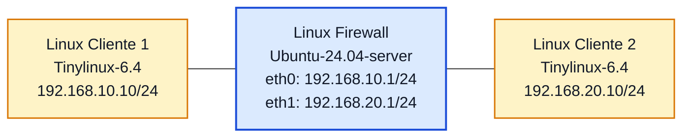

# Laboratório 10B - Firewall Stateful com `iptables`

**Disciplina:** ENE0025 - Protocolos de Transporte e Roteamento  
**Professor responsável:** Prof. Dr. Laerte Peotta de Melo  

---

## Objetivo

Implementar um **firewall stateful** em uma máquina Linux no PNetLab , reutilizando a topologia do **Laboratório  10**, com regras baseadas em **estado de conexão** para permitir automaticamente o tráfego de retorno de sessões já autorizadas.

---

## Introdução

No **Laboratório  10**, o controle foi feito com um **firewall de pacotes**. Nesse modelo, cada pacote é tratado de forma isolada e, por isso, normalmente é necessário criar regras explícitas de ida e de volta.

No **Laboratório  10B**, o firewall passa a acompanhar o **estado das conexões**. Com isso, é possível permitir o início de uma comunicação e deixar que o tráfego de retorno seja aceito automaticamente quando ele pertencer a uma sessão já estabelecida.

No Linux, isso é feito com `iptables` e rastreamento de conexões do kernel, usando principalmente:

- `-m conntrack` Ativa o módulo de rastreamento de conexões no iptables, permitindo que a regra use informações sobre o estado da comunicação.
- `--ctstate NEW` Indica que o pacote está iniciando uma nova conexão.
- `--ctstate ESTABLISHED` Indica que o pacote faz parte de uma conexão já estabelecida, ou seja, de uma comunicação que já foi iniciada e aceita antes.
- `--ctstate RELATED` Indica que o pacote está relacionado a uma conexão existente, mesmo que não pertença exatamente ao fluxo principal.


---

## Situação-problema

Uma organização deseja evoluir seu firewall Linux, saindo de um modelo de filtragem simples de pacotes para um modelo **stateful**, capaz de reconhecer conexões já estabelecidas e permitir automaticamente o tráfego de retorno, reduzindo a quantidade de regras e tornando a política mais fácil de administrar.

---

## Topologia lógica



---

## Plano de endereçamento

| Dispositivo | Interface | Endereço IP | Máscara | Gateway |
|---|---|---|---|---|
| Linux Cliente 1 | eth0 | 192.168.10.10 | 255.255.255.0 | 192.168.10.1 |
| Linux Firewall | eth0 | 192.168.10.1 | 255.255.255.0 | - |
| Linux Firewall | eth1 | 192.168.20.1 | 255.255.255.0 | - |
| Linux Cliente 2 | eth0 | 192.168.20.10 | 255.255.255.0 | 192.168.20.1 |

---

## Pré-requisitos

Considere já concluídos:

- configuração IP dos hosts;
- configuração IP do Linux Firewall;
- ativação do roteamento IP;
- testes básicos de conectividade do Laboratório  10.

Confirme no firewall:

```bash
ip addr show
cat /proc/sys/net/ipv4/ip_forward
```

---

## Conceitos de estado

### `NEW`
Pacote que inicia uma nova conexão.

### `ESTABLISHED`
Pacote pertencente a uma conexão já estabelecida.

### `RELATED`
Pacote relacionado a uma conexão existente.

> Neste Laboratório o foco principal será observar a diferença entre **NEW** e **ESTABLISHED**.

---

## Limpeza inicial

```bash
sudo iptables -F
sudo iptables -X
sudo iptables -Z
sudo iptables -P FORWARD DROP
```

---

## Regra central do firewall stateful

A principal diferença deste Laboratório é permitir automaticamente o tráfego de retorno de conexões já estabelecidas.

```bash
sudo iptables -A FORWARD -m conntrack --ctstate ESTABLISHED,RELATED -j ACCEPT
```

Essa regra permite:

- pacotes que pertencem a conexões já aceitas;
- pacotes relacionados a conexões existentes.

---

## Regras de novas conexões iniciadas pelo Cliente 1

### Permitir ICMP iniciado pelo Cliente 1

```bash
sudo iptables -A FORWARD -s 192.168.10.10 -d 192.168.20.10 -p icmp -m conntrack --ctstate NEW -j ACCEPT
```

### Permitir HTTP iniciado pelo Cliente 1

```bash
sudo iptables -A FORWARD -s 192.168.10.10 -d 192.168.20.10 -p tcp --dport 80 -m conntrack --ctstate NEW -j ACCEPT
```

### Conjunto final mínimo de regras

```bash
sudo iptables -F
sudo iptables -P FORWARD DROP
sudo iptables -A FORWARD -m conntrack --ctstate ESTABLISHED,RELATED -j ACCEPT
sudo iptables -A FORWARD -s 192.168.10.10 -d 192.168.20.10 -p icmp -m conntrack --ctstate NEW -j ACCEPT
sudo iptables -A FORWARD -s 192.168.10.10 -d 192.168.20.10 -p tcp --dport 80 -m conntrack --ctstate NEW -j ACCEPT
```

---

## Verificação das regras

```bash
sudo iptables -L -n -v
sudo iptables -S
```

---

## Testes práticos

### Teste de ICMP iniciado pelo Cliente 1

No **Linux Cliente 1**:

```bash
ping 192.168.20.10
```

Resultado esperado: **deve funcionar**.

No **Linux Cliente 2**:

```bash
ping 192.168.10.10
```

Resultado esperado: **deve falhar**.

### Teste de HTTP iniciado pelo Cliente 1

No **Linux Cliente 2**, suba um serviço HTTP simples:

```bash
python3 -m http.server 80
```

ou

```bash
busybox httpd -f -p 80
```

No **Linux Cliente 1**:

```bash
curl http://192.168.20.10
```

ou

```bash
wget -O- http://192.168.20.10
```

Resultado esperado: **deve funcionar**.

### Teste de nova conexão iniciada pelo Cliente 2

```bash
nc -vz 192.168.10.10 80
```

Resultado esperado: **deve falhar**.

### Teste de Telnet não permitido

No **Linux Cliente 1**:

```bash
telnet 192.168.20.10 23
```

ou

```bash
nc -vz 192.168.20.10 23
```

Resultado esperado: **deve falhar**.

---

## Atividade comparativa para visualizar a diferença entre filtro de pacotes e stateful

Nesta atividade, os alunos devem comparar o comportamento do **Laboratório  10** e do **Laboratório  10B** na mesma topologia.

### Etapa A - Executar o Laboratório  10

Aplicar as regras do **firewall de pacotes** e observar que, para o tráfego funcionar, foi necessário criar:

- regra de ida;
- regra de volta.

Exemplo observado no Laboratório  10:

- Cliente 1 inicia HTTP para Cliente 2;
- o retorno precisou ser tratado por regra explícita.

### Etapa B - Executar o Laboratório  10B

Substituir as regras anteriores pelas regras **stateful** deste Laboratório oratório e observar que agora basta:

- permitir a conexão nova;
- permitir `ESTABLISHED,RELATED`.

### Etapa C - Realizar os mesmos testes nos dois Laboratório

Os alunos devem testar:

- ping iniciado pelo Cliente 1;
- ping iniciado pelo Cliente 2;
- HTTP iniciado pelo Cliente 1;
- nova conexão TCP iniciada pelo Cliente 2;
- tentativa de Telnet.

### Etapa D - Comparar a saída das regras

Executar em ambos os cenários:

```bash
sudo iptables -L -n -v
sudo iptables -S
```

Se disponível no firewall stateful:

```bash
sudo conntrack -L
```

### Tabela para preenchimento pelos alunos

| Teste | Laboratório  10 - Filtro de pacotes | Laboratório  10B - Stateful |
|---|---|---|
| Ping iniciado pelo Cliente 1 |  |  |
| Retorno da comunicação |  |  |
| HTTP Cliente 1 → Cliente 2 |  |  |
| Nova conexão iniciada pelo Cliente 2 |  |  |
| Quantidade de regras |  |  |
| Facilidade de administração |  |  |

### Síntese esperada da atividade

Ao final, o aluno deve perceber que:

- no **filtro de pacotes**, normalmente é preciso escrever regras explícitas de ida e de volta;
- no **stateful**, o retorno de conexões autorizadas é tratado automaticamente;
- o modelo stateful reduz regras duplicadas e melhora a legibilidade da política.

---

## Inspeção de conexões rastreadas

Se o pacote `conntrack` estiver disponível no firewall:

```bash
sudo conntrack -L
```

> Se esse utilitário não estiver instalado, a análise pode ser feita pelos testes práticos e pelos contadores das regras.

---

## Questões para análise

1. O que diferencia um firewall stateful de um firewall de pacotes simples?
2. Qual a função de `-m conntrack --ctstate ESTABLISHED,RELATED`?
3. Por que o retorno da conexão HTTP não precisou de regra explícita no sentido inverso?
4. O que caracteriza um pacote no estado `NEW`?
5. Qual a principal vantagem de usar regras stateful em relação ao Laboratório  10?
6. Por que o Cliente 2 não conseguiu iniciar novas conexões para o Cliente 1?
7. O que mudou na quantidade e na lógica das regras entre Laboratório  10 e Laboratório  10B?
8. Em que tipo de ambiente um firewall stateful tende a ser mais adequado?
9. O firewall stateful elimina a necessidade de política de bloqueio padrão? Explique.
10. O que a atividade comparativa mostrou de forma mais clara sobre a diferença entre os dois modelos?

---

## Critérios de avaliação

| Critério | Pontuação |
|---|---:|
| Reutilização correta da topologia e do endereçamento | 1,5 |
| Limpeza e aplicação das políticas padrão e regras com `conntrack` | 2,5 |
| Implementação da lógica stateful (`ESTABLISHED,RELATED` e `NEW`) | 2,5 |
| Testes práticos de conectividade unidirecional e bloqueio | 1,5 |
| Respostas técnicas às questões para análise e tabela comparativa | 2,0 |
| **Total** | **10,0** |

---

## Entregáveis

Cada aluno deve entregar relatório contendo:

- print da topologia no PNetLab;
- print da configuração IP dos três Linux;
- print do comando `iptables -L -n -v`;
- evidência dos testes de:
  - ping iniciado pelo Cliente 1 e funcionando;
  - ping iniciado pelo Cliente 2 e falhando;
  - HTTP iniciado pelo Cliente 1 e funcionando;
  - tentativa de Telnet bloqueada;
- tabela comparativa preenchida entre **Laboratório 10** e **Laboratório 10B**;
- texto curto explicando a diferença entre firewall de pacotes e firewall stateful;
- respostas completas às questões para análise.

---

## Conclusão esperada

Ao final deste Laboratório, o aluno deve perceber que:

- um firewall stateful acompanha o estado das conexões;
- o `iptables`, com `conntrack`, permite liberar respostas automaticamente;
- o modelo stateful reduz a necessidade de regras duplicadas de retorno;
- a comparação prática com o Laboratório 10 torna mais visível a diferença entre os dois modelos;
- o firewall stateful representa uma evolução natural em relação ao firewall de pacotes estudado no Laboratório 10.

---

[← Anterior: Laboratório 10](lab10.md) | [Índice Geral (README)](../README.md) | [Próximo: Laboratório 11A →](lab11A.md)

