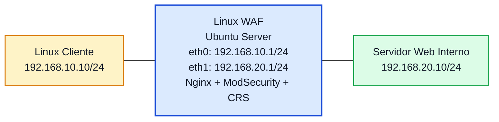

# Laboratório 11A - Implementação de WAF com ModSecurity e OWASP CRS

**Disciplina:** ENE0025 - Protocolos de Transporte e Roteamento  
**Professor responsável:** Prof. Dr. Laerte Peotta de Melo  
**Tema:** Proteção de aplicações web com Web Application Firewall  

---

## Objetivo

Implementar um **Web Application Firewall (WAF)** em uma máquina Linux no PNetLab, utilizando **Nginx + ModSecurity + OWASP Core Rule Set (CRS)** em modo de **proxy reverso**, de forma que o tráfego HTTP entre um cliente e um servidor web interno seja inspecionado e controlado na **camada de aplicação**.

- **Nginx**: servidor web e proxy reverso que recebe as requisições dos clientes e as encaminha para o servidor interno.
- **ModSecurity**: mecanismo de firewall de aplicação que inspeciona requisições e respostas HTTP em busca de padrões suspeitos.
- **OWASP Core Rule Set (CRS)**: conjunto de regras prontas para o ModSecurity, criado para detectar e bloquear ataques web comuns, como SQL Injection e XSS.

Ao final deste laboratório, o estudante deverá ser capaz de:

- compreender a função de um WAF;
- diferenciar WAF de firewall de pacotes e firewall stateful;
- implantar um proxy reverso com inspeção HTTP;
- validar acesso legítimo a uma aplicação web;
- observar o ponto de inserção do WAF na arquitetura da rede.

---

## Introdução

Nos laboratórios anteriores, o controle de tráfego foi feito inicialmente com um **firewall de pacotes**, que toma decisões com base em informações como endereço IP, protocolo e porta, e depois com um **firewall stateful**, que também acompanha o estado das conexões. Esses mecanismos são fundamentais para a segurança da rede, mas não conseguem, sozinhos, analisar em profundidade o conteúdo de uma requisição web.

## Web Application Firewall (WAF)

Um **Web Application Firewall (WAF)** atua em um nível mais alto, inspecionando o tráfego **HTTP/HTTPS** e aplicando regras voltadas à proteção de aplicações web. Em vez de decidir apenas se a porta 80 ou 443 pode ser usada, o WAF analisa elementos como:

- URL requisitada;
- parâmetros enviados;
- cabeçalhos HTTP;
- corpo da requisição;
- padrões de ataque comuns contra aplicações.

Na prática, isso permite bloquear comportamentos suspeitos mesmo quando o acesso à aplicação web é legítimo do ponto de vista da rede. Ou seja, a porta 80 pode estar aberta, a conexão pode estar estabelecida corretamente, mas ainda assim a requisição pode ser barrada por conter um padrão perigoso.

Neste laboratório, será utilizado o **ModSecurity**, em conjunto com o **OWASP Core Rule Set (CRS)**, para transformar uma máquina Linux em um **WAF reverso**, posicionada entre um cliente e um servidor web interno. O objetivo desta primeira parte é implantar a estrutura do WAF, publicar a aplicação web por meio do proxy reverso e validar o funcionamento do fluxo legítimo. A exploração de ataques e a análise aprofundada dos bloqueios ficam como continuidade natural para o **Lab 11B**.


## Proxy Reverso

Um proxy reverso é um servidor intermediário que recebe as requisições dos clientes e as encaminha para um ou mais servidores internos, devolvendo depois a resposta ao cliente.

Na prática, o cliente acha que está falando diretamente com o serviço, mas na verdade está falando primeiro com o proxy reverso. Esse proxy fica “na frente” da aplicação.


## Funções principais de um proxy reverso

- Ocultar o servidor interno: O cliente acessa o proxy, não o servidor real.
- Distribuir requisições: Pode enviar tráfego para vários servidores backend, fazendo balanceamento de carga.
- Aplicar segurança: Pode atuar com WAF, TLS/HTTPS, autenticação, filtragem e limitação de acesso.
- Melhorar desempenho: Pode fazer cache, compressão e otimização de conexões.
- Centralizar publicação de serviços: Vários sites ou aplicações podem ser publicados por um único ponto de entrada.

---

## Relação com os Laboratórios 10 e 10B

Este laboratório deve ser entendido como continuação direta do processo de evolução das defesas em rede:

- **Lab 10**: firewall de pacotes com `iptables`
- **Lab 10B**: firewall stateful com `conntrack`
- **Lab 11A**: firewall de aplicação com inspeção de tráfego HTTP

### Síntese comparativa

| Tecnologia | Camada de atuação | Exemplo de decisão |
|---|---|---|
| Firewall de pacotes | Rede / Transporte | Permitir ou bloquear TCP/80 |
| Firewall stateful | Rede / Transporte com estado | Permitir retorno de conexão já estabelecida |
| WAF | Aplicação | Permitir acesso à página, mas bloquear requisição maliciosa |

---

## Situação-problema

Uma organização já protege sua rede com um firewall tradicional, permitindo apenas o tráfego necessário entre suas redes. Posteriormente, passou a usar firewall stateful para melhorar o controle das conexões e reduzir regras redundantes. Ainda assim, a equipe percebe que uma aplicação web interna continua exposta a riscos, já que qualquer usuário com acesso à porta HTTP pode enviar requisições maliciosas.

Para aumentar a proteção, a organização decide implantar um **WAF** entre os clientes e o servidor web interno, de forma que o serviço continue acessível, mas com inspeção de conteúdo na camada de aplicação.

---

## Topologia lógica



---

## Plano de endereçamento

| Dispositivo | Interface | Endereço IP | Máscara | Gateway |
|---|---|---|---|---|
| Linux Cliente | eth0 | 192.168.10.10 | 255.255.255.0 | 192.168.10.1 |
| Linux WAF | eth0 | 192.168.10.1 | 255.255.255.0 | - |
| Linux WAF | eth1 | 192.168.20.1 | 255.255.255.0 | - |
| Servidor Web Interno | eth0 | 192.168.20.10 | 255.255.255.0 | 192.168.20.1 |

---

## Premissas do laboratório

Neste laboratório, o foco será:

- configurar o endereçamento IP dos três hosts;
- instalar e preparar o servidor web interno;
- instalar o Nginx no host intermediário;
- instalar e habilitar o ModSecurity;
- ativar o OWASP CRS;
- configurar o WAF como **proxy reverso**;
- validar o acesso legítimo ao serviço publicado.

> Neste primeiro laboratório, a ênfase está na **implantação do WAF** e na **publicação da aplicação web**. Testes de ataques, tuning de regras e análise de bloqueios podem ser aprofundados no **Lab 11B**.

---

## Sugestão de imagens no PNetLab

### Linux Cliente
Pode ser usado:

- TinyCore Linux
- Ubuntu básico

### Linux WAF
Recomendado:

- **Ubuntu Server 24.04**  
ou  
- **Ubuntu Server 22.04**

### Servidor Web Interno
Pode ser usado:

- Ubuntu Server
- Debian Server

---

## Configuração dos hosts

### Linux Cliente

Configure o endereço IP e a rota padrão:

```bash
sudo ip addr add 192.168.10.10/24 dev eth0
sudo ip link set eth0 up
sudo ip route add default via 192.168.10.1
```

### Servidor Web Interno

Configure o endereço IP e a rota padrão:

```bash
sudo ip addr add 192.168.20.10/24 dev eth0
sudo ip link set eth0 up
sudo ip route add default via 192.168.20.1
```

### Linux WAF

Configure as duas interfaces:

```bash
sudo ip addr add 192.168.10.1/24 dev eth0
sudo ip addr add 192.168.20.1/24 dev eth1
sudo ip link set eth0 up
sudo ip link set eth1 up
```

Verifique:

```bash
ip addr show
```

---

## Ativação do roteamento IP no WAF

Embora o WAF opere principalmente como proxy reverso, é recomendável manter o host preparado para encaminhamento entre interfaces quando necessário.

```bash
sudo sysctl -w net.ipv4.ip_forward=1
```

Confirmar:

```bash
cat /proc/sys/net/ipv4/ip_forward
```

Valor esperado:

```bash
1
```

---

## Teste inicial de conectividade

Antes da implantação do WAF, valide a conectividade entre os hosts.

### No Linux Cliente

```bash
ping 192.168.10.1
```

### No Servidor Web

```bash
ping 192.168.20.1
```

### No Linux WAF

```bash
ping 192.168.10.10
ping 192.168.20.10
```

---

## Preparação do servidor web interno

No servidor web interno, instale um serviço HTTP simples.

### Opção com Nginx

```bash
sudo apt update
sudo apt install -y nginx
```

### Criar uma página simples

```bash
echo "<h1>Servidor Web Interno OK</h1>" | sudo tee /var/www/html/index.html
```

### Verificar o serviço

```bash
sudo systemctl enable nginx
sudo systemctl start nginx
sudo systemctl status nginx
```

### Teste local no próprio servidor

```bash
curl http://127.0.0.1
```

Resultado esperado: a página HTML deve ser exibida.

---

## Instalação do Nginx no host WAF

No Linux WAF:

```bash
sudo apt update
sudo apt install -y nginx
```

Verifique:

```bash
sudo systemctl enable nginx
sudo systemctl start nginx
sudo systemctl status nginx
```

---

## Instalação do ModSecurity no host WAF

Instale o módulo do ModSecurity e componentes necessários:

```bash
sudo apt install -y libnginx-mod-http-modsecurity modsecurity-crs
```

> Dependendo da imagem Linux e do repositório disponível, os nomes dos pacotes podem variar ligeiramente. O importante é garantir:
>
> - módulo ModSecurity para Nginx;
> - conjunto de regras OWASP CRS.

---

## Habilitação do ModSecurity

Verifique o arquivo principal de configuração do ModSecurity. Em muitas instalações, ele está em:

```bash
/etc/modsecurity/modsecurity.conf
```

Se necessário, copie o arquivo recomendado:

```bash
sudo cp /etc/modsecurity/modsecurity.conf-recommended /etc/modsecurity/modsecurity.conf
```

Edite o parâmetro:

```bash
SecRuleEngine DetectionOnly
```

e altere para:

```bash
SecRuleEngine On
```

Exemplo com `sed`:

```bash
sudo sed -i 's/SecRuleEngine DetectionOnly/SecRuleEngine On/' /etc/modsecurity/modsecurity.conf
```

---

## Ativação do OWASP CRS

Verifique a localização do CRS. Em instalações comuns no Ubuntu, ele pode estar em:

```bash
/etc/modsecurity/crs/
```

ou

```bash
/usr/share/modsecurity-crs/
```

Se necessário, copie o arquivo de exemplo:

```bash
sudo cp /usr/share/modsecurity-crs/crs-setup.conf.example /etc/modsecurity/crs/crs-setup.conf
```

---

## Configuração do Nginx como proxy reverso com WAF

Crie ou edite a configuração do site padrão do Nginx no WAF.

Exemplo de arquivo:

```bash
sudo vi /etc/nginx/sites-available/default
```

Conteúdo sugerido:

```nginx
server {
    listen 80;
    server_name _;

    modsecurity on;
    modsecurity_rules_file /etc/nginx/modsec/main.conf;

    location / {
        proxy_pass http://192.168.20.10;
        proxy_set_header Host $host;
        proxy_set_header X-Real-IP $remote_addr;
        proxy_set_header X-Forwarded-For $proxy_add_x_forwarded_for;
    }
}
```

---

## Arquivo principal de regras do Nginx + ModSecurity

Crie o arquivo:

```bash
sudo mkdir -p /etc/nginx/modsec
sudo vi /etc/nginx/modsec/main.conf
```

Conteúdo sugerido:

```conf
Include /etc/modsecurity/modsecurity.conf
Include /usr/share/modsecurity-crs/crs-setup.conf
Include /usr/share/modsecurity-crs/rules/*.conf
```

> Em algumas distribuições, o caminho do CRS pode mudar. Ajuste conforme a instalação real.

---

## Teste e recarga do Nginx

Verifique a sintaxe:

```bash
sudo nginx -t
```

Se estiver correto:

```bash
sudo systemctl restart nginx
```

Verifique o serviço:

```bash
sudo systemctl status nginx
```

---

## Teste funcional do proxy reverso

No **Linux Cliente**, faça o acesso ao IP do WAF:

```bash
curl http://192.168.10.1
```

Resultado esperado:

- o cliente deve receber a página hospedada no servidor web interno;
- o acesso deve ocorrer **via WAF**, e não diretamente ao backend.

---

## Teste comparativo de acesso direto e indireto

### Acesso via WAF

No cliente:

```bash
curl http://192.168.10.1
```

### Acesso direto ao backend

Se houver rota direta, teste:

```bash
curl http://192.168.20.10
```

### O que observar

- o acesso correto para publicação deve ser via **WAF**;
- o backend idealmente deve ficar menos exposto ao cliente;
- o WAF passa a ser o ponto principal de entrada para o serviço web.

---

## Verificação de logs

### Logs do Nginx

```bash
sudo tail -f /var/log/nginx/access.log
```

```bash
sudo tail -f /var/log/nginx/error.log
```

### Logs do ModSecurity

Dependendo da configuração, o log pode estar em:

```bash
/var/log/modsec_audit.log
```

ou em outro caminho definido no `modsecurity.conf`.

Exemplo:

```bash
sudo tail -f /var/log/modsec_audit.log
```

---

## Observações didáticas importantes

Ao final desta etapa, o aluno deve perceber que:

- o cliente acessa o serviço web pelo IP do WAF;
- o servidor web interno continua existindo atrás da proteção;
- o WAF analisa o conteúdo HTTP antes de encaminhar ao backend;
- a proteção agora ocorre na **camada de aplicação**, e não apenas em IP, porta ou estado da conexão.

---

## Diferença em relação aos Labs 10 e 10B

### No Lab 10
O host intermediário filtrava pacotes com `iptables`.

### No Lab 10B
O host intermediário passou a considerar estados de conexão.

### No Lab 11A
O host intermediário atua como **proxy reverso com inspeção HTTP**, o que significa que ele entende melhor o serviço publicado e pode aplicar políticas específicas sobre requisições web.

---

## Questões para análise

1. O que caracteriza um WAF?
2. Qual é a principal diferença entre um WAF e um firewall stateful?
3. Por que o WAF é mais adequado para proteger aplicações web do que um firewall tradicional?
4. Qual é a função do ModSecurity neste laboratório?
5. Qual é a função do OWASP CRS?
6. O que significa operar o WAF como **proxy reverso**?
7. Por que o acesso ao backend deve preferencialmente ocorrer por meio do WAF?
8. Que vantagens práticas surgem ao separar cliente, WAF e servidor web em redes distintas?
9. O WAF substitui a necessidade de firewall de rede? Explique.
10. Qual a principal evolução conceitual entre os Labs 10, 10B e 11A?

---

## Critérios de avaliação

| Critério | Pontos |
|---|---:|
| Configuração correta do endereçamento | 1,5 |
| Instalação e configuração do servidor web interno | 1,5 |
| Instalação do Nginx no host WAF | 1,0 |
| Instalação e ativação do ModSecurity + CRS | 2,5 |
| Configuração funcional do proxy reverso | 2,0 |
| Testes, logs e análise das questões | 1,5 |

**Total: 10,0**

---

## Entregáveis

Cada aluno deve entregar:

- print da topologia no PNetLab;
- print da configuração IP dos três hosts;
- print do `nginx -t` no WAF;
- print do acesso bem-sucedido do cliente ao serviço via WAF;
- print dos logs do Nginx;
- print dos logs do ModSecurity, se já houver eventos registrados;
- relatório curto contendo:
  - objetivo do laboratório;
  - descrição do fluxo Cliente → WAF → Servidor Web;
  - explicação da diferença entre firewall tradicional, stateful e WAF.

---

## Conclusão esperada

Ao final deste laboratório, o estudante deve perceber que:

- um **WAF** protege aplicações web em um nível superior ao firewall tradicional;
- o uso de **proxy reverso** permite centralizar a proteção do serviço publicado;
- o **ModSecurity** com **OWASP CRS** fornece uma base prática para inspeção de tráfego HTTP;
- a porta 80 pode continuar aberta, mas o conteúdo da requisição passa a ser analisado;
- o WAF representa uma nova camada de defesa, complementar aos mecanismos estudados anteriormente.

---

[← Anterior: Laboratório 10B](lab10B.md) | [Índice Geral (README)](../README.md) | [Próximo: Laboratório 11B →](lab11B.md)

