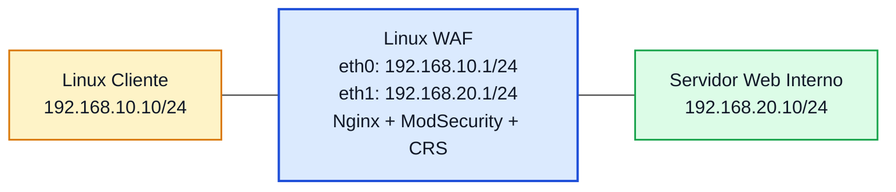

# Laboratório 11B - Testes de Ataques Web e Análise de Logs no WAF

**Disciplina:** ENE0025 - Protocolos de Transporte e Roteamento  
**Professor responsável:** Prof. Dr. Laerte Peotta de Melo  
**Tema:** Validação prática de proteção web com WAF  

---

## Objetivo

Dar continuidade ao **Lab 11A**, realizando testes controlados de requisições HTTP legítimas e maliciosas contra o ambiente protegido por **Nginx + ModSecurity + OWASP CRS**, de modo que o estudante consiga:

- observar o comportamento do WAF diante de tráfego normal e suspeito;
- identificar bloqueios gerados por regras do OWASP CRS;
- analisar logs do Nginx e do ModSecurity;
- compreender, na prática, a diferença entre:
  - firewall de pacotes;
  - firewall stateful;
  - WAF.

---

## Introdução

No **Lab 11A**, o aluno implantou um **proxy reverso com WAF**, posicionando o Linux WAF entre o cliente e o servidor web interno. Nessa etapa, o foco foi a instalação, a publicação do serviço e a validação do acesso legítimo.

No **Lab 11B**, o foco passa a ser o **comportamento do WAF diante de diferentes tipos de requisição HTTP**. O objetivo é mostrar que, mesmo com a porta 80 liberada e a comunicação TCP funcionando normalmente, ainda assim uma requisição pode ser bloqueada quando apresenta sinais de ataque na camada de aplicação.

Este laboratório é importante porque torna visível a principal diferença entre os mecanismos estudados até aqui:

- o firewall de pacotes decide com base em IP, protocolo e porta;
- o firewall stateful acompanha o estado da conexão;
- o WAF inspeciona o conteúdo da requisição HTTP.

---

## Relação com os Labs 10, 10B e 11A

| Laboratório | Tecnologia | Foco principal |
|---|---|---|
| Lab 10 | Firewall de pacotes | Filtragem por IP, protocolo e porta |
| Lab 10B | Firewall stateful | Filtragem com rastreamento de conexão |
| Lab 11A | WAF em proxy reverso | Publicação e inspeção HTTP |
| Lab 11B | WAF com testes práticos | Bloqueio e análise de requisições maliciosas |

---

## Situação-problema

Uma aplicação web já está publicada por meio de um proxy reverso com WAF. A equipe de segurança precisa verificar se essa proteção consegue identificar padrões suspeitos em requisições HTTP e registrar adequadamente os eventos para investigação.

Para isso, serão realizados acessos normais e testes controlados com padrões frequentemente associados a:

- **SQL Injection:** Ataque em que o invasor tenta inserir comandos SQL em campos ou parâmetros da aplicação para manipular consultas ao banco de dados.
- **Cross-Site Scripting (XSS):** Ataque em que código malicioso, geralmente JavaScript, é injetado em páginas web para ser executado no navegador da vítima.
- **path traversal:** Ataque em que o invasor tenta acessar arquivos ou diretórios indevidos no servidor usando caminhos como `../` para sair da pasta permitida.
- **Parâmetros suspeitos em URL:** São valores passados na própria URL que indicam tentativa de manipular o comportamento da aplicação ou acessar algo indevido.

### Exemplos comuns:

- tentar inserir comandos em parâmetros, como em `?id=1' OR '1'='1`
- enviar scripts maliciosos, como em `?q=<script>alert(1)</script>`
- tentar acessar arquivos fora da pasta permitida, como em `?file=../../etc/passwd`

São chamados de suspeitos porque fogem do uso normal esperado pela aplicação e podem indicar tentativa de ataque, exploração ou varredura. Em um **WAF**, esses parâmetros são analisados para decidir se a requisição deve ser permitida, registrada ou bloqueada.

---

## Topologia lógica



---

## Plano de endereçamento

| Dispositivo | Interface | Endereço IP | Máscara | Gateway |
|---|---|---|---|---|
| Linux Cliente | eth0 | 192.168.10.10 | 255.255.255.0 | 192.168.10.1 |
| Linux WAF | eth0 | 192.168.10.1 | 255.255.255.0 | - |
| Linux WAF | eth1 | 192.168.20.1 | 255.255.255.0 | - |
| Servidor Web Interno | eth0 | 192.168.20.10 | 255.255.255.0 | 192.168.20.1 |

---

## Pré-requisitos

Este laboratório pressupõe que o **Lab 11A** já esteja funcional, com os seguintes itens concluídos:

- endereçamento IP configurado;
- servidor web interno respondendo;
- Nginx em funcionamento no host WAF;
- ModSecurity habilitado;
- OWASP CRS habilitado;
- proxy reverso funcionando;
- acesso normal ao serviço via `http://192.168.10.1`.

---

## Validação inicial do ambiente

Antes dos testes de ataque, confirme que o ambiente está operacional.

### No servidor web interno

```bash
curl http://127.0.0.1
```

### No cliente, via WAF

```bash
curl http://192.168.10.1
```

Resultado esperado: a página do servidor interno deve ser entregue normalmente.

---

## Verificação dos serviços no WAF

```bash
sudo systemctl status nginx
sudo nginx -t
```

Verificar se o ModSecurity está ativo no Nginx:

```bash
sudo grep -R "modsecurity on" /etc/nginx/
```

Verificar o arquivo principal de regras:

```bash
sudo cat /etc/nginx/modsec/main.conf
```

---

## Observação de logs

Durante os testes, mantenha ao menos um terminal aberto no WAF para acompanhar os registros.

### Log de acesso do Nginx

```bash
sudo tail -f /var/log/nginx/access.log
```

### Log de erro do Nginx

```bash
sudo tail -f /var/log/nginx/error.log
```

### Log do ModSecurity

Dependendo da configuração:

```bash
sudo tail -f /var/log/modsec_audit.log
```

ou verifique no `modsecurity.conf` o caminho configurado para auditoria.

---

## Testes de tráfego legítimo

### Acesso normal à página inicial

No cliente:

```bash
curl http://192.168.10.1
```

### Acesso com parâmetro simples

```bash
curl "http://192.168.10.1/?id=10"
```

### Acesso com user-agent comum

```bash
curl -A "Mozilla/5.0" http://192.168.10.1
```

### Resultado esperado

- a resposta deve ser permitida;
- o acesso deve aparecer nos logs;
- não deve haver bloqueio para requisições normais.

---

## Testes controlados de requisições suspeitas

> Execute os testes abaixo somente no ambiente de laboratório.

### Teste de padrão semelhante a SQL Injection

```bash
curl "http://192.168.10.1/?id=1' OR '1'='1"
```

### Teste de padrão semelhante a XSS

```bash
curl "http://192.168.10.1/?q=<script>alert(1)</script>"
```

### Teste de path traversal

```bash
curl "http://192.168.10.1/../../../etc/passwd"
```

### Teste com URL codificada

```bash
curl "http://192.168.10.1/?file=%2e%2e%2f%2e%2e%2fetc%2fpasswd"
```

### Resultado esperado

Em parte dos casos, o WAF deverá:

- bloquear a requisição;
- registrar o evento no log;
- associar o evento a alguma regra do CRS;
- retornar resposta como `403 Forbidden` ou comportamento equivalente.

> Alguns testes podem não acionar bloqueio dependendo da versão do CRS, do modo configurado e do conjunto de regras habilitado. Isso também deve ser analisado pelos alunos.

---

## Comparação prática: rede funcionando, aplicação bloqueada


### Verificar que a conectividade IP continua válida

No cliente:

```bash
ping 192.168.10.1
```

### Verificar que a porta HTTP continua publicada

```bash
curl -I http://192.168.10.1
```

### Verificar que uma requisição maliciosa pode ser bloqueada mesmo com a porta aberta

```bash
curl "http://192.168.10.1/?q=<script>alert(1)</script>"
```

### Interpretação

O aluno deve perceber que:

- a rede está operacional;
- a sessão TCP pode ser estabelecida;
- a porta 80 está acessível;
- mesmo assim, a requisição pode ser barrada por causa do conteúdo HTTP.

---

## Atividade comparativa entre os modelos de firewall

Preencha a tabela abaixo após executar os testes.

| Situação | Firewall de pacotes | Firewall stateful | WAF |
|---|---|---|---|
| Liberar ou bloquear TCP/80 | Sim | Sim | Sim |
| Acompanhar conexão já estabelecida | Não | Sim | Indiretamente |
| Analisar conteúdo da URL | Não | Não | Sim |
| Identificar padrão de XSS | Não | Não | Sim |
| Identificar padrão de SQLi | Não | Não | Sim |
| Bloquear requisição web suspeita sem fechar a porta 80 | Não | Não | Sim |

---

## Análise de logs

Após os testes, os alunos devem localizar nos logs:

- horário da requisição;
- IP de origem;
- recurso acessado;
- código HTTP retornado;
- regra acionada, quando disponível;
- mensagem de auditoria do ModSecurity.

### Exemplo de análise esperada

O aluno deve conseguir afirmar algo como:

- uma requisição legítima foi aceita e registrada no `access.log`;
- uma requisição suspeita gerou evento no `modsec_audit.log`;
- o WAF atuou antes do servidor processar normalmente o conteúdo.

---

## Atividade opcional de tuning

Caso o ambiente esteja estável, o professor pode pedir uma pequena atividade de ajuste:

- identificar uma regra que gerou bloqueio;
- analisar a mensagem registrada;
- discutir se o evento representa ataque real, falso positivo ou teste didático;
- propor ajuste futuro sem desabilitar a proteção inteira.

> Esta etapa é opcional.
> 
---

## Questões para análise

1. O que diferencia um WAF de um firewall stateful?
2. Por que a requisição pode ser bloqueada mesmo com a porta 80 aberta?
3. O que o WAF consegue observar que o `iptables` não observa?
4. Qual foi o comportamento do ambiente diante de tráfego legítimo?
5. Qual foi o comportamento do ambiente diante de tráfego suspeito?
6. O que os logs do Nginx mostram?
7. O que os logs do ModSecurity mostram?
8. Um bloqueio HTTP significa necessariamente falha da rede? Explique.
9. O WAF substitui a necessidade de correção de vulnerabilidade na aplicação? Explique.
10. Qual foi a principal evidência prática de que o WAF atua na camada de aplicação?

---

## Critérios de avaliação

| Critério | Pontos |
|---|---:|
| Validação correta do ambiente do Lab 11A | 1,5 |
| Execução dos testes legítimos | 1,5 |
| Execução dos testes suspeitos | 2,5 |
| Coleta e interpretação dos logs | 2,5 |
| Comparação entre os tipos de firewall | 1,0 |
| Respostas às questões analíticas | 1,0 |

**Total: 10,0**

---

## Entregáveis

Cada aluno deve entregar:

- print da topologia no PNetLab;
- print do acesso normal ao serviço via WAF;
- print de pelo menos um teste suspeito executado;
- print dos logs do Nginx;
- print dos logs do ModSecurity;
- tabela comparativa preenchida;
- relatório curto explicando:
  - o que foi permitido;
  - o que foi bloqueado;
  - por que isso demonstra a atuação do WAF.

---

## Conclusão esperada

Ao final deste laboratório, o estudante deve concluir que:

- o WAF atua em um nível diferente dos firewalls estudados anteriormente;
- a proteção web depende da inspeção do conteúdo HTTP;
- é possível manter um serviço publicado e, ao mesmo tempo, bloquear padrões suspeitos;
- logs são parte essencial da operação e da investigação;
- o **Lab 11B** torna visível, de forma prática, a diferença entre **permitir a conexão** e **permitir a requisição**.

---

[← Anterior: Laboratório 11A](lab11A.md) | [Índice Geral (README)](../README.md) | [Próximo: Laboratório 12 →](lab12.md)

