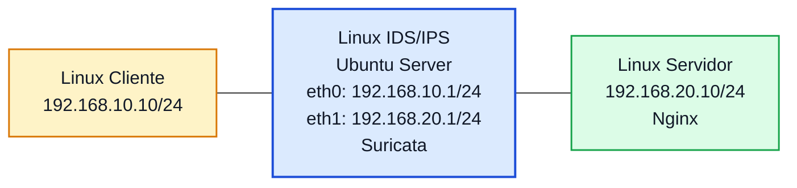

# Laboratório 12 - Implementação de IDS/IPS com Suricata no PNetLab

**Disciplina:** ENE0025 - Protocolos de Transporte e Roteamento  
**Professor responsável:** Prof. Dr. Laerte Peotta de Melo  
**Tema:** Detecção e prevenção de intrusões em tráfego de rede

---

## Objetivo

Implementar um ambiente de **IDS/IPS** no PNetLab utilizando **Suricata** em uma máquina Linux posicionada entre duas redes, permitindo ao estudante:

- compreender a diferença entre **firewall tradicional**, **WAF** e **IDS/IPS**;
- instalar e configurar o Suricata em modo de monitoramento;
- observar alertas gerados a partir da inspeção de tráfego;
- analisar logs e eventos de segurança;
- comparar proteção em camada de rede, transporte e aplicação.

---

## Introdução

Nos laboratórios anteriores, a proteção foi evoluindo em camadas.

No **Lab 10**, foi implementado um **firewall de pacotes**, capaz de tomar decisões com base em endereço IP, protocolo e porta. No **Lab 10B**, esse modelo foi ampliado para um **firewall stateful**, com acompanhamento do estado das conexões. No **Lab 11A** e no **Lab 11B**, a proteção avançou para a **camada de aplicação**, com uso de **WAF**, capaz de inspecionar requisições HTTP e bloquear padrões suspeitos.

Neste **Lab 12**, o foco será um novo tipo de mecanismo: o **IDS/IPS**.

- **IDS (Intrusion Detection System)**: sistema que monitora o tráfego e gera alertas quando identifica padrões suspeitos.
- **IPS (Intrusion Prevention System)**: sistema que, além de detectar, também pode atuar para bloquear ou prevenir tráfego considerado malicioso.


O **Suricata** é uma ferramenta amplamente usada nesse contexto, pois permite:

- inspeção de tráfego em tempo real;
- uso de regras de detecção;
- geração de alertas e logs estruturados;
- identificação de eventos em protocolos como IP, TCP, UDP, ICMP, DNS e HTTP.

Neste laboratório, a ênfase será a **implantação do Suricata** e a **observação de alertas em modo IDS**.

---

## Relação com os laboratórios anteriores

| Laboratório | Tecnologia | Foco principal |
|---|---|---|
| Lab 10 | Firewall de pacotes | Filtragem por IP, protocolo e porta |
| Lab 10B | Firewall stateful | Rastreamento de conexões |
| Lab 11A | WAF | Publicação protegida via proxy reverso |
| Lab 11B | WAF | Testes de ataques web e análise de logs |
| Lab 12 | IDS/IPS com Suricata | Detecção e análise de tráfego suspeito |

---

## Situação-problema

Uma organização já possui firewall e WAF para proteger sua infraestrutura. Mesmo assim, a equipe de segurança precisa de uma camada adicional que permita **detectar padrões suspeitos no tráfego da rede**, registrar eventos e apoiar a investigação de incidentes.

Para isso, será implantado um **sensor IDS/IPS** entre duas redes, de forma que o tráfego passe por inspeção e gere alertas quando forem identificadas assinaturas suspeitas.

---

## Topologia lógica



---

## Plano de endereçamento

| Dispositivo | Interface | Endereço IP | Máscara | Gateway |
|---|---|---|---|---|
| Linux Cliente | eth0 | 192.168.10.10 | 255.255.255.0 | 192.168.10.1 |
| Linux IDS/IPS | eth0 | 192.168.10.1 | 255.255.255.0 | - |
| Linux IDS/IPS | eth1 | 192.168.20.1 | 255.255.255.0 | - |
| Linux Servidor | eth0 | 192.168.20.10 | 255.255.255.0 | 192.168.20.1 |

---

## Premissas do laboratório

Neste laboratório, considere que:

- os equipamentos **já estão com a rede configurada**;
- o **Nginx já está instalado** no servidor;
- o tráfego entre cliente, sensor e servidor já pode ser testado;
- o foco será exclusivamente na **implantação do Suricata** e na **análise dos eventos gerados**.

> Neste primeiro momento, a proposta principal é trabalhar com **detecção**. O uso de **IPS com bloqueio ativo** pode ser explorado depois, com integração ao `iptables` ou `NFQUEUE`.

---

## Validação inicial do ambiente

Antes de instalar o Suricata, valide se o cenário já está funcional.

### No cliente

```bash
ping 192.168.10.1
ping 192.168.20.10
curl http://192.168.20.10
```

### No servidor

```bash
ping 192.168.20.1
ping 192.168.10.10
curl http://127.0.0.1
```

### No IDS/IPS

```bash
ping 192.168.10.10
ping 192.168.20.10
```

Resultado esperado:

- conectividade IP entre os elementos;
- resposta HTTP do servidor;
- ambiente pronto para monitoramento.

---

## Verificação do encaminhamento IP no sensor

No Linux IDS/IPS:

```bash
cat /proc/sys/net/ipv4/ip_forward
```

Se o valor não for `1`, habilite:

```bash
sudo sysctl -w net.ipv4.ip_forward=1
```

Para persistência:

```bash
echo "net.ipv4.ip_forward = 1" | sudo tee -a /etc/sysctl.conf
sudo sysctl -p
```

---

## Verificação do serviço web

Como o **Nginx já está instalado**, apenas confirme se o serviço está ativo no servidor:

```bash
sudo systemctl status nginx
curl http://127.0.0.1
```

---

## Instalação do Suricata

No Linux IDS/IPS:

```bash
sudo apt update
sudo apt install -y suricata
```

Verificar versão:

```bash
suricata --build-info
```

Verificar serviço:

```bash
sudo systemctl status suricata
```

---

## Localização dos arquivos principais

Em instalações típicas no Ubuntu:

- configuração principal: `/etc/suricata/suricata.yaml`
- regras: `/var/lib/suricata/rules/`
- logs: `/var/log/suricata/`

---

## Atualização das regras

Atualize as regras do Suricata:

```bash
sudo suricata-update
```

Após a atualização, reinicie o serviço:

```bash
sudo systemctl restart suricata
```

---

## Interfaces de captura

Antes de iniciar testes, identifique os nomes corretos das interfaces:

```bash
ip -br addr
```

Exemplo esperado:

- `eth0` voltada para a rede 192.168.10.0/24
- `eth1` voltada para a rede 192.168.20.0/24

---

## Execução do Suricata em modo IDS

Para testes controlados, você pode parar o serviço e executar manualmente o Suricata em foreground.

```bash
sudo systemctl stop suricata
```

Executar na interface desejada:

```bash
sudo suricata -i eth0 -v
```

> Dependendo do cenário, pode ser mais interessante monitorar `eth0`, `eth1` ou ambas em configuração mais avançada. Neste laboratório inicial, uma interface já é suficiente para observar o comportamento da ferramenta.

---

## Testes de tráfego legítimo

### Ping

No cliente:

```bash
ping 192.168.20.10
```

### HTTP

No cliente:

```bash
curl http://192.168.20.10
```

### Conexão simples na porta 80

```bash
nc -vz 192.168.20.10 80
```

### Resultado esperado

- o tráfego deve continuar funcionando normalmente;
- o Suricata deve registrar fluxos e possivelmente eventos, dependendo das regras ativas;
- os alunos devem perceber que o IDS monitora sem necessariamente bloquear.

---

## Observação dos logs

Abra outro terminal no Linux IDS/IPS.

### Alertas simples

```bash
sudo tail -f /var/log/suricata/fast.log
```

### Eventos estruturados

```bash
sudo tail -f /var/log/suricata/eve.json
```

### Estatísticas

```bash
sudo tail -f /var/log/suricata/stats.log
```

---

## Testes de tráfego suspeito controlado

> Execute somente em ambiente de laboratório.

### Varredura simples com Nmap

No cliente, se o `nmap` estiver disponível:

```bash
sudo apt install -y nmap
nmap -sS 192.168.20.10
```

ou

```bash
nmap -sV 192.168.20.10
```

### Requisição HTTP suspeita

```bash
curl "http://192.168.20.10/?q=<script>alert(1)</script>"
```

### Tentativa de path traversal

```bash
curl "http://192.168.20.10/../../../etc/passwd"
```

### Interpretação esperada

- o Suricata pode gerar alertas dependendo do conjunto de regras ativo;
- os eventos devem aparecer em `fast.log` e/ou `eve.json`;
- nem todo tráfego suspeito necessariamente acionará uma regra, e isso também faz parte da análise.

---

## Diferença entre IDS e IPS

### IDS
- monitora;
- detecta;
- registra;
- alerta.

### IPS
- monitora;
- detecta;
- pode bloquear ou descartar tráfego.

Neste laboratório, o ambiente está inicialmente configurado como **IDS**.

---

## Comparação didática com os laboratórios anteriores

| Recurso | Firewall de pacotes | Stateful | WAF | IDS/IPS |
|---|---|---|---|---|
| Filtrar por IP e porta | Sim | Sim | Não é o foco | Pode observar |
| Acompanhar estado de conexão | Não | Sim | Parcialmente | Pode analisar |
| Inspecionar conteúdo HTTP | Não | Não | Sim | Sim, dependendo das regras |
| Gerar alerta de comportamento suspeito | Limitado | Limitado | Sim | Sim |
| Bloquear automaticamente | Sim | Sim | Sim | Somente em modo IPS |

---

## Exemplo de leitura de evento

Os alunos devem observar nos logs informações como:

- horário do evento;
- IP de origem;
- IP de destino;
- protocolo envolvido;
- mensagem da assinatura;
- severidade e categoria, quando disponíveis.

No caso do `eve.json`, pode ser útil filtrar:

```bash
sudo grep '"alert"' /var/log/suricata/eve.json
```

ou usar `jq`, se disponível.

---

## Atividade opcional: criação de regra local simples

O professor pode propor uma regra local para detectar um ping.

Exemplo de regra local em:

```bash
/etc/suricata/rules/local.rules
```

Conteúdo:

```conf
alert icmp any any -> any any (msg:"ICMP detectado no laboratorio"; sid:1000001; rev:1;)
```

Depois, garantir que o arquivo esteja incluído no `suricata.yaml` e reiniciar o Suricata.

Gerar tráfego ICMP:

```bash
ping 192.168.20.10
```

Resultado esperado: alerta correspondente nos logs.

> Esta etapa é opcional, mostra como assinaturas podem ser personalizadas.

---

## Questões para análise

1. O que diferencia IDS de IPS?
2. Qual o papel do Suricata neste laboratório?
3. Por que o IDS/IPS complementa o firewall e o WAF?
4. O que os logs do `fast.log` mostram?
5. O que o arquivo `eve.json` oferece de vantagem em relação ao `fast.log`?
6. Todo tráfego suspeito gera alerta automaticamente? Explique.
7. Qual a diferença entre detectar e bloquear?
8. Por que uma varredura de portas pode ser relevante para um IDS?
9. O IDS substitui firewall ou WAF? Explique.
10. Qual foi a principal evidência prática da utilidade de um IDS no laboratório?

---

## Critérios de avaliação

| Critério | Pontos |
|---|---:|
| Validação correta do ambiente existente | 1,5 |
| Instalação do Suricata | 2,0 |
| Atualização de regras e execução correta | 2,0 |
| Geração de tráfego legítimo e suspeito | 2,0 |
| Coleta e interpretação de logs | 1,5 |
| Respostas às questões analíticas | 1,0 |

**Total: 10,0**

---

## Entregáveis

Cada aluno deve entregar:

- print da topologia no PNetLab;
- print da configuração IP dos hosts;
- print da versão ou status do Suricata;
- print do `fast.log`;
- print do `eve.json` ou de trecho relevante;
- evidência de pelo menos um tráfego legítimo;
- evidência de pelo menos um teste suspeito;
- relatório curto explicando:
  - o que foi detectado;
  - o que não foi detectado;
  - por que IDS/IPS complementa as outras tecnologias estudadas.

---

## Conclusão esperada

Ao final deste laboratório, o estudante deve perceber que:

- o **IDS/IPS** acrescenta visibilidade e capacidade de detecção à segurança da rede;
- o **Suricata** pode monitorar tráfego real e gerar eventos detalhados;
- a análise de logs é parte essencial da operação de segurança;
- firewall, WAF e IDS/IPS não competem entre si, mas se complementam;
- a segurança em redes modernas exige múltiplas camadas de proteção e observabilidade.

---

[← Anterior: Laboratório 11B](lab11B.md) | [Índice Geral (README)](../README.md) | [Próximo: Laboratório 13 →](lab13.md)

