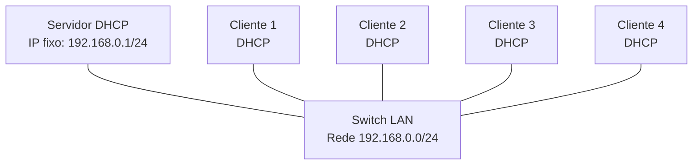

# Laboratório 13 - Configuração e Análise do Protocolo DHCP

**Disciplina:** ENE0025 - Protocolos de Transporte e Roteamento  
**Professor responsável:** Prof. Dr. Laerte Peotta de Melo  
**Tema:** DHCP - Dynamic Host Configuration Protocol  

---


## 1. Objetivo

Este laboratório tem como objetivo demonstrar o funcionamento do protocolo **DHCP (Dynamic Host Configuration Protocol)** em uma rede IPv4 privada classe C.

Ao final da atividade, o estudante deverá ser capaz de:

- compreender a função do protocolo DHCP;
- configurar um servidor DHCP em ambiente Linux;
- configurar clientes para receberem endereços IP automaticamente;
- validar a atribuição dinâmica de endereços IPv4;
- analisar o processo DHCP por meio de comandos de rede;
- identificar os parâmetros entregues pelo servidor DHCP aos clientes.

---

## 2. Contextualização

Em redes pequenas, é comum configurar manualmente o endereço IP de cada dispositivo. Entretanto, em redes maiores, essa prática se torna trabalhosa e sujeita a erros.

O protocolo **DHCP** permite que os dispositivos recebam automaticamente informações essenciais de rede, como:

- endereço IP;
- máscara de sub-rede;
- gateway padrão;
- servidor DNS;
- tempo de concessão do endereço IP, conhecido como *lease*.

O DHCP utiliza o protocolo UDP como transporte. As mensagens enviadas do cliente para o servidor usam a porta UDP 67, enquanto as mensagens enviadas do servidor para o cliente usam a porta UDP 68.

O processo básico de obtenção de endereço IP segue a sequência conhecida como **DORA**:

```text
Discover  -> o cliente procura um servidor DHCP
Offer     -> o servidor oferece um endereço IP
Request   -> o cliente solicita o endereço oferecido
ACK       -> o servidor confirma a concessão
```


---

## 3. Topologia

A topologia será composta por:

- 1 servidor DHCP;
- 1 switch;
- 4 máquinas clientes.

Todos os dispositivos estarão na mesma rede local: `192.168.0.0/24`.



---

## 4. Plano de Endereçamento

| Dispositivo | Interface | Endereço IP | Máscara | Gateway | Observação |
|---|---|---:|---:|---:|---|
| Servidor DHCP | eth0 | 192.168.0.1 | 255.255.255.0 | - | IP estático |
| Cliente 1 | eth0 | DHCP | DHCP | DHCP | IP automático |
| Cliente 2 | eth0 | DHCP | DHCP | DHCP | IP automático |
| Cliente 3 | eth0 | DHCP | DHCP | DHCP | IP automático |
| Cliente 4 | eth0 | DHCP | DHCP | DHCP | IP automático |

---

## 5. Escopo DHCP

O servidor DHCP deverá distribuir endereços dentro da rede `192.168.0.0/24`.

| Parâmetro | Valor |
|---|---:|
| Rede | 192.168.0.0/24 |
| Máscara | 255.255.255.0 |
| Servidor DHCP | 192.168.0.1 |
| Faixa de distribuição | 192.168.0.100 a 192.168.0.150 |
| Gateway padrão | 192.168.0.1 |
| DNS primário | 8.8.8.8 |
| DNS secundário | 1.1.1.1 |
| Lease padrão | 600 segundos |
| Lease máximo | 3600 segundos |

---

## 6. Preparação da Topologia no PNetLab

No PNetLab, crie a seguinte topologia:

1. Adicione uma máquina Linux para atuar como **Servidor DHCP**.
2. Adicione quatro máquinas Linux para atuarem como **clientes DHCP**.
3. Adicione um switch simples.
4. Conecte todos os dispositivos ao switch.
5. Inicie todos os nós.

---

## 7. Configuração do Servidor DHCP

### 7.1 Configurar IP estático no servidor

No servidor DHCP, identifique a interface de rede:

```bash
ip -br addr
```

Considere que a interface seja `eth0`.

Configure o endereço IP do servidor:

```bash
sudo ip addr flush dev eth0
sudo ip addr add 192.168.0.1/24 dev eth0
sudo ip link set eth0 up
```

Verifique:

```bash
ip -br addr
```

Resultado esperado:

```text
eth0    UP    192.168.0.1/24
```

---

### 7.2 Instalar o serviço DHCP

No servidor:

```bash
sudo apt update
sudo apt install -y isc-dhcp-server
```

Verifique se o pacote foi instalado:

```bash
dpkg -l | grep isc-dhcp-server
```

---

### 7.3 Definir a interface do serviço DHCP

Edite o arquivo:

```bash
sudo nano /etc/default/isc-dhcp-server
```

Localize a linha:

```bash
INTERFACESv4=""
```

Altere para:

```bash
INTERFACESv4="eth0"
```

Salve o arquivo.

---

### 7.4 Configurar o escopo DHCP

Faça backup do arquivo original:

```bash
sudo cp /etc/dhcp/dhcpd.conf /etc/dhcp/dhcpd.conf.bkp
```

Edite o arquivo de configuração:

```bash
sudo nano /etc/dhcp/dhcpd.conf
```

Adicione ao final do arquivo:

```bash
default-lease-time 600;
max-lease-time 3600;

authoritative;

subnet 192.168.0.0 netmask 255.255.255.0 {
    range 192.168.0.100 192.168.0.150;
    option routers 192.168.0.1;
    option subnet-mask 255.255.255.0;
    option domain-name-servers 8.8.8.8, 1.1.1.1;
    option domain-name "ptr.local";
}
```

---

### 7.5 Validar a configuração

Antes de iniciar o serviço, valide a sintaxe:

```bash
sudo dhcpd -t -cf /etc/dhcp/dhcpd.conf
```

Se não houver erro, reinicie o serviço:

```bash
sudo systemctl restart isc-dhcp-server
```

Verifique o status:

```bash
sudo systemctl status isc-dhcp-server
```

Caso ocorra erro:

```bash
sudo journalctl -u isc-dhcp-server --no-pager -n 50
```

---

## 8. Configuração dos Clientes DHCP

Em cada cliente, identifique a interface:

```bash
ip -br link
```

Considere que a interface seja `eth0`.

Remova configurações antigas:

```bash
sudo ip addr flush dev eth0
sudo ip link set eth0 up
```

Solicite um endereço IP ao servidor DHCP:

```bash
sudo dhclient -v eth0
```

Repita o procedimento nos quatro clientes.

---

## 9. Verificação nos Clientes

Em cada cliente, execute:

```bash
ip -br addr
```

Resultado esperado:

```text
eth0    UP    192.168.0.100/24
```

ou outro endereço dentro da faixa:

```text
192.168.0.100 a 192.168.0.150
```

Verifique a rota padrão:

```bash
ip route
```

Resultado esperado:

```text
default via 192.168.0.1 dev eth0
```

Verifique os servidores DNS:

```bash
cat /etc/resolv.conf
```

---

## 10. Teste de Conectividade

A partir de cada cliente, teste a comunicação com o servidor DHCP:

```bash
ping 192.168.0.1
```

Teste também a comunicação entre clientes.

Exemplo no Cliente 1:

```bash
ping 192.168.0.101
ping 192.168.0.102
ping 192.168.0.103
```

Os endereços devem ser ajustados conforme os IPs recebidos pelos clientes.

---

## 11. Verificação das Concessões DHCP no Servidor

No servidor DHCP, visualize as concessões:

```bash
sudo cat /var/lib/dhcp/dhcpd.leases
```

Procure informações como:

```text
lease 192.168.0.100 {
  starts ...
  ends ...
  hardware ethernet ...
}
```

Também é possível acompanhar os logs do serviço:

```bash
sudo journalctl -u isc-dhcp-server -f
```

---

## 12. Análise do Processo DHCP com tcpdump

No servidor DHCP, execute:

```bash
sudo tcpdump -i eth0 -n port 67 or port 68
```

Em um dos clientes, libere o endereço atual:

```bash
sudo dhclient -r eth0
```

Solicite novamente:

```bash
sudo dhclient -v eth0
```

No servidor, observe mensagens semelhantes a:

```text
DHCPDISCOVER
DHCPOFFER
DHCPREQUEST
DHCPACK
```

Essas mensagens representam o processo DORA.

---

## 13. Teste de Renovação do Endereço IP

Em um cliente, execute:

```bash
sudo dhclient -r eth0
ip -br addr
sudo dhclient -v eth0
ip -br addr
```

Observe:

- o cliente recebeu o mesmo IP?
- recebeu outro IP da faixa?
- o servidor registrou a nova concessão?
- houve nova sequência DHCP?

---

## 14. Teste de Falha Controlada

Pare o serviço DHCP no servidor:

```bash
sudo systemctl stop isc-dhcp-server
```

Em um cliente, tente obter endereço novamente:

```bash
sudo dhclient -r eth0
sudo dhclient -v eth0
```

Observe o comportamento.

Depois, reative o serviço:

```bash
sudo systemctl start isc-dhcp-server
```

Solicite novamente o endereço no cliente:

```bash
sudo dhclient -v eth0
```

---

## 15. Reserva DHCP por MAC Address

No Cliente 1, descubra o endereço MAC:

```bash
ip link show eth0
```

No servidor DHCP, edite o arquivo:

```bash
sudo nano /etc/dhcp/dhcpd.conf
```

Adicione ao final, substituindo o MAC pelo endereço real do Cliente 1:

```bash
host cliente1 {
    hardware ethernet 08:00:27:aa:bb:cc;
    fixed-address 192.168.0.120;
}
```

Reinicie o serviço:

```bash
sudo systemctl restart isc-dhcp-server
```

No Cliente 1:

```bash
sudo dhclient -r eth0
sudo dhclient -v eth0
ip -br addr
```

Resultado esperado:

```text
eth0    UP    192.168.0.120/24
```

---

## 16. Comandos Úteis

### No servidor DHCP

```bash
ip -br addr
sudo systemctl status isc-dhcp-server
sudo systemctl restart isc-dhcp-server
sudo journalctl -u isc-dhcp-server --no-pager -n 50
sudo cat /var/lib/dhcp/dhcpd.leases
sudo tcpdump -i eth0 -n port 67 or port 68
```

### Nos clientes

```bash
ip -br addr
ip route
cat /etc/resolv.conf
sudo dhclient -v eth0
sudo dhclient -r eth0
ping 192.168.0.1
```

---

## 17. Questões para análise

1. Qual é a função principal do protocolo DHCP?
2. Por que o DHCP facilita a administração de redes?
3. Quais informações o servidor DHCP pode entregar a um cliente?
4. O que significa a sequência DORA?
5. Quais portas UDP são usadas pelo DHCP?
6. Qual é a diferença entre endereço IP estático e endereço IP dinâmico?
7. O que é lease DHCP?
8. O que acontece se o servidor DHCP estiver desligado?
9. Por que servidores normalmente usam IP fixo ou reserva DHCP?
10. Como o `tcpdump` ajuda a visualizar o funcionamento do DHCP?

---

## 18. Critérios de avaliação

| Critério | Pontuação |
|---|---:|
| Topologia criada corretamente no PNetLab | 1,0 |
| Servidor DHCP com IP estático configurado | 1,0 |
| Serviço DHCP instalado e ativo | 1,5 |
| Escopo DHCP configurado corretamente | 2,0 |
| Quatro clientes recebendo IP automaticamente | 2,0 |
| Testes de conectividade realizados | 1,0 |
| Análise com `tcpdump` ou logs | 1,0 |
| Respostas técnicas às questões de análise | 0,5 |
| **Total** | **10,0** |

---

## 19. Entregáveis

Cada aluno deverá entregar um relatório contendo:
- print ou saída do comando `ip -br addr` no servidor;
- print ou saída do comando `ip -br addr` nos quatro clientes;
- trecho do arquivo `/etc/dhcp/dhcpd.conf`;
- saída do arquivo `/var/lib/dhcp/dhcpd.leases`;
- evidência do processo DORA usando `tcpdump`;
- teste de conectividade entre clientes e servidor;
- respostas completas às questões para análise.

---

## 20. Conclusão

Neste laboratório, foi configurado um servidor DHCP para distribuir automaticamente endereços IPv4 em uma rede privada classe C.

A rede utilizada foi `192.168.0.0/24`, com o servidor DHCP no endereço `192.168.0.1` e uma faixa dinâmica de `192.168.0.100` a `192.168.0.150`.

A prática permitiu observar que o DHCP reduz o esforço de configuração manual, evita erros operacionais e centraliza a administração dos parâmetros básicos de rede.

Além da configuração, a análise com `tcpdump`, logs do sistema e arquivo de concessões permitiu compreender o funcionamento real do protocolo DHCP em uma rede local.

---

[← Anterior: Laboratório 12](lab12.md) | [Índice Geral (README)](../README.md) | [Próximo: Laboratório 13B →](lab13B.md)

