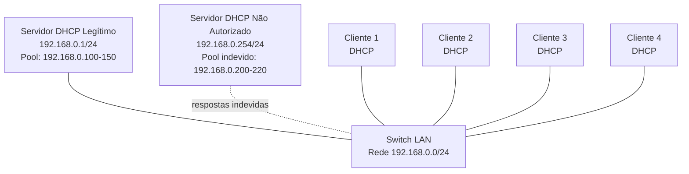
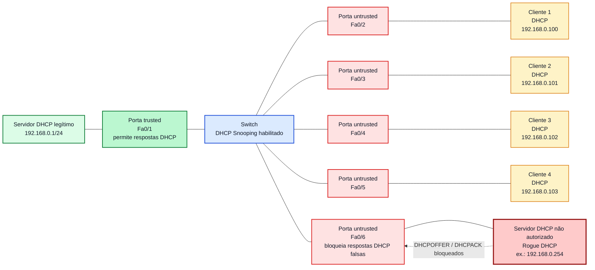

# Laboratório 13B - Segurança no DHCP: Servidor Falso, Análise e Mitigação

**Disciplina:** ENE0025 - Protocolos de Transporte e Roteamento  
**Professor responsável:** Prof. Dr. Laerte Peotta de Melo  
**Tema:** Segurança no DHCP  
**Continuação do: Lab 13 - Configuração e Análise do Protocolo DHCP**

---

## 1. Objetivo

Este laboratório é uma continuação direta do **Lab 13 - Configuração e Análise do Protocolo DHCP**.

No Lab 13, foi configurado um servidor DHCP legítimo para distribuir endereços IPv4 na rede `192.168.0.0/24`. Neste Lab 13B, o objetivo é analisar os principais riscos de segurança associados ao DHCP e compreender como falhas de proteção na camada 2 podem permitir respostas DHCP indevidas na rede local.

Ao final da atividade, o estudante deverá ser capaz de:

- compreender riscos associados ao uso do DHCP em redes locais;
- identificar o impacto de um servidor DHCP não autorizado;
- analisar mensagens DHCP com `tcpdump`;
- verificar os parâmetros recebidos pelos clientes;
- diferenciar servidor DHCP legítimo e servidor DHCP falso;
- compreender o conceito de DHCP Snooping;
- propor boas práticas de mitigação em redes corporativas e acadêmicas.

---

## 2. Contextualização

O DHCP facilita a administração da rede ao entregar automaticamente endereço IP, máscara, gateway, DNS e tempo de concessão aos clientes.

Entretanto, essa facilidade também cria riscos. Por padrão, o cliente DHCP aceita respostas recebidas na rede local sem validar se o servidor é realmente autorizado. Assim, um equipamento indevido conectado ao mesmo domínio de broadcast pode tentar oferecer configurações incorretas.

Isso pode causar:

- perda de conectividade;
- conflito de endereços IP;
- entrega de gateway incorreto;
- entrega de DNS malicioso;
- redirecionamento de tráfego;
- dificuldade de diagnóstico;
- indisponibilidade parcial da rede.

Este laboratório não tem objetivo ofensivo. A finalidade é **didática e defensiva**, permitindo que o estudante compreenda o risco e saiba reconhecer sinais de configuração DHCP indevida.


---

## 3. Topologia Base

A topologia é a mesma do Lab 13, com a adição de um segundo servidor Linux, que representará um **servidor DHCP não autorizado** para fins de análise controlada.

Dispositivos utilizados:

- 1 servidor DHCP legítimo;
- 1 servidor DHCP não autorizado, usado apenas para demonstração em ambiente isolado;
- 1 switch;
- 4 máquinas clientes.

Todos os dispositivos estarão na rede `192.168.0.0/24`.



---

## 4. Plano de Endereçamento

| Dispositivo | Interface | Endereço IP | Função |
|---|---|---:|---|
| Servidor DHCP legítimo | eth0 | 192.168.0.1/24 | Entregar IPs válidos aos clientes |
| Servidor DHCP não autorizado | eth0 | 192.168.0.254/24 | Simular resposta indevida em ambiente controlado |
| Cliente 1 | eth0 | DHCP | Cliente da rede |
| Cliente 2 | eth0 | DHCP | Cliente da rede |
| Cliente 3 | eth0 | DHCP | Cliente da rede |
| Cliente 4 | eth0 | DHCP | Cliente da rede |

---

## 5. Escopos DHCP Utilizados

### 5.1 Servidor DHCP legítimo

| Parâmetro | Valor |
|---|---:|
| Servidor | 192.168.0.1 |
| Rede | 192.168.0.0/24 |
| Faixa DHCP | 192.168.0.100 a 192.168.0.150 |
| Gateway | 192.168.0.1 |
| DNS | 8.8.8.8 e 1.1.1.1 |
| Domínio | ptr.local |

### 5.2 Servidor DHCP não autorizado

| Parâmetro | Valor indevido para demonstração |
|---|---:|
| Servidor | 192.168.0.254 |
| Rede | 192.168.0.0/24 |
| Faixa DHCP | 192.168.0.200 a 192.168.0.220 |
| Gateway falso | 192.168.0.254 |
| DNS indevido | 192.168.0.254 |
| Domínio | falso.local |

---

## 6. Validação do Lab 13

Antes de iniciar o Lab 13B, confirme que o Lab 13 está funcionando corretamente.

No servidor DHCP legítimo:

```bash
ip -br addr
sudo systemctl status isc-dhcp-server
sudo cat /var/lib/dhcp/dhcpd.leases
```

Em cada cliente:

```bash
ip -br addr
ip route
cat /etc/resolv.conf
ping 192.168.0.1
```

Resultado esperado:

- clientes recebendo IP entre `192.168.0.100` e `192.168.0.150`;
- rota padrão via `192.168.0.1`;
- DNS `8.8.8.8` e `1.1.1.1`;
- comunicação com o servidor DHCP legítimo.

---

## 7. Análise do DHCP Legítimo

No servidor DHCP legítimo, monitore o tráfego:

```bash
sudo tcpdump -i eth0 -n port 67 or port 68
```

Em um cliente, force nova solicitação DHCP:

```bash
sudo dhclient -r eth0
sudo dhclient -v eth0
```

Observe a sequência esperada:

```text
DHCPDISCOVER
DHCPOFFER
DHCPREQUEST
DHCPACK
```

O estudante deve registrar:

- IP oferecido;
- endereço do servidor que respondeu;
- gateway recebido;
- DNS recebido;
- tempo de concessão.

---

## 8. Inserção Controlada de um Servidor DHCP Não Autorizado

> Atenção: esta etapa deve ser realizada apenas em ambiente isolado de laboratório, dentro do PNetLab. Não execute este procedimento em redes reais.

Adicione uma nova máquina Linux à mesma LAN dos clientes e configure IP fixo:

```bash
sudo ip addr flush dev eth0
sudo ip addr add 192.168.0.254/24 dev eth0
sudo ip link set eth0 up
```

Instale o serviço DHCP:

```bash
sudo apt update
sudo apt install -y isc-dhcp-server
```

Configure a interface:

```bash
sudo nano /etc/default/isc-dhcp-server
```

Defina:

```bash
INTERFACESv4="eth0"
```

Faça backup da configuração original:

```bash
sudo cp /etc/dhcp/dhcpd.conf /etc/dhcp/dhcpd.conf.bkp
```

Edite o arquivo:

```bash
sudo nano /etc/dhcp/dhcpd.conf
```

Adicione o escopo indevido:

```bash
default-lease-time 600;
max-lease-time 3600;

authoritative;

subnet 192.168.0.0 netmask 255.255.255.0 {
    range 192.168.0.200 192.168.0.220;
    option routers 192.168.0.254;
    option subnet-mask 255.255.255.0;
    option domain-name-servers 192.168.0.254;
    option domain-name "falso.local";
}
```

Valide a configuração:

```bash
sudo dhcpd -t -cf /etc/dhcp/dhcpd.conf
```

Inicie o serviço:

```bash
sudo systemctl restart isc-dhcp-server
sudo systemctl status isc-dhcp-server
```

---

## 9. Observação do Comportamento dos Clientes

Em cada cliente, libere o endereço atual e solicite novo endereço:

```bash
sudo dhclient -r eth0
sudo dhclient -v eth0
```

Verifique a configuração recebida:

```bash
ip -br addr
ip route
cat /etc/resolv.conf
```

O estudante deve comparar os resultados.

### Possibilidade A - Cliente recebeu configuração legítima

Exemplo:

```text
IP: 192.168.0.101/24
Gateway: 192.168.0.1
DNS: 8.8.8.8, 1.1.1.1
```

### Possibilidade B - Cliente recebeu configuração indevida

Exemplo:

```text
IP: 192.168.0.200/24
Gateway: 192.168.0.254
DNS: 192.168.0.254
```

Neste caso, o cliente recebeu resposta do servidor DHCP não autorizado.

---

## 10. Análise com tcpdump

No servidor DHCP legítimo:

```bash
sudo tcpdump -i eth0 -n port 67 or port 68
```

No servidor DHCP não autorizado:

```bash
sudo tcpdump -i eth0 -n port 67 or port 68
```

Em um cliente:

```bash
sudo dhclient -r eth0
sudo dhclient -v eth0
```

Analise:

- quantos servidores responderam ao DHCP Discover?
- qual servidor enviou DHCP Offer primeiro?
- qual oferta o cliente aceitou?
- o cliente recebeu gateway correto ou indevido?
- o cliente recebeu DNS correto ou indevido?

---

## 11. Impactos Esperados

Caso um cliente receba configuração do servidor não autorizado, podem ocorrer:

- alteração da rota padrão;
- falha de comunicação com serviços internos;
- redirecionamento de tráfego para equipamento indevido;
- resolução DNS incorreta;
- dificuldade de acesso à rede;
- comportamento diferente entre clientes da mesma LAN.

Teste a conectividade:

```bash
ping 192.168.0.1
ping 192.168.0.254
ip route
```

Compare os clientes que receberam configuração legítima com aqueles que receberam configuração indevida.

---

## 12. Mitigação: Remoção do Servidor Não Autorizado

No servidor DHCP não autorizado, pare o serviço:

```bash
sudo systemctl stop isc-dhcp-server
sudo systemctl disable isc-dhcp-server
```

Nos clientes, renove os endereços:

```bash
sudo dhclient -r eth0
sudo dhclient -v eth0
```

Verifique se todos voltaram a receber configuração legítima:

```bash
ip -br addr
ip route
cat /etc/resolv.conf
```

Resultado esperado:

- IP entre `192.168.0.100` e `192.168.0.150`;
- gateway `192.168.0.1`;
- DNS `8.8.8.8` e `1.1.1.1`.

---

## 13. DHCP Snooping

O **DHCP Snooping** é um mecanismo de proteção implementado em switches gerenciáveis.

Ele separa as portas em dois grupos:

| Tipo de porta | Descrição |
|---|---|
| Trusted | Porta confiável, autorizada a enviar respostas DHCP |
| Untrusted | Porta de usuário, bloqueia respostas DHCP indevidas |

Modelo conceitual:



### Configuração Switch

> Esta etapa é conceitual. A aplicação prática depende do tipo de switch usado no PNetLab.

Exemplo de configuração em switch Cisco:

```cisco
conf t
ip dhcp snooping
ip dhcp snooping vlan 1

interface g0/1
 description Porta conectada ao servidor DHCP legitimo
 ip dhcp snooping trust

interface range g0/2 - 24
 description Portas dos clientes
 no ip dhcp snooping trust
 spanning-tree portfast
end
```

Verificação:

```cisco
show ip dhcp snooping
show ip dhcp snooping binding
```


### 13.1 Teste Simples - Porta Untrusted com Servidor DHCP Não Autorizado

Em uma rede corporativa, somente a porta conectada ao servidor DHCP legítimo ou ao roteador autorizado deve ser marcada como **trusted**.

As portas de usuários devem permanecer como **untrusted**. Assim, se um usuário conectar um servidor DHCP indevido, o switch bloqueia as respostas DHCP Offer e DHCP ACK vindas dessa porta.

## Objetivo

Observar o comportamento de uma porta configurada como **untrusted** quando um servidor DHCP não autorizado tenta responder solicitações DHCP na rede.

Este teste tem como objetivo verificar, de forma simples, se o mecanismo de **DHCP Snooping** impede que respostas DHCP falsas sejam entregues aos clientes.

---

### 13.2. Manter o servidor DHCP legítimo ativo

Confirme que o servidor DHCP legítimo está ativo e conectado à porta **trusted** do switch.

No servidor DHCP legítimo:

```bash
sudo systemctl status isc-dhcp-server
```

Caso o serviço esteja parado:

```bash
sudo systemctl start isc-dhcp-server
```

---

### 13.3. Ativar o servidor DHCP não autorizado

Ative o servidor DHCP não autorizado conectado à porta **untrusted**.

O objetivo não é validar a configuração detalhada desse servidor, mas apenas observar se suas respostas serão bloqueadas pelo switch.

---

### 13.4. Liberar o endereço IP no cliente

No cliente DHCP, libere o endereço IP atual:

```bash
sudo dhclient -r eth0
```

---

### 13.5. Solicitar novo endereço IP

Ainda no cliente, solicite novamente um endereço IP:

```bash
sudo dhclient -v eth0
```

---

### 13.6. Verificar o endereço recebido

No cliente, verifique a configuração recebida:

```bash
ip -br addr
ip route
cat /etc/resolv.conf
```

---

## 13.7 Resultado Esperado

O cliente deve receber configuração apenas do servidor DHCP legítimo.

A porta **untrusted** deve impedir que o servidor DHCP não autorizado entregue respostas DHCP aos clientes.

O cliente **não deve receber**:

- gateway vindo do servidor não autorizado;
- DNS vindo do servidor não autorizado;
- endereço IP fora da faixa legítima;
- configurações diferentes das definidas no servidor DHCP autorizado.

---

## 13.8 Verificação no Switch

No switch, verifique o funcionamento do DHCP Snooping:

```bash
show ip dhcp snooping
show ip dhcp snooping binding
show ip dhcp snooping statistics
```

Procure por indícios de pacotes DHCP bloqueados ou descartados na porta **untrusted**.

---

## 13.9 Resultado Esperado

Se o DHCP Snooping estiver funcionando corretamente, o servidor DHCP não autorizado pode até tentar responder às solicitações dos clientes, mas suas mensagens DHCP serão bloqueadas pela porta **untrusted**.

Assim, apenas o servidor DHCP legítimo, conectado à porta **trusted**, será capaz de entregar configurações válidas aos clientes da rede.

---

## Questões de Análise

1. O cliente recebeu endereço do servidor legítimo ou do servidor não autorizado?
2. A porta **untrusted** bloqueou as respostas DHCP falsas?
3. Qual comando no switch permite verificar estatísticas do DHCP Snooping?
4. Por que servidores DHCP devem estar conectados somente a portas **trusted**?
5. O que poderia acontecer se a porta do servidor não autorizado fosse configurada como **trusted** por engano?

---

## 15. Boas Práticas de Segurança

Recomendações para redes reais:

- habilitar DHCP Snooping em switches gerenciáveis;
- permitir respostas DHCP apenas em portas confiáveis;
- manter servidores DHCP em segmentos controlados;
- usar VLANs para separar usuários, servidores, visitantes e administração;
- monitorar logs do servidor DHCP;
- verificar concessões desconhecidas;
- evitar pools DHCP excessivamente grandes sem controle;
- usar IP fixo ou reserva DHCP para ativos críticos;
- documentar escopos, gateways, DNS e reservas;
- associar DHCP Snooping a recursos como Dynamic ARP Inspection, quando disponível.

---

## 16. Comandos Úteis

### No servidor DHCP legítimo

```bash
ip -br addr
sudo systemctl status isc-dhcp-server
sudo cat /var/lib/dhcp/dhcpd.leases
sudo journalctl -u isc-dhcp-server --no-pager -n 50
sudo tcpdump -i eth0 -n port 67 or port 68
```

### No servidor DHCP não autorizado

```bash
ip -br addr
sudo systemctl status isc-dhcp-server
sudo systemctl stop isc-dhcp-server
sudo tcpdump -i eth0 -n port 67 or port 68
```

### Nos clientes

```bash
ip -br addr
ip route
cat /etc/resolv.conf
sudo dhclient -r eth0
sudo dhclient -v eth0
ping 192.168.0.1
ping 192.168.0.254
```

---

## 17. Questões para Fixação

1. Por que o DHCP pode representar um risco de segurança em redes locais?
2. O que é um servidor DHCP não autorizado?
3. O que pode acontecer se um cliente receber gateway incorreto?
4. O que pode acontecer se um cliente receber DNS malicioso?
5. Como o `tcpdump` ajuda a identificar múltiplos servidores DHCP?
6. O que é DHCP Snooping?
7. Qual porta do switch deve ser marcada como trusted?
8. Por que as portas dos clientes devem ser untrusted?
9. Qual a diferença entre mitigar o problema no servidor e mitigar no switch?
10. Como VLANs ajudam a reduzir o impacto de problemas DHCP?

---

## 18. Atividade de Entrega

Cada aluno deverá entregar um relatório contendo:

- topologia utilizada no PNetLab;
- configuração do servidor DHCP legítimo;
- evidência dos clientes recebendo IP legítimo;
- evidência da resposta do servidor não autorizado em ambiente controlado;
- comparação entre configuração legítima e indevida;
- saída de `tcpdump` mostrando mensagens DHCP;
- explicação do impacto de gateway ou DNS incorreto;
- proposta de mitigação usando DHCP Snooping;
- respostas às questões de fixação.

---

## 19. Critérios de Avaliação

| Critério | Pontuação |
|---|---:|
| Continuidade correta a partir do Lab 13 | 1,0 |
| Topologia com servidor legítimo, servidor não autorizado e clientes | 1,5 |
| Análise correta dos parâmetros DHCP recebidos | 1,5 |
| Uso de `tcpdump` para observar mensagens DHCP | 1,5 |
| Identificação dos riscos de gateway e DNS indevidos | 1,5 |
| Explicação do DHCP Snooping | 1,0 |
| Proposta de boas práticas de mitigação | 1,0 |
| Respostas às questões de fixação | 1,0 |
| **Total** | **10,0** |

---

## 20. Conclusão

Neste laboratório, foi analisado o aspecto de segurança do protocolo DHCP.

A prática demonstrou que, embora o DHCP simplifique a configuração de clientes, ele pode ser explorado de forma indevida quando a rede local não possui controles de camada 2.

A presença de um servidor DHCP não autorizado pode causar entrega de gateway incorreto, DNS indevido, conflitos de configuração e indisponibilidade. A principal defesa em redes com switches gerenciáveis é o uso de **DHCP Snooping**, combinado com segmentação por VLANs, monitoramento de logs e controle das portas de acesso.

O Lab 13B complementa o Lab 13 ao mostrar que configurar um protocolo não é suficiente: é necessário também compreender seus riscos, formas de diagnóstico e mecanismos de proteção.

---

[← Anterior: Laboratório 13](lab13.md) | [Índice Geral (README)](../README.md)

